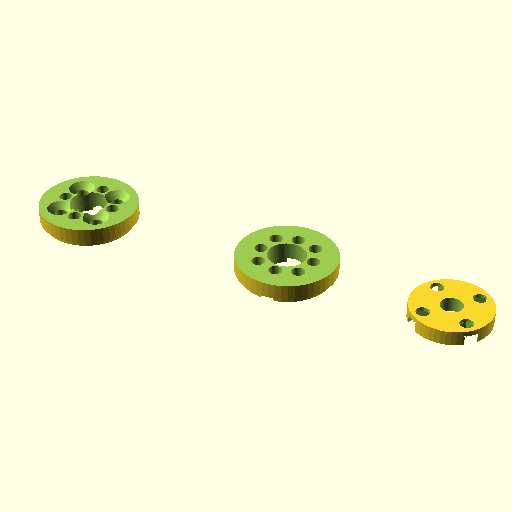

# Oobb Part Bearing Plate 3 Width 3 Height 12 mm Depth 6705 Bearing Coupler Flanged Shaft  

note: This is part of OOMP the Oopen Organization Method For Parts. For more details: https://github.com/oomlout/oomp_base

##  part details
  

bearing plate 3x3x12

### name
* name: Oobb Part Bearing Plate 3 Width 3 Height 12 mm Depth 6705 Bearing Coupler Flanged Shaft
* name_short: Bearing Plate 3x3x12 6705 Bearing
### id
* oomp_id: oobb_part_bearing_plate_3_width_3_height_12_mm_depth_6705_bearing_coupler_flanged_shaft
  * classification: oobb
  * type: part
  * size: bearing_plate
  * color: 
  * description_main: 3_width_3_height_12_mm_depth
  * description_extra: 6705_bearing_coupler_flanged_shaft
  * manufacturer: 
  * part_number: 
  * bip 39 word 2: office recipe
  * bip 39 word 3: office recipe kangaroo
  * bip 39 word: office recipe kangaroo occur boat way ranch tired rate life cricket art

### other_codes
* short_code: 
* oomp_word: watermelon leaves ship
* oomp_word_emoji :watermelon: :leaves: :ship:
* md5_6_alpha: 7z468
* md5_6: cc66e0

### oomlout_oomp_utility_custom_data_manipulation
#### label print
[3x2](http://192.168.1.245:1112/?label=oomp%207z468)
[3x2_oomp_table](http://192.168.1.108:1112/?label=oomp%207z468)
[2x1](http://192.168.1.242:1112/?label=oomp%207z468)
[6x4](http://192.168.1.55:1112/?label=oomp%207z468)    

#### link

[link_main](https://github.com/oomlout/oomlout_oobb_version_4_generated_parts/tree/main/navigation_oomp/oobb/part/bearing_plate/3_width_3_height_12_mm_depth/6705_bearing_coupler_flanged_shaft/part)                              

#### price

### all codes 
| key | value |  
| --- | --- |  
| bearing | 6705 |  
| classification | oobb |  
| classification_name | Oobb |  
| color |  |  
| color_name |  |  
| components | [] |  
| components_objects | [] |  
| components_string | [] |  
| description | bearing plate 3x3x12 |  
| description_extra | 6705_bearing_coupler_flanged_shaft |  
| description_extra_name | 6705 Bearing Coupler Flanged Shaft |  
| description_main | 3_width_3_height_12_mm_depth |  
| description_main_name | 3 Width 3 Height 12 mm Depth |  
| directory | parts/oobb_part_bearing_plate_3_width_3_height_12_mm_depth_6705_bearing_coupler_flanged_shaft |  
| folder | C:\gh\oomlout_oobb_version_4_generated_parts\parts\oobb_part_bearing_plate_3_width_3_height_12_mm_depth_6705_bearing_coupler_flanged_shaft |  
| github_link | https://github.com/oomlout/oomlout_oomp_part_src/tree/main/parts/oobb_part_bearing_plate_3_width_3_height_12_mm_depth_6705_bearing_coupler_flanged_shaft |  
| height | 3 |  
| height_mm | 44 |  
| id | oobb_part_bearing_plate_3_width_3_height_12_mm_depth_6705_bearing_coupler_flanged_shaft |  
| link_1 | https://github.com/oomlout/oomlout_oobb_version_4_generated_parts/tree/main/navigation_oomp/oobb/part/bearing_plate/3_width_3_height_12_mm_depth/6705_bearing_coupler_flanged_shaft/part |  
| link_1_name | link_main |  
| link_main | https://github.com/oomlout/oomlout_oobb_version_4_generated_parts/tree/main/navigation_oomp/oobb/part/bearing_plate/3_width_3_height_12_mm_depth/6705_bearing_coupler_flanged_shaft/part |  
| link_oomlout_label_2x1 | http://192.168.1.242:1112/?label=oomp%207z468 |  
| link_oomlout_label_3x2 | http://192.168.1.245:1112/?label=oomp%207z468 |  
| link_oomlout_label_3x2_oomp_table | http://192.168.1.108:1112/?label=oomp%207z468 |  
| link_oomlout_label_6x4 | http://192.168.1.55:1112/?label=oomp%207z468 |  
| link_redirect | https://github.com/oomlout/oomlout_oobb_version_4_generated_parts/tree/main/parts/oobb_bearing_plate_03_03_12_6705_sh_coupler_flanged |  
| manufacturer |  |  
| manufacturer_name |  |  
| md5 | cc66e05591e2b633e00c698cf32ceccc |  
| md5_10 | cc66e05591 |  
| md5_5 | cc66e |  
| md5_6 | cc66e0 |  
| md5_6_alpha | 7z468 |  
| name | Oobb Part Bearing Plate 3 Width 3 Height 12 mm Depth 6705 Bearing Coupler Flanged Shaft |  
| name_short | Bearing Plate 3x3x12 6705 Bearing |  
| oomlout_detail_hierarchy_1 | oobb |  
| oomlout_detail_hierarchy_2 | part |  
| oomlout_detail_hierarchy_3 | bearing_plate |  
| oomlout_detail_hierarchy_4 | 12_mm_depth |  
| oomlout_detail_hierarchy_5 | 6705_bearing_coupler_flanged_shaft |  
| oomlout_oomp_utility_custom_data_manipulation | True |  
| oomp_key | oomp_oobb_part_bearing_plate_3_width_3_height_12_mm_depth_6705_bearing_coupler_flanged_shaft |  
| oomp_word | watermelon leaves ship |  
| oomp_word_emoji | :watermelon: :leaves: :ship: |  
| oomp_word_emoji_list | [':watermelon:', ':leaves:', ':ship:'] |  
| oomp_word_list | ['watermelon', 'leaves', 'ship'] |  
| part_number |  |  
| part_number_name |  |  
| shaft | coupler_flanged |  
| short_name |  |  
| size | bearing_plate |  
| size_name | Bearing Plate |  
| thickness | 12 |  
| thickness_mm | 12 |  
| type | part |  
| type_name | Part |  
| width | 3 |  
| width_mm | 44 |  
