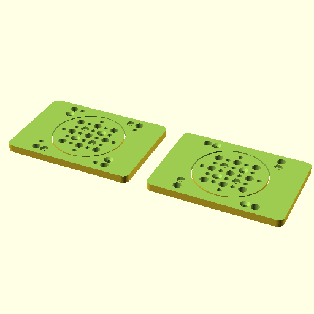

# Oobb Part Bearing Plate 7 Width 5 Height 12 mm Depth 6810 Bearing  

note: This is part of OOMP the Oopen Organization Method For Parts. For more details: https://github.com/oomlout/oomp_base

##  part details
  

bearing plate 7x5x12

### name
* name: Oobb Part Bearing Plate 7 Width 5 Height 12 mm Depth 6810 Bearing
* name_short: Bearing Plate 7x5x12 6810 Bearing
### id
* oomp_id: oobb_part_bearing_plate_7_width_5_height_12_mm_depth_6810_bearing
  * classification: oobb
  * type: part
  * size: bearing_plate
  * color: 
  * description_main: 7_width_5_height_12_mm_depth
  * description_extra: 6810_bearing
  * manufacturer: 
  * part_number: 
  * bip 39 word 2: relief curtain
  * bip 39 word 3: relief curtain toilet
  * bip 39 word: relief curtain toilet sleep elevator gather genuine edit firm ill various almost

### other_codes
* short_code: 
* oomp_word: shell rowboat dancer
* oomp_word_emoji :shell: :rowboat: :dancer:
* md5_6_alpha: 4acrg
* md5_6: 6de31c

### oomlout_oomp_utility_custom_data_manipulation
#### label print
[3x2](http://192.168.1.245:1112/?label=oomp%204acrg)
[3x2_oomp_table](http://192.168.1.108:1112/?label=oomp%204acrg)
[2x1](http://192.168.1.242:1112/?label=oomp%204acrg)
[6x4](http://192.168.1.55:1112/?label=oomp%204acrg)    

#### link

[link_main](https://github.com/oomlout/oomlout_oobb_version_4_generated_parts/tree/main/navigation_oomp/oobb/part/bearing_plate/7_width_5_height_12_mm_depth/6810_bearing/part)                              

#### price

### all codes 
| key | value |  
| --- | --- |  
| bearing | 6810 |  
| classification | oobb |  
| classification_name | Oobb |  
| color |  |  
| color_name |  |  
| components | [] |  
| components_objects | [] |  
| components_string | [] |  
| description | bearing plate 7x5x12 |  
| description_extra | 6810_bearing |  
| description_extra_name | 6810 Bearing |  
| description_main | 7_width_5_height_12_mm_depth |  
| description_main_name | 7 Width 5 Height 12 mm Depth |  
| directory | parts/oobb_part_bearing_plate_7_width_5_height_12_mm_depth_6810_bearing |  
| folder | C:\gh\oomlout_oobb_version_4_generated_parts\parts\oobb_part_bearing_plate_7_width_5_height_12_mm_depth_6810_bearing |  
| github_link | https://github.com/oomlout/oomlout_oomp_part_src/tree/main/parts/oobb_part_bearing_plate_7_width_5_height_12_mm_depth_6810_bearing |  
| height | 5 |  
| height_mm | 74 |  
| id | oobb_part_bearing_plate_7_width_5_height_12_mm_depth_6810_bearing |  
| link_1 | https://github.com/oomlout/oomlout_oobb_version_4_generated_parts/tree/main/navigation_oomp/oobb/part/bearing_plate/7_width_5_height_12_mm_depth/6810_bearing/part |  
| link_1_name | link_main |  
| link_main | https://github.com/oomlout/oomlout_oobb_version_4_generated_parts/tree/main/navigation_oomp/oobb/part/bearing_plate/7_width_5_height_12_mm_depth/6810_bearing/part |  
| link_oomlout_label_2x1 | http://192.168.1.242:1112/?label=oomp%204acrg |  
| link_oomlout_label_3x2 | http://192.168.1.245:1112/?label=oomp%204acrg |  
| link_oomlout_label_3x2_oomp_table | http://192.168.1.108:1112/?label=oomp%204acrg |  
| link_oomlout_label_6x4 | http://192.168.1.55:1112/?label=oomp%204acrg |  
| link_redirect | https://github.com/oomlout/oomlout_oobb_version_4_generated_parts/tree/main/parts/oobb_bearing_plate_07_05_12_6810 |  
| manufacturer |  |  
| manufacturer_name |  |  
| md5 | 6de31c3aba466c2981a3fcb3c78d8daa |  
| md5_10 | 6de31c3aba |  
| md5_5 | 6de31 |  
| md5_6 | 6de31c |  
| md5_6_alpha | 4acrg |  
| name | Oobb Part Bearing Plate 7 Width 5 Height 12 mm Depth 6810 Bearing |  
| name_short | Bearing Plate 7x5x12 6810 Bearing |  
| oomlout_detail_hierarchy_1 | oobb |  
| oomlout_detail_hierarchy_2 | part |  
| oomlout_detail_hierarchy_3 | bearing_plate |  
| oomlout_detail_hierarchy_4 | 12_mm_depth |  
| oomlout_detail_hierarchy_5 | 6810_bearing |  
| oomlout_oomp_utility_custom_data_manipulation | True |  
| oomp_key | oomp_oobb_part_bearing_plate_7_width_5_height_12_mm_depth_6810_bearing |  
| oomp_word | shell rowboat dancer |  
| oomp_word_emoji | :shell: :rowboat: :dancer: |  
| oomp_word_emoji_list | [':shell:', ':rowboat:', ':dancer:'] |  
| oomp_word_list | ['shell', 'rowboat', 'dancer'] |  
| part_number |  |  
| part_number_name |  |  
| short_name |  |  
| size | bearing_plate |  
| size_name | Bearing Plate |  
| thickness | 12 |  
| thickness_mm | 12 |  
| type | part |  
| type_name | Part |  
| width | 7 |  
| width_mm | 104 |  
