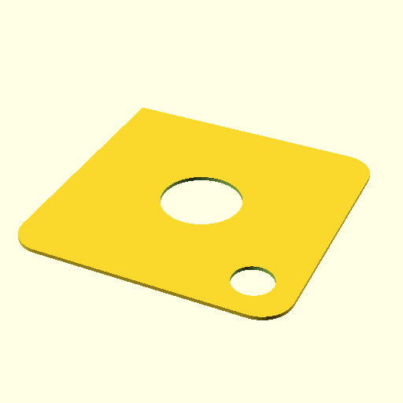

# Oobb Part SMD Magazine Lid 3 Width 3 Height  

note: This is part of OOMP the Oopen Organization Method For Parts. For more details: https://github.com/oomlout/oomp_base

##  part details
  

smd magazine lid 3x3x0

### name
* name: Oobb Part SMD Magazine Lid 3 Width 3 Height
* name_short: Smd Magazine Lid 3x3 Height
### id
* oomp_id: oobb_part_smd_magazine_lid_3_width_3_height
  * classification: oobb
  * type: part
  * size: smd_magazine_lid
  * color: 
  * description_main: 3_width_3_height
  * description_extra: 
  * manufacturer: 
  * part_number: 
  * bip 39 word 2: away column
  * bip 39 word 3: away column palace
  * bip 39 word: away column palace core strike remind argue gossip female rural lawn apart

### other_codes
* short_code: 
* oomp_word: book up cyclone
* oomp_word_emoji :book: :up: :cyclone:
* md5_6_alpha: 6fqy7
* md5_6: a4fc2f

### oomlout_oomp_utility_custom_data_manipulation
#### label print
[3x2](http://192.168.1.245:1112/?label=oomp%206fqy7)
[3x2_oomp_table](http://192.168.1.108:1112/?label=oomp%206fqy7)
[2x1](http://192.168.1.242:1112/?label=oomp%206fqy7)
[6x4](http://192.168.1.55:1112/?label=oomp%206fqy7)    

#### link

[link_main](https://github.com/oomlout/oomlout_oobb_version_4_generated_parts/tree/main/navigation_oomp/oobb/part/smd_magazine_lid/3_width_3_height/part)                              

#### price

### all codes 
| key | value |  
| --- | --- |  
| classification | oobb |  
| classification_name | Oobb |  
| color |  |  
| color_name |  |  
| components | [] |  
| components_objects | [] |  
| components_string | [] |  
| description | smd magazine lid 3x3x0 |  
| description_extra |  |  
| description_extra_name |  |  
| description_main | 3_width_3_height |  
| description_main_name | 3 Width 3 Height |  
| directory | parts/oobb_part_smd_magazine_lid_3_width_3_height |  
| folder | C:\gh\oomlout_oobb_version_4_generated_parts\parts\oobb_part_smd_magazine_lid_3_width_3_height |  
| github_link | https://github.com/oomlout/oomlout_oomp_part_src/tree/main/parts/oobb_part_smd_magazine_lid_3_width_3_height |  
| height | 3 |  
| height_mm | 44 |  
| id | oobb_part_smd_magazine_lid_3_width_3_height |  
| link_1 | https://github.com/oomlout/oomlout_oobb_version_4_generated_parts/tree/main/navigation_oomp/oobb/part/smd_magazine_lid/3_width_3_height/part |  
| link_1_name | link_main |  
| link_main | https://github.com/oomlout/oomlout_oobb_version_4_generated_parts/tree/main/navigation_oomp/oobb/part/smd_magazine_lid/3_width_3_height/part |  
| link_oomlout_label_2x1 | http://192.168.1.242:1112/?label=oomp%206fqy7 |  
| link_oomlout_label_3x2 | http://192.168.1.245:1112/?label=oomp%206fqy7 |  
| link_oomlout_label_3x2_oomp_table | http://192.168.1.108:1112/?label=oomp%206fqy7 |  
| link_oomlout_label_6x4 | http://192.168.1.55:1112/?label=oomp%206fqy7 |  
| link_redirect | https://github.com/oomlout/oomlout_oobb_version_4_generated_parts/tree/main/parts/oobb_smd_magazine_lid_03_03 |  
| manufacturer |  |  
| manufacturer_name |  |  
| md5 | a4fc2f62a764e172d76b83053e4b7083 |  
| md5_10 | a4fc2f62a7 |  
| md5_5 | a4fc2 |  
| md5_6 | a4fc2f |  
| md5_6_alpha | 6fqy7 |  
| name | Oobb Part SMD Magazine Lid 3 Width 3 Height |  
| name_short | Smd Magazine Lid 3x3 Height |  
| oomlout_detail_hierarchy_1 | oobb |  
| oomlout_detail_hierarchy_2 | part |  
| oomlout_detail_hierarchy_3 | smd_magazine_lid |  
| oomlout_detail_hierarchy_4 | 3_width_3_height |  
| oomlout_oomp_utility_custom_data_manipulation | True |  
| oomp_key | oomp_oobb_part_smd_magazine_lid_3_width_3_height |  
| oomp_word | book up cyclone |  
| oomp_word_emoji | :book: :up: :cyclone: |  
| oomp_word_emoji_list | [':book:', ':up:', ':cyclone:'] |  
| oomp_word_list | ['book', 'up', 'cyclone'] |  
| part_number |  |  
| part_number_name |  |  
| short_name |  |  
| size | smd_magazine_lid |  
| size_name | SMD Magazine Lid |  
| type | part |  
| type_name | Part |  
| width | 3 |  
| width_mm | 44 |  
