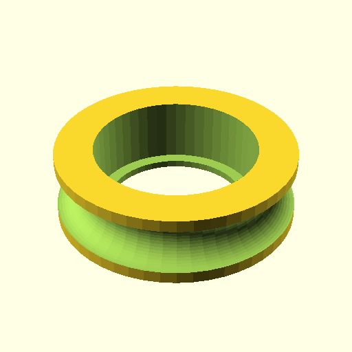

# Oobb Part Wheel 1D75 Diameter 7D5 mm Depth 606 Bearing  

note: This is part of OOMP the Oopen Organization Method For Parts. For more details: https://github.com/oomlout/oomp_base

##  part details
  

wheel 0x0x7.5

### name
* name: Oobb Part Wheel 1D75 Diameter 7D5 mm Depth 606 Bearing
* name_short: Wheel 1D75x7D5 606 Bearing
### id
* oomp_id: oobb_part_wheel_1d75_diameter_7d5_mm_depth_606_bearing
  * classification: oobb
  * type: part
  * size: wheel
  * color: 
  * description_main: 1.75_diameter_7.5_mm_depth
  * description_extra: 606_bearing
  * manufacturer: 
  * part_number: 
  * bip 39 word 2: figure double
  * bip 39 word 3: figure double long
  * bip 39 word: figure double long update income neither enter ocean cradle tip return air

### other_codes
* short_code: 
* oomp_word: rat squirrel bell
* oomp_word_emoji :rat: :squirrel: :bell:
* md5_6_alpha: 3etmg
* md5_6: 577078

### oomlout_oomp_utility_custom_data_manipulation
#### label print
[3x2](http://192.168.1.245:1112/?label=oomp%203etmg)
[3x2_oomp_table](http://192.168.1.108:1112/?label=oomp%203etmg)
[2x1](http://192.168.1.242:1112/?label=oomp%203etmg)
[6x4](http://192.168.1.55:1112/?label=oomp%203etmg)    

#### link

[link_main](https://github.com/oomlout/oomlout_oobb_version_4_generated_parts/tree/main/navigation_oomp/oobb/part/wheel/1.75_diameter_7.5_mm_depth/606_bearing/part)                              

#### price

### all codes 
| key | value |  
| --- | --- |  
| bearing | 606 |  
| classification | oobb |  
| classification_name | Oobb |  
| color |  |  
| color_name |  |  
| components | [] |  
| components_objects | [] |  
| components_string | [] |  
| description | wheel 0x0x7.5 |  
| description_extra | 606_bearing |  
| description_extra_name | 606 Bearing |  
| description_main | 1.75_diameter_7.5_mm_depth |  
| description_main_name | 1.75 Diameter 7.5 mm Depth |  
| diameter | 1.75 |  
| directory | parts/oobb_part_wheel_1d75_diameter_7d5_mm_depth_606_bearing |  
| folder | C:\gh\oomlout_oobb_version_4_generated_parts\parts\oobb_part_wheel_1d75_diameter_7d5_mm_depth_606_bearing |  
| github_link | https://github.com/oomlout/oomlout_oomp_part_src/tree/main/parts/oobb_part_wheel_1d75_diameter_7d5_mm_depth_606_bearing |  
| id | oobb_part_wheel_1d75_diameter_7d5_mm_depth_606_bearing |  
| link_1 | https://github.com/oomlout/oomlout_oobb_version_4_generated_parts/tree/main/navigation_oomp/oobb/part/wheel/1.75_diameter_7.5_mm_depth/606_bearing/part |  
| link_1_name | link_main |  
| link_main | https://github.com/oomlout/oomlout_oobb_version_4_generated_parts/tree/main/navigation_oomp/oobb/part/wheel/1.75_diameter_7.5_mm_depth/606_bearing/part |  
| link_oomlout_label_2x1 | http://192.168.1.242:1112/?label=oomp%203etmg |  
| link_oomlout_label_3x2 | http://192.168.1.245:1112/?label=oomp%203etmg |  
| link_oomlout_label_3x2_oomp_table | http://192.168.1.108:1112/?label=oomp%203etmg |  
| link_oomlout_label_6x4 | http://192.168.1.55:1112/?label=oomp%203etmg |  
| link_redirect | https://github.com/oomlout/oomlout_oobb_version_4_generated_parts/tree/main/parts/oobb_wheel_1d75_7d5_606 |  
| manufacturer |  |  
| manufacturer_name |  |  
| md5 | 577078a18f98e96e50b94ee907906ab0 |  
| md5_10 | 577078a18f |  
| md5_5 | 57707 |  
| md5_6 | 577078 |  
| md5_6_alpha | 3etmg |  
| name | Oobb Part Wheel 1D75 Diameter 7D5 mm Depth 606 Bearing |  
| name_short | Wheel 1D75x7D5 606 Bearing |  
| oomlout_detail_hierarchy_1 | oobb |  
| oomlout_detail_hierarchy_2 | part |  
| oomlout_detail_hierarchy_3 | wheel |  
| oomlout_detail_hierarchy_4 | 75_diameter |  
| oomlout_detail_hierarchy_5 | 5_mm_depth |  
| oomlout_detail_hierarchy_6 | 606_bearing |  
| oomlout_oomp_utility_custom_data_manipulation | True |  
| oomp_key | oomp_oobb_part_wheel_1d75_diameter_7d5_mm_depth_606_bearing |  
| oomp_word | rat squirrel bell |  
| oomp_word_emoji | :rat: :squirrel: :bell: |  
| oomp_word_emoji_list | [':rat:', ':squirrel:', ':bell:'] |  
| oomp_word_list | ['rat', 'squirrel', 'bell'] |  
| part_number |  |  
| part_number_name |  |  
| short_name |  |  
| size | wheel |  
| size_name | Wheel |  
| thickness | 7.5 |  
| thickness_mm | 7.5 |  
| type | part |  
| type_name | Part |  
