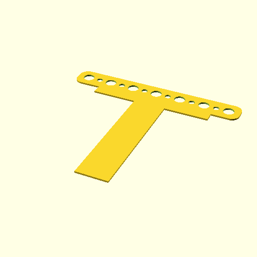

# Oobb Part Bunting Alphabet 7 Width 1 mm Depth T Extra T Extra  

note: This is part of OOMP the Oopen Organization Method For Parts. For more details: https://github.com/oomlout/oomp_base

##  part details
  

bunting alphabet 7x0x1

### name
* name: Oobb Part Bunting Alphabet 7 Width 1 mm Depth T Extra T Extra
* name_short: Bunting Alphabet 7x1 T Extra T Extra
### id
* oomp_id: oobb_part_bunting_alphabet_7_width_1_mm_depth_t_extra_t_extra
  * classification: oobb
  * type: part
  * size: bunting_alphabet
  * color: 
  * description_main: 7_width_1_mm_depth_t_extra
  * description_extra: t_extra
  * manufacturer: 
  * part_number: 
  * bip 39 word 2: casino execute
  * bip 39 word 3: casino execute help
  * bip 39 word: casino execute help rhythm skate diamond frown wrap rather gesture skill around

### other_codes
* short_code: 
* oomp_word: cake microscope hospital
* oomp_word_emoji :cake: :microscope: :hospital:
* md5_6_alpha: 7mq54
* md5_6: c394d8

### oomlout_oomp_utility_custom_data_manipulation
#### label print
[3x2](http://192.168.1.245:1112/?label=oomp%207mq54)
[3x2_oomp_table](http://192.168.1.108:1112/?label=oomp%207mq54)
[2x1](http://192.168.1.242:1112/?label=oomp%207mq54)
[6x4](http://192.168.1.55:1112/?label=oomp%207mq54)    

#### link

[link_main](https://github.com/oomlout/oomlout_oobb_version_4_generated_parts/tree/main/navigation_oomp/oobb/part/bunting_alphabet/7_width_1_mm_depth_t_extra/t_extra/part)                              

#### price

### all codes 
| key | value |  
| --- | --- |  
| classification | oobb |  
| classification_name | Oobb |  
| color |  |  
| color_name |  |  
| components | [] |  
| components_objects | [] |  
| components_string | [] |  
| description | bunting alphabet 7x0x1 |  
| description_extra | t_extra |  
| description_extra_name | T Extra |  
| description_main | 7_width_1_mm_depth_t_extra |  
| description_main_name | 7 Width 1 mm Depth T Extra |  
| directory | parts/oobb_part_bunting_alphabet_7_width_1_mm_depth_t_extra_t_extra |  
| extra | t |  
| folder | C:\gh\oomlout_oobb_version_4_generated_parts\parts\oobb_part_bunting_alphabet_7_width_1_mm_depth_t_extra_t_extra |  
| github_link | https://github.com/oomlout/oomlout_oomp_part_src/tree/main/parts/oobb_part_bunting_alphabet_7_width_1_mm_depth_t_extra_t_extra |  
| id | oobb_part_bunting_alphabet_7_width_1_mm_depth_t_extra_t_extra |  
| link_1 | https://github.com/oomlout/oomlout_oobb_version_4_generated_parts/tree/main/navigation_oomp/oobb/part/bunting_alphabet/7_width_1_mm_depth_t_extra/t_extra/part |  
| link_1_name | link_main |  
| link_main | https://github.com/oomlout/oomlout_oobb_version_4_generated_parts/tree/main/navigation_oomp/oobb/part/bunting_alphabet/7_width_1_mm_depth_t_extra/t_extra/part |  
| link_oomlout_label_2x1 | http://192.168.1.242:1112/?label=oomp%207mq54 |  
| link_oomlout_label_3x2 | http://192.168.1.245:1112/?label=oomp%207mq54 |  
| link_oomlout_label_3x2_oomp_table | http://192.168.1.108:1112/?label=oomp%207mq54 |  
| link_oomlout_label_6x4 | http://192.168.1.55:1112/?label=oomp%207mq54 |  
| link_redirect | https://github.com/oomlout/oomlout_oobb_version_4_generated_parts/tree/main/parts/oobb_bunting_alphabet_07_01_ex_t |  
| manufacturer |  |  
| manufacturer_name |  |  
| md5 | c394d85d92fe0bb0f4e50b8cd613c91b |  
| md5_10 | c394d85d92 |  
| md5_5 | c394d |  
| md5_6 | c394d8 |  
| md5_6_alpha | 7mq54 |  
| name | Oobb Part Bunting Alphabet 7 Width 1 mm Depth T Extra T Extra |  
| name_short | Bunting Alphabet 7x1 T Extra T Extra |  
| oomlout_detail_hierarchy_1 | oobb |  
| oomlout_detail_hierarchy_2 | part |  
| oomlout_detail_hierarchy_3 | bunting_alphabet |  
| oomlout_detail_hierarchy_4 | 1_mm_depth |  
| oomlout_detail_hierarchy_5 | t_extra |  
| oomlout_oomp_utility_custom_data_manipulation | True |  
| oomp_key | oomp_oobb_part_bunting_alphabet_7_width_1_mm_depth_t_extra_t_extra |  
| oomp_word | cake microscope hospital |  
| oomp_word_emoji | :cake: :microscope: :hospital: |  
| oomp_word_emoji_list | [':cake:', ':microscope:', ':hospital:'] |  
| oomp_word_list | ['cake', 'microscope', 'hospital'] |  
| part_number |  |  
| part_number_name |  |  
| short_name |  |  
| size | bunting_alphabet |  
| size_name | Bunting Alphabet |  
| thickness | 1 |  
| thickness_mm | 1 |  
| type | part |  
| type_name | Part |  
| width | 7 |  
| width_mm | 104 |  
