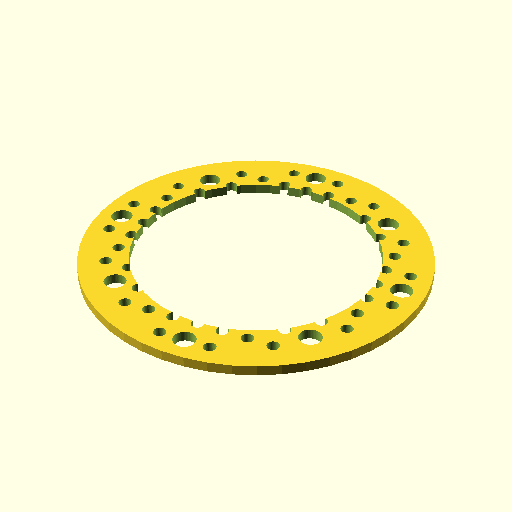

# Oobb Part Circle 7 Diameter 3 mm Depth Doughnut 5 Extra  

note: This is part of OOMP the Oopen Organization Method For Parts. For more details: https://github.com/oomlout/oomp_base

##  part details
  

circle 0x0x3

### name
* name: Oobb Part Circle 7 Diameter 3 mm Depth Doughnut 5 Extra
* name_short: Circle 7x3 Doughnut 5 Extra
### id
* oomp_id: oobb_part_circle_7_diameter_3_mm_depth_doughnut_5_extra
  * classification: oobb
  * type: part
  * size: circle
  * color: 
  * description_main: 7_diameter_3_mm_depth
  * description_extra: doughnut_5_extra
  * manufacturer: 
  * part_number: 
  * bip 39 word 2: bamboo dose
  * bip 39 word 3: bamboo dose coral
  * bip 39 word: bamboo dose coral twin worth coral miracle fluid tomorrow champion ripple all

### other_codes
* short_code: 
* oomp_word: herb fireworks hammer
* oomp_word_emoji :herb: :fireworks: :hammer:
* md5_6_alpha: 41bih
* md5_6: 677489

### oomlout_oomp_utility_custom_data_manipulation
#### label print
[3x2](http://192.168.1.245:1112/?label=oomp%2041bih)
[3x2_oomp_table](http://192.168.1.108:1112/?label=oomp%2041bih)
[2x1](http://192.168.1.242:1112/?label=oomp%2041bih)
[6x4](http://192.168.1.55:1112/?label=oomp%2041bih)    

#### link

[link_main](https://github.com/oomlout/oomlout_oobb_version_4_generated_parts/tree/main/navigation_oomp/oobb/part/circle/7_diameter_3_mm_depth/doughnut_5_extra/part)                              

#### price

### all codes 
| key | value |  
| --- | --- |  
| classification | oobb |  
| classification_name | Oobb |  
| color |  |  
| color_name |  |  
| components | [] |  
| components_objects | [] |  
| components_string | [] |  
| description | circle 0x0x3 |  
| description_extra | doughnut_5_extra |  
| description_extra_name | Doughnut 5 Extra |  
| description_main | 7_diameter_3_mm_depth |  
| description_main_name | 7 Diameter 3 mm Depth |  
| diameter | 7 |  
| directory | parts/oobb_part_circle_7_diameter_3_mm_depth_doughnut_5_extra |  
| extra | doughnut_5 |  
| folder | C:\gh\oomlout_oobb_version_4_generated_parts\parts\oobb_part_circle_7_diameter_3_mm_depth_doughnut_5_extra |  
| github_link | https://github.com/oomlout/oomlout_oomp_part_src/tree/main/parts/oobb_part_circle_7_diameter_3_mm_depth_doughnut_5_extra |  
| id | oobb_part_circle_7_diameter_3_mm_depth_doughnut_5_extra |  
| link_1 | https://github.com/oomlout/oomlout_oobb_version_4_generated_parts/tree/main/navigation_oomp/oobb/part/circle/7_diameter_3_mm_depth/doughnut_5_extra/part |  
| link_1_name | link_main |  
| link_main | https://github.com/oomlout/oomlout_oobb_version_4_generated_parts/tree/main/navigation_oomp/oobb/part/circle/7_diameter_3_mm_depth/doughnut_5_extra/part |  
| link_oomlout_label_2x1 | http://192.168.1.242:1112/?label=oomp%2041bih |  
| link_oomlout_label_3x2 | http://192.168.1.245:1112/?label=oomp%2041bih |  
| link_oomlout_label_3x2_oomp_table | http://192.168.1.108:1112/?label=oomp%2041bih |  
| link_oomlout_label_6x4 | http://192.168.1.55:1112/?label=oomp%2041bih |  
| link_redirect | https://github.com/oomlout/oomlout_oobb_version_4_generated_parts/tree/main/parts/oobb_circle_07_03_ex_doughnut_5 |  
| manufacturer |  |  
| manufacturer_name |  |  
| md5 | 677489872159b1acc0fefeb660506090 |  
| md5_10 | 6774898721 |  
| md5_5 | 67748 |  
| md5_6 | 677489 |  
| md5_6_alpha | 41bih |  
| name | Oobb Part Circle 7 Diameter 3 mm Depth Doughnut 5 Extra |  
| name_short | Circle 7x3 Doughnut 5 Extra |  
| oomlout_detail_hierarchy_1 | oobb |  
| oomlout_detail_hierarchy_2 | part |  
| oomlout_detail_hierarchy_3 | circle |  
| oomlout_detail_hierarchy_4 | 7_diameter |  
| oomlout_detail_hierarchy_5 | 3_mm_depth |  
| oomlout_detail_hierarchy_6 | doughnut_5_extra |  
| oomlout_oomp_utility_custom_data_manipulation | True |  
| oomp_key | oomp_oobb_part_circle_7_diameter_3_mm_depth_doughnut_5_extra |  
| oomp_word | herb fireworks hammer |  
| oomp_word_emoji | :herb: :fireworks: :hammer: |  
| oomp_word_emoji_list | [':herb:', ':fireworks:', ':hammer:'] |  
| oomp_word_list | ['herb', 'fireworks', 'hammer'] |  
| part_number |  |  
| part_number_name |  |  
| short_name |  |  
| size | circle |  
| size_name | Circle |  
| thickness | 3 |  
| thickness_mm | 3 |  
| type | part |  
| type_name | Part |  
