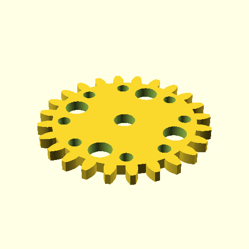

# Oobb Part Gear 3 Diameter 3 mm Depth Electronic Potentiometer 17 mm Shaft 24 Teeth Extra  

note: This is part of OOMP the Oopen Organization Method For Parts. For more details: https://github.com/oomlout/oomp_base

##  part details
  

gear 0x0x3

### name
* name: Oobb Part Gear 3 Diameter 3 mm Depth Electronic Potentiometer 17 mm Shaft 24 Teeth Extra
* name_short: Gear 3x3 Electronic Potentiometer 17 mm
### id
* oomp_id: oobb_part_gear_3_diameter_3_mm_depth_electronic_potentiometer_17_mm_shaft_24_teeth_extra
  * classification: oobb
  * type: part
  * size: gear
  * color: 
  * description_main: 3_diameter_3_mm_depth
  * description_extra: electronic_potentiometer_17_mm_shaft_24_teeth_extra
  * manufacturer: 
  * part_number: 
  * bip 39 word 2: expect photo
  * bip 39 word 3: expect photo bless
  * bip 39 word: expect photo bless beach follow sport gather alert exclude timber space adult

### other_codes
* short_code: 
* oomp_word: cow ring hamburger
* oomp_word_emoji :cow: :ring: :hamburger:
* md5_6_alpha: 2eke0
* md5_6: 3da0b8

### oomlout_oomp_utility_custom_data_manipulation
#### label print
[3x2](http://192.168.1.245:1112/?label=oomp%202eke0)
[3x2_oomp_table](http://192.168.1.108:1112/?label=oomp%202eke0)
[2x1](http://192.168.1.242:1112/?label=oomp%202eke0)
[6x4](http://192.168.1.55:1112/?label=oomp%202eke0)    

#### link

[link_main](https://github.com/oomlout/oomlout_oobb_version_4_generated_parts/tree/main/navigation_oomp/oobb/part/gear/3_diameter_3_mm_depth/electronic_potentiometer_17_mm_shaft_24_teeth_extra/part)                              

#### price

### all codes 
| key | value |  
| --- | --- |  
| classification | oobb |  
| classification_name | Oobb |  
| color |  |  
| color_name |  |  
| components | [] |  
| components_objects | [] |  
| components_string | [] |  
| description | gear 0x0x3 |  
| description_extra | electronic_potentiometer_17_mm_shaft_24_teeth_extra |  
| description_extra_name | Electronic Potentiometer 17 mm Shaft 24 Teeth Extra |  
| description_main | 3_diameter_3_mm_depth |  
| description_main_name | 3 Diameter 3 mm Depth |  
| diameter | 3 |  
| directory | parts/oobb_part_gear_3_diameter_3_mm_depth_electronic_potentiometer_17_mm_shaft_24_teeth_extra |  
| extra | 24_teeth |  
| folder | C:\gh\oomlout_oobb_version_4_generated_parts\parts\oobb_part_gear_3_diameter_3_mm_depth_electronic_potentiometer_17_mm_shaft_24_teeth_extra |  
| github_link | https://github.com/oomlout/oomlout_oomp_part_src/tree/main/parts/oobb_part_gear_3_diameter_3_mm_depth_electronic_potentiometer_17_mm_shaft_24_teeth_extra |  
| id | oobb_part_gear_3_diameter_3_mm_depth_electronic_potentiometer_17_mm_shaft_24_teeth_extra |  
| link_1 | https://github.com/oomlout/oomlout_oobb_version_4_generated_parts/tree/main/navigation_oomp/oobb/part/gear/3_diameter_3_mm_depth/electronic_potentiometer_17_mm_shaft_24_teeth_extra/part |  
| link_1_name | link_main |  
| link_main | https://github.com/oomlout/oomlout_oobb_version_4_generated_parts/tree/main/navigation_oomp/oobb/part/gear/3_diameter_3_mm_depth/electronic_potentiometer_17_mm_shaft_24_teeth_extra/part |  
| link_oomlout_label_2x1 | http://192.168.1.242:1112/?label=oomp%202eke0 |  
| link_oomlout_label_3x2 | http://192.168.1.245:1112/?label=oomp%202eke0 |  
| link_oomlout_label_3x2_oomp_table | http://192.168.1.108:1112/?label=oomp%202eke0 |  
| link_oomlout_label_6x4 | http://192.168.1.55:1112/?label=oomp%202eke0 |  
| link_redirect | https://github.com/oomlout/oomlout_oobb_version_4_generated_parts/tree/main/parts/oobb_gear_03_03_ex_24_teeth_sh_electronic_potentiometer_17_mm |  
| manufacturer |  |  
| manufacturer_name |  |  
| md5 | 3da0b88a77062c0f4aad51362f68ea82 |  
| md5_10 | 3da0b88a77 |  
| md5_5 | 3da0b |  
| md5_6 | 3da0b8 |  
| md5_6_alpha | 2eke0 |  
| name | Oobb Part Gear 3 Diameter 3 mm Depth Electronic Potentiometer 17 mm Shaft 24 Teeth Extra |  
| name_short | Gear 3x3 Electronic Potentiometer 17 mm |  
| oomlout_detail_hierarchy_1 | oobb |  
| oomlout_detail_hierarchy_2 | part |  
| oomlout_detail_hierarchy_3 | gear |  
| oomlout_detail_hierarchy_4 | 3_diameter |  
| oomlout_detail_hierarchy_5 | 3_mm_depth |  
| oomlout_detail_hierarchy_6 | electronic_potentiometer_17_mm |  
| oomlout_detail_hierarchy_7 | shaft_24_teeth_extra |  
| oomlout_oomp_utility_custom_data_manipulation | True |  
| oomp_key | oomp_oobb_part_gear_3_diameter_3_mm_depth_electronic_potentiometer_17_mm_shaft_24_teeth_extra |  
| oomp_word | cow ring hamburger |  
| oomp_word_emoji | :cow: :ring: :hamburger: |  
| oomp_word_emoji_list | [':cow:', ':ring:', ':hamburger:'] |  
| oomp_word_list | ['cow', 'ring', 'hamburger'] |  
| part_number |  |  
| part_number_name |  |  
| shaft | electronic_potentiometer_17_mm |  
| short_name |  |  
| size | gear |  
| size_name | Gear |  
| thickness | 3 |  
| thickness_mm | 3 |  
| type | part |  
| type_name | Part |  
