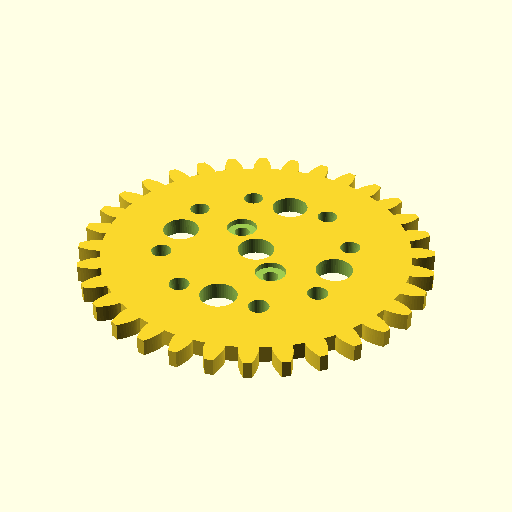

# Oobb Part Gear 4 Diameter 3 mm Depth Motor Servo Standard 01 Shaft 32 Teeth Extra  

note: This is part of OOMP the Oopen Organization Method For Parts. For more details: https://github.com/oomlout/oomp_base

##  part details
  

gear 0x0x3

### name
* name: Oobb Part Gear 4 Diameter 3 mm Depth Motor Servo Standard 01 Shaft 32 Teeth Extra
* name_short: Gear 4x3 Motor Servo Standard 01 Shaft
### id
* oomp_id: oobb_part_gear_4_diameter_3_mm_depth_motor_servo_standard_01_shaft_32_teeth_extra
  * classification: oobb
  * type: part
  * size: gear
  * color: 
  * description_main: 4_diameter_3_mm_depth
  * description_extra: motor_servo_standard_01_shaft_32_teeth_extra
  * manufacturer: 
  * part_number: 
  * bip 39 word 2: nut evil
  * bip 39 word 3: nut evil prize
  * bip 39 word: nut evil prize lobster ostrich riot cable chest border dish anchor arm

### other_codes
* short_code: 
* oomp_word: spaghetti star melon
* oomp_word_emoji :spaghetti: :star: :melon:
* md5_6_alpha: 79cy7
* md5_6: ba10cf

### oomlout_oomp_utility_custom_data_manipulation
#### label print
[3x2](http://192.168.1.245:1112/?label=oomp%2079cy7)
[3x2_oomp_table](http://192.168.1.108:1112/?label=oomp%2079cy7)
[2x1](http://192.168.1.242:1112/?label=oomp%2079cy7)
[6x4](http://192.168.1.55:1112/?label=oomp%2079cy7)    

#### link

[link_main](https://github.com/oomlout/oomlout_oobb_version_4_generated_parts/tree/main/navigation_oomp/oobb/part/gear/4_diameter_3_mm_depth/motor_servo_standard_01_shaft_32_teeth_extra/part)                              

#### price

### all codes 
| key | value |  
| --- | --- |  
| classification | oobb |  
| classification_name | Oobb |  
| color |  |  
| color_name |  |  
| components | [] |  
| components_objects | [] |  
| components_string | [] |  
| description | gear 0x0x3 |  
| description_extra | motor_servo_standard_01_shaft_32_teeth_extra |  
| description_extra_name | Motor Servo Standard 01 Shaft 32 Teeth Extra |  
| description_main | 4_diameter_3_mm_depth |  
| description_main_name | 4 Diameter 3 mm Depth |  
| diameter | 4 |  
| directory | parts/oobb_part_gear_4_diameter_3_mm_depth_motor_servo_standard_01_shaft_32_teeth_extra |  
| extra | 32_teeth |  
| folder | C:\gh\oomlout_oobb_version_4_generated_parts\parts\oobb_part_gear_4_diameter_3_mm_depth_motor_servo_standard_01_shaft_32_teeth_extra |  
| github_link | https://github.com/oomlout/oomlout_oomp_part_src/tree/main/parts/oobb_part_gear_4_diameter_3_mm_depth_motor_servo_standard_01_shaft_32_teeth_extra |  
| id | oobb_part_gear_4_diameter_3_mm_depth_motor_servo_standard_01_shaft_32_teeth_extra |  
| link_1 | https://github.com/oomlout/oomlout_oobb_version_4_generated_parts/tree/main/navigation_oomp/oobb/part/gear/4_diameter_3_mm_depth/motor_servo_standard_01_shaft_32_teeth_extra/part |  
| link_1_name | link_main |  
| link_main | https://github.com/oomlout/oomlout_oobb_version_4_generated_parts/tree/main/navigation_oomp/oobb/part/gear/4_diameter_3_mm_depth/motor_servo_standard_01_shaft_32_teeth_extra/part |  
| link_oomlout_label_2x1 | http://192.168.1.242:1112/?label=oomp%2079cy7 |  
| link_oomlout_label_3x2 | http://192.168.1.245:1112/?label=oomp%2079cy7 |  
| link_oomlout_label_3x2_oomp_table | http://192.168.1.108:1112/?label=oomp%2079cy7 |  
| link_oomlout_label_6x4 | http://192.168.1.55:1112/?label=oomp%2079cy7 |  
| link_redirect | https://github.com/oomlout/oomlout_oobb_version_4_generated_parts/tree/main/parts/oobb_gear_04_03_ex_32_teeth_sh_motor_servo_standard_01 |  
| manufacturer |  |  
| manufacturer_name |  |  
| md5 | ba10cfc8ce2783fee8ce783356937cbd |  
| md5_10 | ba10cfc8ce |  
| md5_5 | ba10c |  
| md5_6 | ba10cf |  
| md5_6_alpha | 79cy7 |  
| name | Oobb Part Gear 4 Diameter 3 mm Depth Motor Servo Standard 01 Shaft 32 Teeth Extra |  
| name_short | Gear 4x3 Motor Servo Standard 01 Shaft |  
| oomlout_detail_hierarchy_1 | oobb |  
| oomlout_detail_hierarchy_2 | part |  
| oomlout_detail_hierarchy_3 | gear |  
| oomlout_detail_hierarchy_4 | 4_diameter |  
| oomlout_detail_hierarchy_5 | 3_mm_depth |  
| oomlout_detail_hierarchy_6 | motor_servo_standard_01 |  
| oomlout_detail_hierarchy_7 | shaft_32_teeth_extra |  
| oomlout_oomp_utility_custom_data_manipulation | True |  
| oomp_key | oomp_oobb_part_gear_4_diameter_3_mm_depth_motor_servo_standard_01_shaft_32_teeth_extra |  
| oomp_word | spaghetti star melon |  
| oomp_word_emoji | :spaghetti: :star: :melon: |  
| oomp_word_emoji_list | [':spaghetti:', ':star:', ':melon:'] |  
| oomp_word_list | ['spaghetti', 'star', 'melon'] |  
| part_number |  |  
| part_number_name |  |  
| shaft | motor_servo_standard_01 |  
| short_name |  |  
| size | gear |  
| size_name | Gear |  
| thickness | 3 |  
| thickness_mm | 3 |  
| type | part |  
| type_name | Part |  
