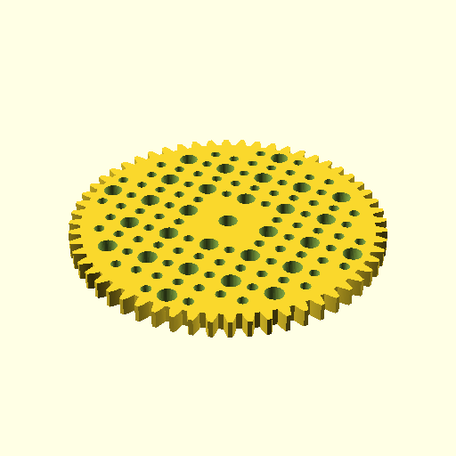

# Oobb Part Gear 7 Diameter 6 mm Depth 56 Teeth Extra  

note: This is part of OOMP the Oopen Organization Method For Parts. For more details: https://github.com/oomlout/oomp_base

##  part details
  

gear 0x0x6

### name
* name: Oobb Part Gear 7 Diameter 6 mm Depth 56 Teeth Extra
* name_short: Gear 7x6 56 Teeth Extra
### id
* oomp_id: oobb_part_gear_7_diameter_6_mm_depth_56_teeth_extra
  * classification: oobb
  * type: part
  * size: gear
  * color: 
  * description_main: 7_diameter_6_mm_depth
  * description_extra: 56_teeth_extra
  * manufacturer: 
  * part_number: 
  * bip 39 word 2: solar plug
  * bip 39 word 3: solar plug hand
  * bip 39 word: solar plug hand cool decorate length minor purpose security rack cake agent

### other_codes
* short_code: 
* oomp_word: honeybee racehorse shirt
* oomp_word_emoji :honeybee: :racehorse: :shirt:
* md5_6_alpha: 31x2k
* md5_6: 4e40ac

### oomlout_oomp_utility_custom_data_manipulation
#### label print
[3x2](http://192.168.1.245:1112/?label=oomp%2031x2k)
[3x2_oomp_table](http://192.168.1.108:1112/?label=oomp%2031x2k)
[2x1](http://192.168.1.242:1112/?label=oomp%2031x2k)
[6x4](http://192.168.1.55:1112/?label=oomp%2031x2k)    

#### link

[link_main](https://github.com/oomlout/oomlout_oobb_version_4_generated_parts/tree/main/navigation_oomp/oobb/part/gear/7_diameter_6_mm_depth/56_teeth_extra/part)                              

#### price

### all codes 
| key | value |  
| --- | --- |  
| classification | oobb |  
| classification_name | Oobb |  
| color |  |  
| color_name |  |  
| components | [] |  
| components_objects | [] |  
| components_string | [] |  
| description | gear 0x0x6 |  
| description_extra | 56_teeth_extra |  
| description_extra_name | 56 Teeth Extra |  
| description_main | 7_diameter_6_mm_depth |  
| description_main_name | 7 Diameter 6 mm Depth |  
| diameter | 7 |  
| directory | parts/oobb_part_gear_7_diameter_6_mm_depth_56_teeth_extra |  
| extra | 56_teeth |  
| folder | C:\gh\oomlout_oobb_version_4_generated_parts\parts\oobb_part_gear_7_diameter_6_mm_depth_56_teeth_extra |  
| github_link | https://github.com/oomlout/oomlout_oomp_part_src/tree/main/parts/oobb_part_gear_7_diameter_6_mm_depth_56_teeth_extra |  
| id | oobb_part_gear_7_diameter_6_mm_depth_56_teeth_extra |  
| link_1 | https://github.com/oomlout/oomlout_oobb_version_4_generated_parts/tree/main/navigation_oomp/oobb/part/gear/7_diameter_6_mm_depth/56_teeth_extra/part |  
| link_1_name | link_main |  
| link_main | https://github.com/oomlout/oomlout_oobb_version_4_generated_parts/tree/main/navigation_oomp/oobb/part/gear/7_diameter_6_mm_depth/56_teeth_extra/part |  
| link_oomlout_label_2x1 | http://192.168.1.242:1112/?label=oomp%2031x2k |  
| link_oomlout_label_3x2 | http://192.168.1.245:1112/?label=oomp%2031x2k |  
| link_oomlout_label_3x2_oomp_table | http://192.168.1.108:1112/?label=oomp%2031x2k |  
| link_oomlout_label_6x4 | http://192.168.1.55:1112/?label=oomp%2031x2k |  
| link_redirect | https://github.com/oomlout/oomlout_oobb_version_4_generated_parts/tree/main/parts/oobb_gear_07_06_ex_56_teeth |  
| manufacturer |  |  
| manufacturer_name |  |  
| md5 | 4e40ac2616ae71a6001c82fcd1a9b673 |  
| md5_10 | 4e40ac2616 |  
| md5_5 | 4e40a |  
| md5_6 | 4e40ac |  
| md5_6_alpha | 31x2k |  
| name | Oobb Part Gear 7 Diameter 6 mm Depth 56 Teeth Extra |  
| name_short | Gear 7x6 56 Teeth Extra |  
| oomlout_detail_hierarchy_1 | oobb |  
| oomlout_detail_hierarchy_2 | part |  
| oomlout_detail_hierarchy_3 | gear |  
| oomlout_detail_hierarchy_4 | 7_diameter |  
| oomlout_detail_hierarchy_5 | 6_mm_depth |  
| oomlout_detail_hierarchy_6 | 56_teeth_extra |  
| oomlout_oomp_utility_custom_data_manipulation | True |  
| oomp_key | oomp_oobb_part_gear_7_diameter_6_mm_depth_56_teeth_extra |  
| oomp_word | honeybee racehorse shirt |  
| oomp_word_emoji | :honeybee: :racehorse: :shirt: |  
| oomp_word_emoji_list | [':honeybee:', ':racehorse:', ':shirt:'] |  
| oomp_word_list | ['honeybee', 'racehorse', 'shirt'] |  
| part_number |  |  
| part_number_name |  |  
| shaft |  |  
| short_name |  |  
| size | gear |  
| size_name | Gear |  
| thickness | 6 |  
| thickness_mm | 6 |  
| type | part |  
| type_name | Part |  
