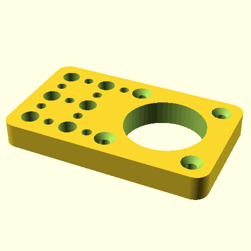

# Oobb Part Holder 5 Width 3 Height 9 mm Depth Motor Stepper Nema 17 Flat Shifted Extra  

note: This is part of OOMP the Oopen Organization Method For Parts. For more details: https://github.com/oomlout/oomp_base

##  part details
  

holder 5x3x9

### name
* name: Oobb Part Holder 5 Width 3 Height 9 mm Depth Motor Stepper Nema 17 Flat Shifted Extra
* name_short: Holder 5x3x9 Motor Stepper Nema 17 Flat
### id
* oomp_id: oobb_part_holder_5_width_3_height_9_mm_depth_motor_stepper_nema_17_flat_shifted_extra
  * classification: oobb
  * type: part
  * size: holder
  * color: 
  * description_main: 5_width_3_height_9_mm_depth
  * description_extra: motor_stepper_nema_17_flat_shifted_extra
  * manufacturer: 
  * part_number: 
  * bip 39 word 2: core require
  * bip 39 word 3: core require miracle
  * bip 39 word: core require miracle narrow solve knife color arch omit casino faculty actor

### other_codes
* short_code: 
* oomp_word: umbrella pencil hatched_chick
* oomp_word_emoji :umbrella: :pencil: :hatched_chick:
* md5_6_alpha: 1nw3s
* md5_6: 2aa348

### oomlout_oomp_utility_custom_data_manipulation
#### label print
[3x2](http://192.168.1.245:1112/?label=oomp%201nw3s)
[3x2_oomp_table](http://192.168.1.108:1112/?label=oomp%201nw3s)
[2x1](http://192.168.1.242:1112/?label=oomp%201nw3s)
[6x4](http://192.168.1.55:1112/?label=oomp%201nw3s)    

#### link

[link_main](https://github.com/oomlout/oomlout_oobb_version_4_generated_parts/tree/main/navigation_oomp/oobb/part/holder/5_width_3_height_9_mm_depth/motor_stepper_nema_17_flat_shifted_extra/part)                              

#### price

### all codes 
| key | value |  
| --- | --- |  
| classification | oobb |  
| classification_name | Oobb |  
| color |  |  
| color_name |  |  
| components | [] |  
| components_objects | [] |  
| components_string | [] |  
| description | holder 5x3x9 |  
| description_extra | motor_stepper_nema_17_flat_shifted_extra |  
| description_extra_name | Motor Stepper Nema 17 Flat Shifted Extra |  
| description_main | 5_width_3_height_9_mm_depth |  
| description_main_name | 5 Width 3 Height 9 mm Depth |  
| directory | parts/oobb_part_holder_5_width_3_height_9_mm_depth_motor_stepper_nema_17_flat_shifted_extra |  
| extra | motor_stepper_nema_17_flat_shifted |  
| folder | C:\gh\oomlout_oobb_version_4_generated_parts\parts\oobb_part_holder_5_width_3_height_9_mm_depth_motor_stepper_nema_17_flat_shifted_extra |  
| github_link | https://github.com/oomlout/oomlout_oomp_part_src/tree/main/parts/oobb_part_holder_5_width_3_height_9_mm_depth_motor_stepper_nema_17_flat_shifted_extra |  
| height | 3 |  
| height_mm | 44 |  
| id | oobb_part_holder_5_width_3_height_9_mm_depth_motor_stepper_nema_17_flat_shifted_extra |  
| link_1 | https://github.com/oomlout/oomlout_oobb_version_4_generated_parts/tree/main/navigation_oomp/oobb/part/holder/5_width_3_height_9_mm_depth/motor_stepper_nema_17_flat_shifted_extra/part |  
| link_1_name | link_main |  
| link_main | https://github.com/oomlout/oomlout_oobb_version_4_generated_parts/tree/main/navigation_oomp/oobb/part/holder/5_width_3_height_9_mm_depth/motor_stepper_nema_17_flat_shifted_extra/part |  
| link_oomlout_label_2x1 | http://192.168.1.242:1112/?label=oomp%201nw3s |  
| link_oomlout_label_3x2 | http://192.168.1.245:1112/?label=oomp%201nw3s |  
| link_oomlout_label_3x2_oomp_table | http://192.168.1.108:1112/?label=oomp%201nw3s |  
| link_oomlout_label_6x4 | http://192.168.1.55:1112/?label=oomp%201nw3s |  
| link_redirect | https://github.com/oomlout/oomlout_oobb_version_4_generated_parts/tree/main/parts/oobb_holder_05_03_09_ex_motor_stepper_nema_17_flat_shifted |  
| manufacturer |  |  
| manufacturer_name |  |  
| md5 | 2aa348dcd30b05b5eee779311aedc182 |  
| md5_10 | 2aa348dcd3 |  
| md5_5 | 2aa34 |  
| md5_6 | 2aa348 |  
| md5_6_alpha | 1nw3s |  
| name | Oobb Part Holder 5 Width 3 Height 9 mm Depth Motor Stepper Nema 17 Flat Shifted Extra |  
| name_short | Holder 5x3x9 Motor Stepper Nema 17 Flat |  
| oomlout_detail_hierarchy_1 | oobb |  
| oomlout_detail_hierarchy_2 | part |  
| oomlout_detail_hierarchy_3 | holder |  
| oomlout_detail_hierarchy_4 | 9_mm_depth |  
| oomlout_detail_hierarchy_5 | motor_stepper_nema_17 |  
| oomlout_detail_hierarchy_6 | flat_shifted_extra |  
| oomlout_oomp_utility_custom_data_manipulation | True |  
| oomp_key | oomp_oobb_part_holder_5_width_3_height_9_mm_depth_motor_stepper_nema_17_flat_shifted_extra |  
| oomp_word | umbrella pencil hatched_chick |  
| oomp_word_emoji | :umbrella: :pencil: :hatched_chick: |  
| oomp_word_emoji_list | [':umbrella:', ':pencil:', ':hatched_chick:'] |  
| oomp_word_list | ['umbrella', 'pencil', 'hatched_chick'] |  
| part_number |  |  
| part_number_name |  |  
| short_name |  |  
| size | holder |  
| size_name | Holder |  
| thickness | 9 |  
| thickness_mm | 9 |  
| type | part |  
| type_name | Part |  
| width | 5 |  
| width_mm | 74 |  
