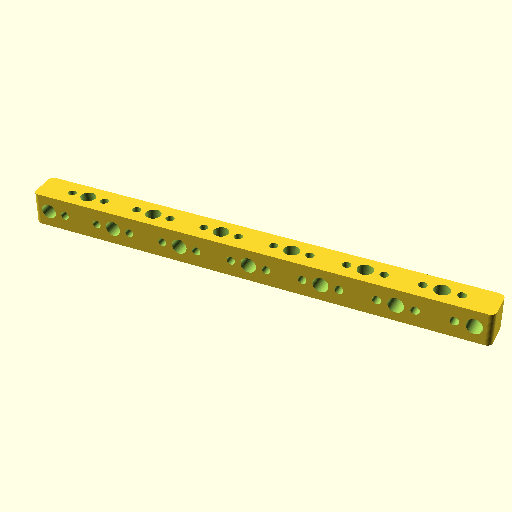

# Oobb Part Plate 13 Width 1 Height 14 mm Depth Ninety Degree Extra  

note: This is part of OOMP the Oopen Organization Method For Parts. For more details: https://github.com/oomlout/oomp_base

##  part details
  

plate 13x1x14

### name
* name: Oobb Part Plate 13 Width 1 Height 14 mm Depth Ninety Degree Extra
* name_short: Plate 13x1x14 Ninety Degree Extra
### id
* oomp_id: oobb_part_plate_13_width_1_height_14_mm_depth_ninety_degree_extra
  * classification: oobb
  * type: part
  * size: plate
  * color: 
  * description_main: 13_width_1_height_14_mm_depth
  * description_extra: ninety_degree_extra
  * manufacturer: 
  * part_number: 
  * bip 39 word 2: alone avocado
  * bip 39 word 3: alone avocado cruise
  * bip 39 word: alone avocado cruise remove whisper buzz drift fox hat napkin episode abstract

### other_codes
* short_code: 
* oomp_word: cupid baseball anchor
* oomp_word_emoji :cupid: :baseball: :anchor:
* md5_6_alpha: khyc
* md5_6: 0e97e4

### oomlout_oomp_utility_custom_data_manipulation
#### label print
[3x2](http://192.168.1.245:1112/?label=oomp%20khyc)
[3x2_oomp_table](http://192.168.1.108:1112/?label=oomp%20khyc)
[2x1](http://192.168.1.242:1112/?label=oomp%20khyc)
[6x4](http://192.168.1.55:1112/?label=oomp%20khyc)    

#### link

[link_main](https://github.com/oomlout/oomlout_oobb_version_4_generated_parts/tree/main/navigation_oomp/oobb/part/plate/13_width_1_height_14_mm_depth/ninety_degree_extra/part)                              

#### price

### all codes 
| key | value |  
| --- | --- |  
| classification | oobb |  
| classification_name | Oobb |  
| color |  |  
| color_name |  |  
| components | [] |  
| components_objects | [] |  
| components_string | [] |  
| description | plate 13x1x14 |  
| description_extra | ninety_degree_extra |  
| description_extra_name | Ninety Degree Extra |  
| description_main | 13_width_1_height_14_mm_depth |  
| description_main_name | 13 Width 1 Height 14 mm Depth |  
| directory | parts/oobb_part_plate_13_width_1_height_14_mm_depth_ninety_degree_extra |  
| extra | ninety_degree |  
| folder | C:\gh\oomlout_oobb_version_4_generated_parts\parts\oobb_part_plate_13_width_1_height_14_mm_depth_ninety_degree_extra |  
| github_link | https://github.com/oomlout/oomlout_oomp_part_src/tree/main/parts/oobb_part_plate_13_width_1_height_14_mm_depth_ninety_degree_extra |  
| height | 1 |  
| height_mm | 14 |  
| id | oobb_part_plate_13_width_1_height_14_mm_depth_ninety_degree_extra |  
| link_1 | https://github.com/oomlout/oomlout_oobb_version_4_generated_parts/tree/main/navigation_oomp/oobb/part/plate/13_width_1_height_14_mm_depth/ninety_degree_extra/part |  
| link_1_name | link_main |  
| link_main | https://github.com/oomlout/oomlout_oobb_version_4_generated_parts/tree/main/navigation_oomp/oobb/part/plate/13_width_1_height_14_mm_depth/ninety_degree_extra/part |  
| link_oomlout_label_2x1 | http://192.168.1.242:1112/?label=oomp%20khyc |  
| link_oomlout_label_3x2 | http://192.168.1.245:1112/?label=oomp%20khyc |  
| link_oomlout_label_3x2_oomp_table | http://192.168.1.108:1112/?label=oomp%20khyc |  
| link_oomlout_label_6x4 | http://192.168.1.55:1112/?label=oomp%20khyc |  
| link_redirect | https://github.com/oomlout/oomlout_oobb_version_4_generated_parts/tree/main/parts/oobb_plate_13_01_14_ex_ninety_degree |  
| manufacturer |  |  
| manufacturer_name |  |  
| md5 | 0e97e4bb4c5c48587e7d4b5e6943f837 |  
| md5_10 | 0e97e4bb4c |  
| md5_5 | 0e97e |  
| md5_6 | 0e97e4 |  
| md5_6_alpha | khyc |  
| name | Oobb Part Plate 13 Width 1 Height 14 mm Depth Ninety Degree Extra |  
| name_short | Plate 13x1x14 Ninety Degree Extra |  
| oomlout_detail_hierarchy_1 | oobb |  
| oomlout_detail_hierarchy_2 | part |  
| oomlout_detail_hierarchy_3 | plate |  
| oomlout_detail_hierarchy_4 | 14_mm_depth |  
| oomlout_detail_hierarchy_5 | ninety_degree_extra |  
| oomlout_oomp_utility_custom_data_manipulation | True |  
| oomp_key | oomp_oobb_part_plate_13_width_1_height_14_mm_depth_ninety_degree_extra |  
| oomp_word | cupid baseball anchor |  
| oomp_word_emoji | :cupid: :baseball: :anchor: |  
| oomp_word_emoji_list | [':cupid:', ':baseball:', ':anchor:'] |  
| oomp_word_list | ['cupid', 'baseball', 'anchor'] |  
| part_number |  |  
| part_number_name |  |  
| short_name |  |  
| size | plate |  
| size_name | Plate |  
| thickness | 14 |  
| thickness_mm | 14 |  
| type | part |  
| type_name | Part |  
| width | 13 |  
| width_mm | 194 |  
