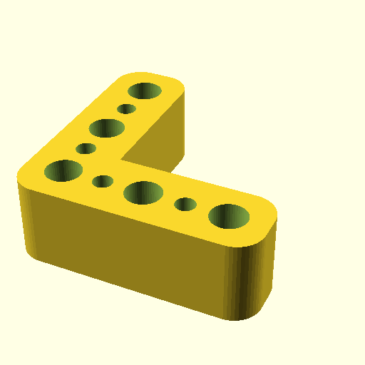

# Oobb Part Plate 3 Width 3 Height 15 mm Depth L Extra  

note: This is part of OOMP the Oopen Organization Method For Parts. For more details: https://github.com/oomlout/oomp_base

##  part details
  

plate 3x3x15

### name
* name: Oobb Part Plate 3 Width 3 Height 15 mm Depth L Extra
* name_short: Plate 3x3x15 L Extra
### id
* oomp_id: oobb_part_plate_3_width_3_height_15_mm_depth_l_extra
  * classification: oobb
  * type: part
  * size: plate
  * color: 
  * description_main: 3_width_3_height_15_mm_depth
  * description_extra: l_extra
  * manufacturer: 
  * part_number: 
  * bip 39 word 2: pencil dish
  * bip 39 word 3: pencil dish void
  * bip 39 word: pencil dish void olive since hobby parade vast wife dwarf legal area

### other_codes
* short_code: 
* oomp_word: coffee recycle pear
* oomp_word_emoji :coffee: :recycle: :pear:
* md5_6_alpha: 728k1
* md5_6: b4fed1

### oomlout_oomp_utility_custom_data_manipulation
#### label print
[3x2](http://192.168.1.245:1112/?label=oomp%20728k1)
[3x2_oomp_table](http://192.168.1.108:1112/?label=oomp%20728k1)
[2x1](http://192.168.1.242:1112/?label=oomp%20728k1)
[6x4](http://192.168.1.55:1112/?label=oomp%20728k1)    

#### link

[link_main](https://github.com/oomlout/oomlout_oobb_version_4_generated_parts/tree/main/navigation_oomp/oobb/part/plate/3_width_3_height_15_mm_depth/l_extra/part)                              

#### price

### all codes 
| key | value |  
| --- | --- |  
| classification | oobb |  
| classification_name | Oobb |  
| color |  |  
| color_name |  |  
| components | [] |  
| components_objects | [] |  
| components_string | [] |  
| description | plate 3x3x15 |  
| description_extra | l_extra |  
| description_extra_name | L Extra |  
| description_main | 3_width_3_height_15_mm_depth |  
| description_main_name | 3 Width 3 Height 15 mm Depth |  
| directory | parts/oobb_part_plate_3_width_3_height_15_mm_depth_l_extra |  
| extra | l |  
| folder | C:\gh\oomlout_oobb_version_4_generated_parts\parts\oobb_part_plate_3_width_3_height_15_mm_depth_l_extra |  
| github_link | https://github.com/oomlout/oomlout_oomp_part_src/tree/main/parts/oobb_part_plate_3_width_3_height_15_mm_depth_l_extra |  
| height | 3 |  
| height_mm | 44 |  
| id | oobb_part_plate_3_width_3_height_15_mm_depth_l_extra |  
| link_1 | https://github.com/oomlout/oomlout_oobb_version_4_generated_parts/tree/main/navigation_oomp/oobb/part/plate/3_width_3_height_15_mm_depth/l_extra/part |  
| link_1_name | link_main |  
| link_main | https://github.com/oomlout/oomlout_oobb_version_4_generated_parts/tree/main/navigation_oomp/oobb/part/plate/3_width_3_height_15_mm_depth/l_extra/part |  
| link_oomlout_label_2x1 | http://192.168.1.242:1112/?label=oomp%20728k1 |  
| link_oomlout_label_3x2 | http://192.168.1.245:1112/?label=oomp%20728k1 |  
| link_oomlout_label_3x2_oomp_table | http://192.168.1.108:1112/?label=oomp%20728k1 |  
| link_oomlout_label_6x4 | http://192.168.1.55:1112/?label=oomp%20728k1 |  
| link_redirect | https://github.com/oomlout/oomlout_oobb_version_4_generated_parts/tree/main/parts/_plate_03_03_15_ex_l |  
| manufacturer |  |  
| manufacturer_name |  |  
| md5 | b4fed12fd7f1b401b16499a3eb0fcd15 |  
| md5_10 | b4fed12fd7 |  
| md5_5 | b4fed |  
| md5_6 | b4fed1 |  
| md5_6_alpha | 728k1 |  
| name | Oobb Part Plate 3 Width 3 Height 15 mm Depth L Extra |  
| name_short | Plate 3x3x15 L Extra |  
| oomlout_detail_hierarchy_1 | oobb |  
| oomlout_detail_hierarchy_2 | part |  
| oomlout_detail_hierarchy_3 | plate |  
| oomlout_detail_hierarchy_4 | 15_mm_depth |  
| oomlout_detail_hierarchy_5 | l_extra |  
| oomlout_oomp_utility_custom_data_manipulation | True |  
| oomp_key | oomp_oobb_part_plate_3_width_3_height_15_mm_depth_l_extra |  
| oomp_word | coffee recycle pear |  
| oomp_word_emoji | :coffee: :recycle: :pear: |  
| oomp_word_emoji_list | [':coffee:', ':recycle:', ':pear:'] |  
| oomp_word_list | ['coffee', 'recycle', 'pear'] |  
| part_number |  |  
| part_number_name |  |  
| short_name |  |  
| size | plate |  
| size_name | Plate |  
| thickness | 15 |  
| thickness_mm | 15 |  
| type | part |  
| type_name | Part |  
| width | 3 |  
| width_mm | 44 |  
