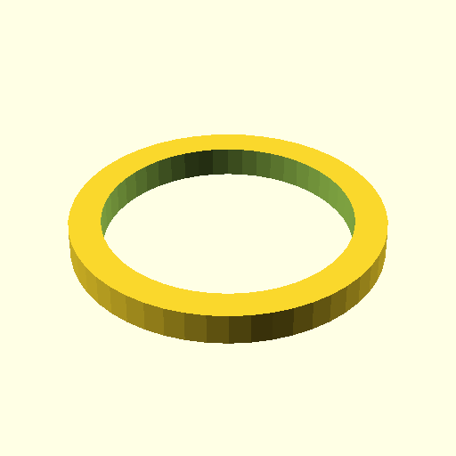

# Oobb Part Bearing 6816 Bearing Name  

note: This is part of OOMP the Oopen Organization Method For Parts. For more details: https://github.com/oomlout/oomp_base

##  part details
  

bearing 0x0x0

### name
* name: Oobb Part Bearing 6816 Bearing Name
* name_short: Bearing 6816 Bearing Name
### id
* oomp_id: oobb_part_bearing_6816_bearing_name
  * classification: oobb
  * type: part
  * size: bearing
  * color: 
  * description_main: 
  * description_extra: 6816_bearing_name
  * manufacturer: 
  * part_number: 
  * bip 39 word 2: regret absent
  * bip 39 word 3: regret absent bundle
  * bip 39 word: regret absent bundle twenty tree subway pattern believe squeeze fuel globe aim

### other_codes
* short_code: 
* oomp_word: whale lollipop baseball
* oomp_word_emoji :whale: :lollipop: :baseball:
* md5_6_alpha: 3b2xj
* md5_6: 54c697

### oomlout_oomp_utility_custom_data_manipulation
#### label print
[3x2](http://192.168.1.245:1112/?label=oomp%203b2xj)
[3x2_oomp_table](http://192.168.1.108:1112/?label=oomp%203b2xj)
[2x1](http://192.168.1.242:1112/?label=oomp%203b2xj)
[6x4](http://192.168.1.55:1112/?label=oomp%203b2xj)    

#### link

[link_main](https://github.com/oomlout/oomlout_oobb_version_4_generated_parts/tree/main/navigation_oomp/oobb/part/bearing//6816_bearing_name/part)                              

#### price

### all codes 
| key | value |  
| --- | --- |  
| bearing_name | 6816 |  
| classification | oobb |  
| classification_name | Oobb |  
| color |  |  
| color_name |  |  
| components | [] |  
| components_objects | [] |  
| components_string | [] |  
| description | bearing 0x0x0 |  
| description_extra | 6816_bearing_name |  
| description_extra_name | 6816 Bearing Name |  
| description_main |  |  
| description_main_name |  |  
| directory | parts/oobb_part_bearing_6816_bearing_name |  
| folder | C:\gh\oomlout_oobb_version_4_generated_parts\parts\oobb_part_bearing_6816_bearing_name |  
| github_link | https://github.com/oomlout/oomlout_oomp_part_src/tree/main/parts/oobb_part_bearing_6816_bearing_name |  
| id | oobb_part_bearing_6816_bearing_name |  
| link_1 | https://github.com/oomlout/oomlout_oobb_version_4_generated_parts/tree/main/navigation_oomp/oobb/part/bearing//6816_bearing_name/part |  
| link_1_name | link_main |  
| link_main | https://github.com/oomlout/oomlout_oobb_version_4_generated_parts/tree/main/navigation_oomp/oobb/part/bearing//6816_bearing_name/part |  
| link_oomlout_label_2x1 | http://192.168.1.242:1112/?label=oomp%203b2xj |  
| link_oomlout_label_3x2 | http://192.168.1.245:1112/?label=oomp%203b2xj |  
| link_oomlout_label_3x2_oomp_table | http://192.168.1.108:1112/?label=oomp%203b2xj |  
| link_oomlout_label_6x4 | http://192.168.1.55:1112/?label=oomp%203b2xj |  
| link_redirect | https://github.com/oomlout/oomlout_oobb_version_4_generated_parts/tree/main/parts/hardware_bearing_6816 |  
| manufacturer |  |  
| manufacturer_name |  |  
| md5 | 54c6977e9c14b42b60f3feb23c802da5 |  
| md5_10 | 54c6977e9c |  
| md5_5 | 54c69 |  
| md5_6 | 54c697 |  
| md5_6_alpha | 3b2xj |  
| name | Oobb Part Bearing 6816 Bearing Name |  
| name_short | Bearing 6816 Bearing Name |  
| oomlout_detail_hierarchy_1 | oobb |  
| oomlout_detail_hierarchy_2 | part |  
| oomlout_detail_hierarchy_3 | bearing |  
| oomlout_detail_hierarchy_4 | 6816_bearing_name |  
| oomlout_oomp_utility_custom_data_manipulation | True |  
| oomp_key | oomp_oobb_part_bearing_6816_bearing_name |  
| oomp_word | whale lollipop baseball |  
| oomp_word_emoji | :whale: :lollipop: :baseball: |  
| oomp_word_emoji_list | [':whale:', ':lollipop:', ':baseball:'] |  
| oomp_word_list | ['whale', 'lollipop', 'baseball'] |  
| part_number |  |  
| part_number_name |  |  
| short_name |  |  
| size | bearing |  
| size_name | Bearing |  
| type | part |  
| type_name | Part |  
