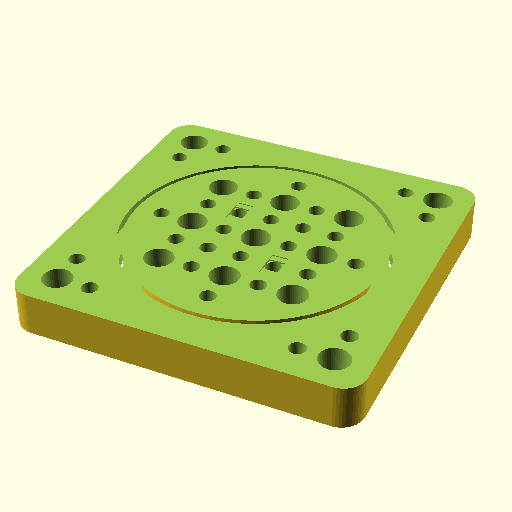

# Oobb Part Bearing Plate 5 Width 5 Height 12 mm Depth 6810 Bearing Three Quarter Extra  

note: This is part of OOMP the Oopen Organization Method For Parts. For more details: https://github.com/oomlout/oomp_base

##  part details
  

bearing plate 5x5x12

### name
* name: Oobb Part Bearing Plate 5 Width 5 Height 12 mm Depth 6810 Bearing Three Quarter Extra
* name_short: Bearing Plate 5x5x12 6810 Bearing Three
### id
* oomp_id: oobb_part_bearing_plate_5_width_5_height_12_mm_depth_6810_bearing_three_quarter_extra
  * classification: oobb
  * type: part
  * size: bearing_plate
  * color: 
  * description_main: 5_width_5_height_12_mm_depth
  * description_extra: 6810_bearing_three_quarter_extra
  * manufacturer: 
  * part_number: 
  * bip 39 word 2: bring danger
  * bip 39 word 3: bring danger candy
  * bip 39 word: bring danger candy test rural mix weird inmate minor bean copy aim

### other_codes
* short_code: 
* oomp_word: whale poodle wink
* oomp_word_emoji :whale: :poodle: :wink:
* md5_6_alpha: 3aio4
* md5_6: 546004

### oomlout_oomp_utility_custom_data_manipulation
#### label print
[3x2](http://192.168.1.245:1112/?label=oomp%203aio4)
[3x2_oomp_table](http://192.168.1.108:1112/?label=oomp%203aio4)
[2x1](http://192.168.1.242:1112/?label=oomp%203aio4)
[6x4](http://192.168.1.55:1112/?label=oomp%203aio4)    

#### link

[link_main](https://github.com/oomlout/oomlout_oobb_version_4_generated_parts/tree/main/navigation_oomp/oobb/part/bearing_plate/5_width_5_height_12_mm_depth/6810_bearing_three_quarter_extra/part)                              

#### price

### all codes 
| key | value |  
| --- | --- |  
| bearing | 6810 |  
| classification | oobb |  
| classification_name | Oobb |  
| color |  |  
| color_name |  |  
| components | [] |  
| components_objects | [] |  
| components_string | [] |  
| description | bearing plate 5x5x12 |  
| description_extra | 6810_bearing_three_quarter_extra |  
| description_extra_name | 6810 Bearing Three Quarter Extra |  
| description_main | 5_width_5_height_12_mm_depth |  
| description_main_name | 5 Width 5 Height 12 mm Depth |  
| directory | parts/oobb_part_bearing_plate_5_width_5_height_12_mm_depth_6810_bearing_three_quarter_extra |  
| extra | three_quarter |  
| folder | C:\gh\oomlout_oobb_version_4_generated_parts\parts\oobb_part_bearing_plate_5_width_5_height_12_mm_depth_6810_bearing_three_quarter_extra |  
| github_link | https://github.com/oomlout/oomlout_oomp_part_src/tree/main/parts/oobb_part_bearing_plate_5_width_5_height_12_mm_depth_6810_bearing_three_quarter_extra |  
| height | 5 |  
| height_mm | 74 |  
| id | oobb_part_bearing_plate_5_width_5_height_12_mm_depth_6810_bearing_three_quarter_extra |  
| link_1 | https://github.com/oomlout/oomlout_oobb_version_4_generated_parts/tree/main/navigation_oomp/oobb/part/bearing_plate/5_width_5_height_12_mm_depth/6810_bearing_three_quarter_extra/part |  
| link_1_name | link_main |  
| link_main | https://github.com/oomlout/oomlout_oobb_version_4_generated_parts/tree/main/navigation_oomp/oobb/part/bearing_plate/5_width_5_height_12_mm_depth/6810_bearing_three_quarter_extra/part |  
| link_oomlout_label_2x1 | http://192.168.1.242:1112/?label=oomp%203aio4 |  
| link_oomlout_label_3x2 | http://192.168.1.245:1112/?label=oomp%203aio4 |  
| link_oomlout_label_3x2_oomp_table | http://192.168.1.108:1112/?label=oomp%203aio4 |  
| link_oomlout_label_6x4 | http://192.168.1.55:1112/?label=oomp%203aio4 |  
| link_redirect | https://github.com/oomlout/oomlout_oobb_version_4_generated_parts/tree/main/parts/oobb_bearing_plate_05_05_12_6810_ex_three_quarter |  
| manufacturer |  |  
| manufacturer_name |  |  
| md5 | 546004e469745f26385ecdf8428dd8e1 |  
| md5_10 | 546004e469 |  
| md5_5 | 54600 |  
| md5_6 | 546004 |  
| md5_6_alpha | 3aio4 |  
| name | Oobb Part Bearing Plate 5 Width 5 Height 12 mm Depth 6810 Bearing Three Quarter Extra |  
| name_short | Bearing Plate 5x5x12 6810 Bearing Three |  
| oomlout_detail_hierarchy_1 | oobb |  
| oomlout_detail_hierarchy_2 | part |  
| oomlout_detail_hierarchy_3 | bearing_plate |  
| oomlout_detail_hierarchy_4 | 12_mm_depth |  
| oomlout_detail_hierarchy_5 | 6810_bearing_three_quarter_extra |  
| oomlout_oomp_utility_custom_data_manipulation | True |  
| oomp_key | oomp_oobb_part_bearing_plate_5_width_5_height_12_mm_depth_6810_bearing_three_quarter_extra |  
| oomp_word | whale poodle wink |  
| oomp_word_emoji | :whale: :poodle: :wink: |  
| oomp_word_emoji_list | [':whale:', ':poodle:', ':wink:'] |  
| oomp_word_list | ['whale', 'poodle', 'wink'] |  
| part_number |  |  
| part_number_name |  |  
| short_name |  |  
| size | bearing_plate |  
| size_name | Bearing Plate |  
| thickness | 12 |  
| thickness_mm | 12 |  
| type | part |  
| type_name | Part |  
| width | 5 |  
| width_mm | 74 |  
