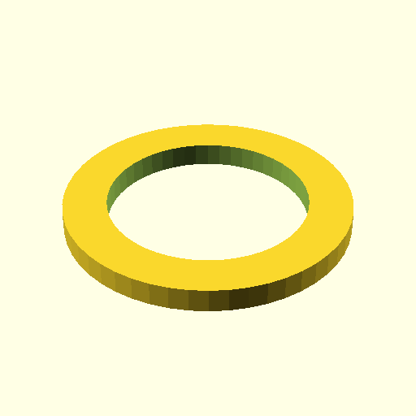

# Oobb Part Bearing Plate Shim 2 mm Depth 6704 Bearing  

note: This is part of OOMP the Oopen Organization Method For Parts. For more details: https://github.com/oomlout/oomp_base

##  part details
  

bearing plate shim 0x0x2

### name
* name: Oobb Part Bearing Plate Shim 2 mm Depth 6704 Bearing
* name_short: Bearing Plate Shim 2 6704 Bearing
### id
* oomp_id: oobb_part_bearing_plate_shim_2_mm_depth_6704_bearing
  * classification: oobb
  * type: part
  * size: bearing_plate_shim
  * color: 
  * description_main: 2_mm_depth
  * description_extra: 6704_bearing
  * manufacturer: 
  * part_number: 
  * bip 39 word 2: crawl assist
  * bip 39 word 3: crawl assist refuse
  * bip 39 word: crawl assist refuse warfare wagon sting comfort chair nest fresh zoo amount

### other_codes
* short_code: 
* oomp_word: watch trident office
* oomp_word_emoji :watch: :trident: :office:
* md5_6_alpha: 52lsn
* md5_6: 81ffd7

### oomlout_oomp_utility_custom_data_manipulation
#### label print
[3x2](http://192.168.1.245:1112/?label=oomp%2052lsn)
[3x2_oomp_table](http://192.168.1.108:1112/?label=oomp%2052lsn)
[2x1](http://192.168.1.242:1112/?label=oomp%2052lsn)
[6x4](http://192.168.1.55:1112/?label=oomp%2052lsn)    

#### link

                              

#### price

### all codes 
| key | value |  
| --- | --- |  
| bearing | 6704 |  
| classification | oobb |  
| classification_name | Oobb |  
| color |  |  
| color_name |  |  
| components | [] |  
| components_objects | [] |  
| components_string | [] |  
| description | bearing plate shim 0x0x2 |  
| description_extra | 6704_bearing |  
| description_extra_name | 6704 Bearing |  
| description_main | 2_mm_depth |  
| description_main_name | 2 mm Depth |  
| directory | parts/oobb_part_bearing_plate_shim_2_mm_depth_6704_bearing |  
| folder | C:\gh\oomlout_oobb_version_4_generated_parts\parts\oobb_part_bearing_plate_shim_2_mm_depth_6704_bearing |  
| github_link | https://github.com/oomlout/oomlout_oomp_part_src/tree/main/parts/oobb_part_bearing_plate_shim_2_mm_depth_6704_bearing |  
| id | oobb_part_bearing_plate_shim_2_mm_depth_6704_bearing |  
| link_oomlout_label_2x1 | http://192.168.1.242:1112/?label=oomp%2052lsn |  
| link_oomlout_label_3x2 | http://192.168.1.245:1112/?label=oomp%2052lsn |  
| link_oomlout_label_3x2_oomp_table | http://192.168.1.108:1112/?label=oomp%2052lsn |  
| link_oomlout_label_6x4 | http://192.168.1.55:1112/?label=oomp%2052lsn |  
| manufacturer |  |  
| manufacturer_name |  |  
| md5 | 81ffd734a425c5c757fb2f7168c37195 |  
| md5_10 | 81ffd734a4 |  
| md5_5 | 81ffd |  
| md5_6 | 81ffd7 |  
| md5_6_alpha | 52lsn |  
| name | Oobb Part Bearing Plate Shim 2 mm Depth 6704 Bearing |  
| name_short | Bearing Plate Shim 2 6704 Bearing |  
| oomlout_detail_hierarchy_1 | oobb |  
| oomlout_detail_hierarchy_2 | part |  
| oomlout_detail_hierarchy_3 | bearing_plate_shim |  
| oomlout_detail_hierarchy_4 | 2_mm_depth |  
| oomlout_detail_hierarchy_5 | 6704_bearing |  
| oomlout_oomp_utility_custom_data_manipulation | True |  
| oomp_key | oomp_oobb_part_bearing_plate_shim_2_mm_depth_6704_bearing |  
| oomp_word | watch trident office |  
| oomp_word_emoji | :watch: :trident: :office: |  
| oomp_word_emoji_list | [':watch:', ':trident:', ':office:'] |  
| oomp_word_list | ['watch', 'trident', 'office'] |  
| part_number |  |  
| part_number_name |  |  
| short_name |  |  
| size | bearing_plate_shim |  
| size_name | Bearing Plate Shim |  
| thickness | 2 |  
| thickness_mm | 2 |  
| type | part |  
| type_name | Part |  
