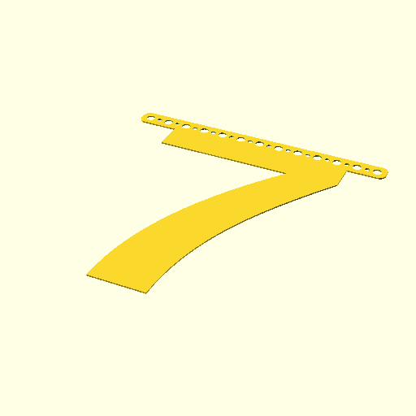

# Oobb Part Bunting Alphabet 13 Width 1 mm Depth 7 Extra  

note: This is part of OOMP the Oopen Organization Method For Parts. For more details: https://github.com/oomlout/oomp_base

##  part details
  

bunting alphabet 13x0x1

### name
* name: Oobb Part Bunting Alphabet 13 Width 1 mm Depth 7 Extra
* name_short: Bunting Alphabet 13x1 7 Extra
### id
* oomp_id: oobb_part_bunting_alphabet_13_width_1_mm_depth_7_extra
  * classification: oobb
  * type: part
  * size: bunting_alphabet
  * color: 
  * description_main: 13_width_1_mm_depth
  * description_extra: 7_extra
  * manufacturer: 
  * part_number: 
  * bip 39 word 2: federal news
  * bip 39 word 3: federal news ten
  * bip 39 word: federal news ten ugly rib busy plastic spoil hybrid again zoo allow

### other_codes
* short_code: 
* oomp_word: chestnut trident doughnut
* oomp_word_emoji :chestnut: :trident: :doughnut:
* md5_6_alpha: 47pa9
* md5_6: 6bffc1

### oomlout_oomp_utility_custom_data_manipulation
#### label print
[3x2](http://192.168.1.245:1112/?label=oomp%2047pa9)
[3x2_oomp_table](http://192.168.1.108:1112/?label=oomp%2047pa9)
[2x1](http://192.168.1.242:1112/?label=oomp%2047pa9)
[6x4](http://192.168.1.55:1112/?label=oomp%2047pa9)    

#### link

                              

#### price

### all codes 
| key | value |  
| --- | --- |  
| classification | oobb |  
| classification_name | Oobb |  
| color |  |  
| color_name |  |  
| components | [] |  
| components_objects | [] |  
| components_string | [] |  
| description | bunting alphabet 13x0x1 |  
| description_extra | 7_extra |  
| description_extra_name | 7 Extra |  
| description_main | 13_width_1_mm_depth |  
| description_main_name | 13 Width 1 mm Depth |  
| directory | parts/oobb_part_bunting_alphabet_13_width_1_mm_depth_7_extra |  
| extra | 7 |  
| folder | C:\gh\oomlout_oobb_version_4_generated_parts\things\oobb_part_bunting_alphabet_13_width_1_mm_depth_7_extra |  
| github_link | https://github.com/oomlout/oomlout_oomp_part_src/tree/main/parts/oobb_part_bunting_alphabet_13_width_1_mm_depth_7_extra |  
| id | oobb_part_bunting_alphabet_13_width_1_mm_depth_7_extra |  
| link_oomlout_label_2x1 | http://192.168.1.242:1112/?label=oomp%2047pa9 |  
| link_oomlout_label_3x2 | http://192.168.1.245:1112/?label=oomp%2047pa9 |  
| link_oomlout_label_3x2_oomp_table | http://192.168.1.108:1112/?label=oomp%2047pa9 |  
| link_oomlout_label_6x4 | http://192.168.1.55:1112/?label=oomp%2047pa9 |  
| manufacturer |  |  
| manufacturer_name |  |  
| md5 | 6bffc12b80d254c07cdc7ec1bde54aa3 |  
| md5_10 | 6bffc12b80 |  
| md5_5 | 6bffc |  
| md5_6 | 6bffc1 |  
| md5_6_alpha | 47pa9 |  
| name | Oobb Part Bunting Alphabet 13 Width 1 mm Depth 7 Extra |  
| name_short | Bunting Alphabet 13x1 7 Extra |  
| oomlout_detail_hierarchy_1 | oobb |  
| oomlout_detail_hierarchy_2 | part |  
| oomlout_detail_hierarchy_3 | bunting_alphabet |  
| oomlout_detail_hierarchy_4 | 1_mm_depth |  
| oomlout_detail_hierarchy_5 | 7_extra |  
| oomlout_oomp_utility_custom_data_manipulation | True |  
| oomp_key | oomp_oobb_part_bunting_alphabet_13_width_1_mm_depth_7_extra |  
| oomp_word | chestnut trident doughnut |  
| oomp_word_emoji | :chestnut: :trident: :doughnut: |  
| oomp_word_emoji_list | [':chestnut:', ':trident:', ':doughnut:'] |  
| oomp_word_list | ['chestnut', 'trident', 'doughnut'] |  
| part_number |  |  
| part_number_name |  |  
| short_name |  |  
| size | bunting_alphabet |  
| size_name | Bunting Alphabet |  
| thickness | 1 |  
| thickness_mm | 1 |  
| type | part |  
| type_name | Part |  
| width | 13 |  
| width_mm | 194 |  
