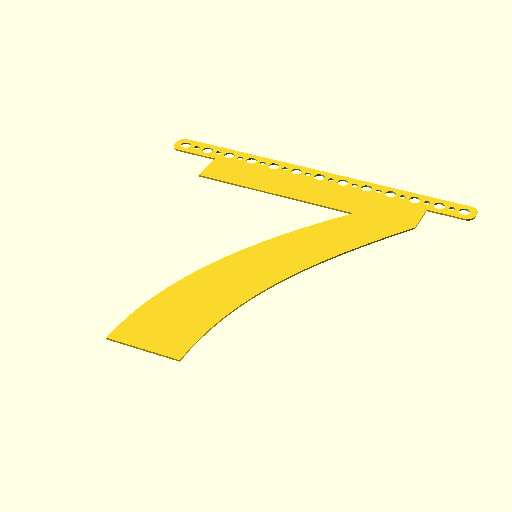

# Oobb Part Bunting Alphabet 13 Width 1 mm Depth 7 Extra 7 Extra  

note: This is part of OOMP the Oopen Organization Method For Parts. For more details: https://github.com/oomlout/oomp_base

##  part details
  

bunting alphabet 13x0x1

### name
* name: Oobb Part Bunting Alphabet 13 Width 1 mm Depth 7 Extra 7 Extra
* name_short: Bunting Alphabet 13x1 7 Extra 7 Extra
### id
* oomp_id: oobb_part_bunting_alphabet_13_width_1_mm_depth_7_extra_7_extra
  * classification: oobb
  * type: part
  * size: bunting_alphabet
  * color: 
  * description_main: 13_width_1_mm_depth_7_extra
  * description_extra: 7_extra
  * manufacturer: 
  * part_number: 
  * bip 39 word 2: fame day
  * bip 39 word 3: fame day tragic
  * bip 39 word: fame day tragic dwarf code day soccer alley saddle display moon actual

### other_codes
* short_code: 
* oomp_word: cyclone princess sparkles
* oomp_word_emoji :cyclone: :princess: :sparkles:
* md5_6_alpha: 1u6tr
* md5_6: 2f1f0f

### oomlout_oomp_utility_custom_data_manipulation
#### label print
[3x2](http://192.168.1.245:1112/?label=oomp%201u6tr)
[3x2_oomp_table](http://192.168.1.108:1112/?label=oomp%201u6tr)
[2x1](http://192.168.1.242:1112/?label=oomp%201u6tr)
[6x4](http://192.168.1.55:1112/?label=oomp%201u6tr)    

#### link

[link_main](https://github.com/oomlout/oomlout_oobb_version_4_generated_parts/tree/main/navigation_oomp/oobb/part/bunting_alphabet/13_width_1_mm_depth_7_extra/7_extra/part)                              

#### price

### all codes 
| key | value |  
| --- | --- |  
| classification | oobb |  
| classification_name | Oobb |  
| color |  |  
| color_name |  |  
| components | [] |  
| components_objects | [] |  
| components_string | [] |  
| description | bunting alphabet 13x0x1 |  
| description_extra | 7_extra |  
| description_extra_name | 7 Extra |  
| description_main | 13_width_1_mm_depth_7_extra |  
| description_main_name | 13 Width 1 mm Depth 7 Extra |  
| directory | parts/oobb_part_bunting_alphabet_13_width_1_mm_depth_7_extra_7_extra |  
| extra | 7 |  
| folder | C:\gh\oomlout_oobb_version_4_generated_parts\parts\oobb_part_bunting_alphabet_13_width_1_mm_depth_7_extra_7_extra |  
| github_link | https://github.com/oomlout/oomlout_oomp_part_src/tree/main/parts/oobb_part_bunting_alphabet_13_width_1_mm_depth_7_extra_7_extra |  
| id | oobb_part_bunting_alphabet_13_width_1_mm_depth_7_extra_7_extra |  
| link_1 | https://github.com/oomlout/oomlout_oobb_version_4_generated_parts/tree/main/navigation_oomp/oobb/part/bunting_alphabet/13_width_1_mm_depth_7_extra/7_extra/part |  
| link_1_name | link_main |  
| link_main | https://github.com/oomlout/oomlout_oobb_version_4_generated_parts/tree/main/navigation_oomp/oobb/part/bunting_alphabet/13_width_1_mm_depth_7_extra/7_extra/part |  
| link_oomlout_label_2x1 | http://192.168.1.242:1112/?label=oomp%201u6tr |  
| link_oomlout_label_3x2 | http://192.168.1.245:1112/?label=oomp%201u6tr |  
| link_oomlout_label_3x2_oomp_table | http://192.168.1.108:1112/?label=oomp%201u6tr |  
| link_oomlout_label_6x4 | http://192.168.1.55:1112/?label=oomp%201u6tr |  
| link_redirect | https://github.com/oomlout/oomlout_oobb_version_4_generated_parts/tree/main/parts/oobb_bunting_alphabet_13_01_ex_7 |  
| manufacturer |  |  
| manufacturer_name |  |  
| md5 | 2f1f0fe5ee0699b8e016844bcdce0293 |  
| md5_10 | 2f1f0fe5ee |  
| md5_5 | 2f1f0 |  
| md5_6 | 2f1f0f |  
| md5_6_alpha | 1u6tr |  
| name | Oobb Part Bunting Alphabet 13 Width 1 mm Depth 7 Extra 7 Extra |  
| name_short | Bunting Alphabet 13x1 7 Extra 7 Extra |  
| oomlout_detail_hierarchy_1 | oobb |  
| oomlout_detail_hierarchy_2 | part |  
| oomlout_detail_hierarchy_3 | bunting_alphabet |  
| oomlout_detail_hierarchy_4 | 1_mm_depth |  
| oomlout_detail_hierarchy_5 | 7_extra |  
| oomlout_oomp_utility_custom_data_manipulation | True |  
| oomp_key | oomp_oobb_part_bunting_alphabet_13_width_1_mm_depth_7_extra_7_extra |  
| oomp_word | cyclone princess sparkles |  
| oomp_word_emoji | :cyclone: :princess: :sparkles: |  
| oomp_word_emoji_list | [':cyclone:', ':princess:', ':sparkles:'] |  
| oomp_word_list | ['cyclone', 'princess', 'sparkles'] |  
| part_number |  |  
| part_number_name |  |  
| short_name |  |  
| size | bunting_alphabet |  
| size_name | Bunting Alphabet |  
| thickness | 1 |  
| thickness_mm | 1 |  
| type | part |  
| type_name | Part |  
| width | 13 |  
| width_mm | 194 |  
