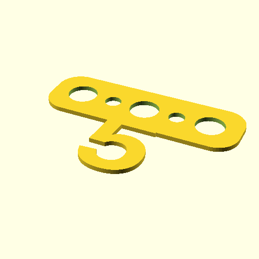

# Oobb Part Bunting Alphabet 3 Width 1 mm Depth 5 Extra  

note: This is part of OOMP the Oopen Organization Method For Parts. For more details: https://github.com/oomlout/oomp_base

##  part details
  

bunting alphabet 3x0x1

### name
* name: Oobb Part Bunting Alphabet 3 Width 1 mm Depth 5 Extra
* name_short: Bunting Alphabet 3x1 5 Extra
### id
* oomp_id: oobb_part_bunting_alphabet_3_width_1_mm_depth_5_extra
  * classification: oobb
  * type: part
  * size: bunting_alphabet
  * color: 
  * description_main: 3_width_1_mm_depth
  * description_extra: 5_extra
  * manufacturer: 
  * part_number: 
  * bip 39 word 2: region rose
  * bip 39 word 3: region rose crawl
  * bip 39 word: region rose crawl ivory entire spoon annual swap love pact sort accident

### other_codes
* short_code: 
* oomp_word: thumbsdown diamonds nose
* oomp_word_emoji :thumbsdown: :diamonds: :nose:
* md5_6_alpha: x6hz
* md5_6: 179f27

### oomlout_oomp_utility_custom_data_manipulation
#### label print
[3x2](http://192.168.1.245:1112/?label=oomp%20x6hz)
[3x2_oomp_table](http://192.168.1.108:1112/?label=oomp%20x6hz)
[2x1](http://192.168.1.242:1112/?label=oomp%20x6hz)
[6x4](http://192.168.1.55:1112/?label=oomp%20x6hz)    

#### link

[link_main](https://github.com/oomlout/oomlout_oobb_version_4_generated_parts/tree/main/navigation_oomp/oobb/part/bunting_alphabet/3_width_1_mm_depth/5_extra/part)                              

#### price

### all codes 
| key | value |  
| --- | --- |  
| classification | oobb |  
| classification_name | Oobb |  
| color |  |  
| color_name |  |  
| components | [] |  
| components_objects | [] |  
| components_string | [] |  
| description | bunting alphabet 3x0x1 |  
| description_extra | 5_extra |  
| description_extra_name | 5 Extra |  
| description_main | 3_width_1_mm_depth |  
| description_main_name | 3 Width 1 mm Depth |  
| directory | parts/oobb_part_bunting_alphabet_3_width_1_mm_depth_5_extra |  
| extra | 5 |  
| folder | C:\gh\oomlout_oobb_version_4_generated_parts\parts\oobb_part_bunting_alphabet_3_width_1_mm_depth_5_extra |  
| github_link | https://github.com/oomlout/oomlout_oomp_part_src/tree/main/parts/oobb_part_bunting_alphabet_3_width_1_mm_depth_5_extra |  
| id | oobb_part_bunting_alphabet_3_width_1_mm_depth_5_extra |  
| link_1 | https://github.com/oomlout/oomlout_oobb_version_4_generated_parts/tree/main/navigation_oomp/oobb/part/bunting_alphabet/3_width_1_mm_depth/5_extra/part |  
| link_1_name | link_main |  
| link_main | https://github.com/oomlout/oomlout_oobb_version_4_generated_parts/tree/main/navigation_oomp/oobb/part/bunting_alphabet/3_width_1_mm_depth/5_extra/part |  
| link_oomlout_label_2x1 | http://192.168.1.242:1112/?label=oomp%20x6hz |  
| link_oomlout_label_3x2 | http://192.168.1.245:1112/?label=oomp%20x6hz |  
| link_oomlout_label_3x2_oomp_table | http://192.168.1.108:1112/?label=oomp%20x6hz |  
| link_oomlout_label_6x4 | http://192.168.1.55:1112/?label=oomp%20x6hz |  
| link_redirect | https://github.com/oomlout/oomlout_oobb_version_4_generated_parts/tree/main/parts/oobb_bunting_alphabet_03_01_ex_5 |  
| manufacturer |  |  
| manufacturer_name |  |  
| md5 | 179f27ac23db412f4a25c76e656f05a4 |  
| md5_10 | 179f27ac23 |  
| md5_5 | 179f2 |  
| md5_6 | 179f27 |  
| md5_6_alpha | x6hz |  
| name | Oobb Part Bunting Alphabet 3 Width 1 mm Depth 5 Extra |  
| name_short | Bunting Alphabet 3x1 5 Extra |  
| oomlout_detail_hierarchy_1 | oobb |  
| oomlout_detail_hierarchy_2 | part |  
| oomlout_detail_hierarchy_3 | bunting_alphabet |  
| oomlout_detail_hierarchy_4 | 1_mm_depth |  
| oomlout_detail_hierarchy_5 | 5_extra |  
| oomlout_oomp_utility_custom_data_manipulation | True |  
| oomp_key | oomp_oobb_part_bunting_alphabet_3_width_1_mm_depth_5_extra |  
| oomp_word | thumbsdown diamonds nose |  
| oomp_word_emoji | :thumbsdown: :diamonds: :nose: |  
| oomp_word_emoji_list | [':thumbsdown:', ':diamonds:', ':nose:'] |  
| oomp_word_list | ['thumbsdown', 'diamonds', 'nose'] |  
| part_number |  |  
| part_number_name |  |  
| short_name |  |  
| size | bunting_alphabet |  
| size_name | Bunting Alphabet |  
| thickness | 1 |  
| thickness_mm | 1 |  
| type | part |  
| type_name | Part |  
| width | 3 |  
| width_mm | 44 |  
