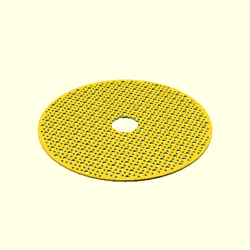

# Oobb Part Circle 19 Diameter 3 mm Depth Doughnut 3 Extra Doughnut 3 Extra  

note: This is part of OOMP the Oopen Organization Method For Parts. For more details: https://github.com/oomlout/oomp_base

##  part details
  

circle 0x0x3

### name
* name: Oobb Part Circle 19 Diameter 3 mm Depth Doughnut 3 Extra Doughnut 3 Extra
* name_short: Circle 19x3 Doughnut 3 Extra Doughnut 3
### id
* oomp_id: oobb_part_circle_19_diameter_3_mm_depth_doughnut_3_extra_doughnut_3_extra
  * classification: oobb
  * type: part
  * size: circle
  * color: 
  * description_main: 19_diameter_3_mm_depth_doughnut_3_extra
  * description_extra: doughnut_3_extra
  * manufacturer: 
  * part_number: 
  * bip 39 word 2: spin cousin
  * bip 39 word 3: spin cousin exchange
  * bip 39 word: spin cousin exchange quote argue endorse update leader matrix gold vendor all

### other_codes
* short_code: 
* oomp_word: herb anchor dragon
* oomp_word_emoji :herb: :anchor: :dragon:
* md5_6_alpha: 41xll
* md5_6: 67e459

### oomlout_oomp_utility_custom_data_manipulation
#### label print
[3x2](http://192.168.1.245:1112/?label=oomp%2041xll)
[3x2_oomp_table](http://192.168.1.108:1112/?label=oomp%2041xll)
[2x1](http://192.168.1.242:1112/?label=oomp%2041xll)
[6x4](http://192.168.1.55:1112/?label=oomp%2041xll)    

#### link

[link_main](https://github.com/oomlout/oomlout_oobb_version_4_generated_parts/tree/main/navigation_oomp/oobb/part/circle/19_diameter_3_mm_depth_doughnut_3_extra/doughnut_3_extra/part)                              

#### price

### all codes 
| key | value |  
| --- | --- |  
| classification | oobb |  
| classification_name | Oobb |  
| color |  |  
| color_name |  |  
| components | [] |  
| components_objects | [] |  
| components_string | [] |  
| description | circle 0x0x3 |  
| description_extra | doughnut_3_extra |  
| description_extra_name | Doughnut 3 Extra |  
| description_main | 19_diameter_3_mm_depth_doughnut_3_extra |  
| description_main_name | 19 Diameter 3 mm Depth Doughnut 3 Extra |  
| diameter | 19 |  
| directory | parts/oobb_part_circle_19_diameter_3_mm_depth_doughnut_3_extra_doughnut_3_extra |  
| extra | doughnut_3 |  
| folder | C:\gh\oomlout_oobb_version_4_generated_parts\parts\oobb_part_circle_19_diameter_3_mm_depth_doughnut_3_extra_doughnut_3_extra |  
| github_link | https://github.com/oomlout/oomlout_oomp_part_src/tree/main/parts/oobb_part_circle_19_diameter_3_mm_depth_doughnut_3_extra_doughnut_3_extra |  
| id | oobb_part_circle_19_diameter_3_mm_depth_doughnut_3_extra_doughnut_3_extra |  
| link_1 | https://github.com/oomlout/oomlout_oobb_version_4_generated_parts/tree/main/navigation_oomp/oobb/part/circle/19_diameter_3_mm_depth_doughnut_3_extra/doughnut_3_extra/part |  
| link_1_name | link_main |  
| link_main | https://github.com/oomlout/oomlout_oobb_version_4_generated_parts/tree/main/navigation_oomp/oobb/part/circle/19_diameter_3_mm_depth_doughnut_3_extra/doughnut_3_extra/part |  
| link_oomlout_label_2x1 | http://192.168.1.242:1112/?label=oomp%2041xll |  
| link_oomlout_label_3x2 | http://192.168.1.245:1112/?label=oomp%2041xll |  
| link_oomlout_label_3x2_oomp_table | http://192.168.1.108:1112/?label=oomp%2041xll |  
| link_oomlout_label_6x4 | http://192.168.1.55:1112/?label=oomp%2041xll |  
| link_redirect | https://github.com/oomlout/oomlout_oobb_version_4_generated_parts/tree/main/parts/oobb_circle_19_03_ex_doughnut_3 |  
| manufacturer |  |  
| manufacturer_name |  |  
| md5 | 67e45914497e9dd12705cb009d4c5e8f |  
| md5_10 | 67e4591449 |  
| md5_5 | 67e45 |  
| md5_6 | 67e459 |  
| md5_6_alpha | 41xll |  
| name | Oobb Part Circle 19 Diameter 3 mm Depth Doughnut 3 Extra Doughnut 3 Extra |  
| name_short | Circle 19x3 Doughnut 3 Extra Doughnut 3 |  
| oomlout_detail_hierarchy_1 | oobb |  
| oomlout_detail_hierarchy_2 | part |  
| oomlout_detail_hierarchy_3 | circle |  
| oomlout_detail_hierarchy_4 | 19_diameter |  
| oomlout_detail_hierarchy_5 | 3_mm_depth |  
| oomlout_detail_hierarchy_6 | doughnut_3_extra |  
| oomlout_oomp_utility_custom_data_manipulation | True |  
| oomp_key | oomp_oobb_part_circle_19_diameter_3_mm_depth_doughnut_3_extra_doughnut_3_extra |  
| oomp_word | herb anchor dragon |  
| oomp_word_emoji | :herb: :anchor: :dragon: |  
| oomp_word_emoji_list | [':herb:', ':anchor:', ':dragon:'] |  
| oomp_word_list | ['herb', 'anchor', 'dragon'] |  
| part_number |  |  
| part_number_name |  |  
| short_name |  |  
| size | circle |  
| size_name | Circle |  
| thickness | 3 |  
| thickness_mm | 3 |  
| type | part |  
| type_name | Part |  
