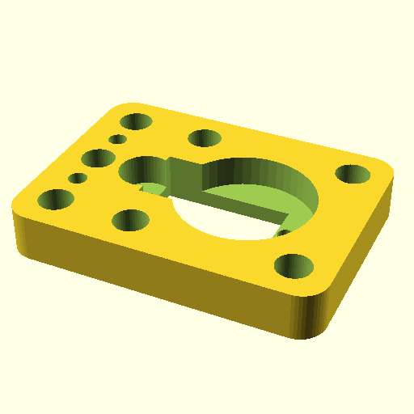

# Oobb Part Holder 4 Width 3 Height 3 mm Depth Motor Servo Micro 01 Extra  

note: This is part of OOMP the Oopen Organization Method For Parts. For more details: https://github.com/oomlout/oomp_base

##  part details
  

holder 4x3x3

### name
* name: Oobb Part Holder 4 Width 3 Height 3 mm Depth Motor Servo Micro 01 Extra
* name_short: Holder 4x3x3 Motor Servo Micro 01 Extra
### id
* oomp_id: oobb_part_holder_4_width_3_height_3_mm_depth_motor_servo_micro_01_extra
  * classification: oobb
  * type: part
  * size: holder
  * color: 
  * description_main: 4_width_3_height_3_mm_depth
  * description_extra: motor_servo_micro_01_extra
  * manufacturer: 
  * part_number: 
  * bip 39 word 2: black snap
  * bip 39 word 3: black snap link
  * bip 39 word: black snap link time intact spare symbol bright field retire uncle attitude

### other_codes
* short_code: 
* oomp_word: car bank snowman
* oomp_word_emoji :car: :bank: :snowman:
* md5_6_alpha: 97act
* md5_6: ebd92d

### oomlout_oomp_utility_custom_data_manipulation
#### label print
[3x2](http://192.168.1.245:1112/?label=oomp%2097act)
[3x2_oomp_table](http://192.168.1.108:1112/?label=oomp%2097act)
[2x1](http://192.168.1.242:1112/?label=oomp%2097act)
[6x4](http://192.168.1.55:1112/?label=oomp%2097act)    

#### link

[link_main](https://github.com/oomlout/oomlout_oobb_version_4_generated_parts/tree/main/navigation_oomp/oobb/part/holder/4_width_3_height_3_mm_depth/motor_servo_micro_01_extra/part)                              

#### price

### all codes 
| key | value |  
| --- | --- |  
| classification | oobb |  
| classification_name | Oobb |  
| color |  |  
| color_name |  |  
| components | [] |  
| components_objects | [] |  
| components_string | [] |  
| description | holder 4x3x3 |  
| description_extra | motor_servo_micro_01_extra |  
| description_extra_name | Motor Servo Micro 01 Extra |  
| description_main | 4_width_3_height_3_mm_depth |  
| description_main_name | 4 Width 3 Height 3 mm Depth |  
| directory | parts/oobb_part_holder_4_width_3_height_3_mm_depth_motor_servo_micro_01_extra |  
| extra | motor_servo_micro_01 |  
| folder | C:\gh\oomlout_oobb_version_4_generated_parts\parts\oobb_part_holder_4_width_3_height_3_mm_depth_motor_servo_micro_01_extra |  
| github_link | https://github.com/oomlout/oomlout_oomp_part_src/tree/main/parts/oobb_part_holder_4_width_3_height_3_mm_depth_motor_servo_micro_01_extra |  
| height | 3 |  
| height_mm | 44 |  
| id | oobb_part_holder_4_width_3_height_3_mm_depth_motor_servo_micro_01_extra |  
| link_1 | https://github.com/oomlout/oomlout_oobb_version_4_generated_parts/tree/main/navigation_oomp/oobb/part/holder/4_width_3_height_3_mm_depth/motor_servo_micro_01_extra/part |  
| link_1_name | link_main |  
| link_main | https://github.com/oomlout/oomlout_oobb_version_4_generated_parts/tree/main/navigation_oomp/oobb/part/holder/4_width_3_height_3_mm_depth/motor_servo_micro_01_extra/part |  
| link_oomlout_label_2x1 | http://192.168.1.242:1112/?label=oomp%2097act |  
| link_oomlout_label_3x2 | http://192.168.1.245:1112/?label=oomp%2097act |  
| link_oomlout_label_3x2_oomp_table | http://192.168.1.108:1112/?label=oomp%2097act |  
| link_oomlout_label_6x4 | http://192.168.1.55:1112/?label=oomp%2097act |  
| link_redirect | https://github.com/oomlout/oomlout_oobb_version_4_generated_parts/tree/main/parts/oobb_holder_04_03_03_ex_motor_servo_micro_01 |  
| manufacturer |  |  
| manufacturer_name |  |  
| md5 | ebd92dfaaf1c1b8f41bace25043350b7 |  
| md5_10 | ebd92dfaaf |  
| md5_5 | ebd92 |  
| md5_6 | ebd92d |  
| md5_6_alpha | 97act |  
| name | Oobb Part Holder 4 Width 3 Height 3 mm Depth Motor Servo Micro 01 Extra |  
| name_short | Holder 4x3x3 Motor Servo Micro 01 Extra |  
| oomlout_detail_hierarchy_1 | oobb |  
| oomlout_detail_hierarchy_2 | part |  
| oomlout_detail_hierarchy_3 | holder |  
| oomlout_detail_hierarchy_4 | 3_mm_depth |  
| oomlout_detail_hierarchy_5 | motor_servo_micro_01_extra |  
| oomlout_oomp_utility_custom_data_manipulation | True |  
| oomp_key | oomp_oobb_part_holder_4_width_3_height_3_mm_depth_motor_servo_micro_01_extra |  
| oomp_word | car bank snowman |  
| oomp_word_emoji | :car: :bank: :snowman: |  
| oomp_word_emoji_list | [':car:', ':bank:', ':snowman:'] |  
| oomp_word_list | ['car', 'bank', 'snowman'] |  
| part_number |  |  
| part_number_name |  |  
| short_name |  |  
| size | holder |  
| size_name | Holder |  
| thickness | 3 |  
| thickness_mm | 3 |  
| type | part |  
| type_name | Part |  
| width | 4 |  
| width_mm | 59 |  
