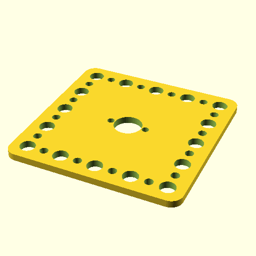

# Oobb Part Holder 5 Width 5 Height 3 mm Depth Mechanical Motor With Encoder 30 mm Diameter Cricut Maker Compatible Extra  

note: This is part of OOMP the Oopen Organization Method For Parts. For more details: https://github.com/oomlout/oomp_base

##  part details
  

holder 5x5x3

### name
* name: Oobb Part Holder 5 Width 5 Height 3 mm Depth Mechanical Motor With Encoder 30 mm Diameter Cricut Maker Compatible Extra
* name_short: Holder 5x5x3 Mechanical Motor With
### id
* oomp_id: oobb_part_holder_5_width_5_height_3_mm_depth_mechanical_motor_with_encoder_30_mm_diameter_cricut_maker_compatible_extra
  * classification: oobb
  * type: part
  * size: holder
  * color: 
  * description_main: 5_width_5_height_3_mm_depth
  * description_extra: mechanical_motor_with_encoder_30_mm_diameter_cricut_maker_compatible_extra
  * manufacturer: 
  * part_number: 
  * bip 39 word 2: unaware run
  * bip 39 word 3: unaware run tennis
  * bip 39 word: unaware run tennis field box deputy bottom stove emotion better sure add

### other_codes
* short_code: 
* oomp_word: dog coffee kissing
* oomp_word_emoji :dog: :coffee: :kissing:
* md5_6_alpha: 20mit
* md5_6: 33b405

### oomlout_oomp_utility_custom_data_manipulation
#### label print
[3x2](http://192.168.1.245:1112/?label=oomp%2020mit)
[3x2_oomp_table](http://192.168.1.108:1112/?label=oomp%2020mit)
[2x1](http://192.168.1.242:1112/?label=oomp%2020mit)
[6x4](http://192.168.1.55:1112/?label=oomp%2020mit)    

#### link

[link_main](https://github.com/oomlout/oomlout_oobb_version_4_generated_parts/tree/main/navigation_oomp/oobb/part/holder/5_width_5_height_3_mm_depth/mechanical_motor_with_encoder_30_mm_diameter_cricut_maker_compatible_extra/part)                              

#### price

### all codes 
| key | value |  
| --- | --- |  
| classification | oobb |  
| classification_name | Oobb |  
| color |  |  
| color_name |  |  
| components | [] |  
| components_objects | [] |  
| components_string | [] |  
| description | holder 5x5x3 |  
| description_extra | mechanical_motor_with_encoder_30_mm_diameter_cricut_maker_compatible_extra |  
| description_extra_name | Mechanical Motor With Encoder 30 mm Diameter Cricut Maker Compatible Extra |  
| description_main | 5_width_5_height_3_mm_depth |  
| description_main_name | 5 Width 5 Height 3 mm Depth |  
| directory | parts/oobb_part_holder_5_width_5_height_3_mm_depth_mechanical_motor_with_encoder_30_mm_diameter_cricut_maker_compatible_extra |  
| extra | mechanical_motor_with_encoder_30_mm_diameter_cricut_maker_compatible |  
| folder | C:\gh\oomlout_oobb_version_4_generated_parts\parts\oobb_part_holder_5_width_5_height_3_mm_depth_mechanical_motor_with_encoder_30_mm_diameter_cricut_maker_compatible_extra |  
| github_link | https://github.com/oomlout/oomlout_oomp_part_src/tree/main/parts/oobb_part_holder_5_width_5_height_3_mm_depth_mechanical_motor_with_encoder_30_mm_diameter_cricut_maker_compatible_extra |  
| height | 5 |  
| height_mm | 74 |  
| id | oobb_part_holder_5_width_5_height_3_mm_depth_mechanical_motor_with_encoder_30_mm_diameter_cricut_maker_compatible_extra |  
| link_1 | https://github.com/oomlout/oomlout_oobb_version_4_generated_parts/tree/main/navigation_oomp/oobb/part/holder/5_width_5_height_3_mm_depth/mechanical_motor_with_encoder_30_mm_diameter_cricut_maker_compatible_extra/part |  
| link_1_name | link_main |  
| link_main | https://github.com/oomlout/oomlout_oobb_version_4_generated_parts/tree/main/navigation_oomp/oobb/part/holder/5_width_5_height_3_mm_depth/mechanical_motor_with_encoder_30_mm_diameter_cricut_maker_compatible_extra/part |  
| link_oomlout_label_2x1 | http://192.168.1.242:1112/?label=oomp%2020mit |  
| link_oomlout_label_3x2 | http://192.168.1.245:1112/?label=oomp%2020mit |  
| link_oomlout_label_3x2_oomp_table | http://192.168.1.108:1112/?label=oomp%2020mit |  
| link_oomlout_label_6x4 | http://192.168.1.55:1112/?label=oomp%2020mit |  
| link_redirect | https://github.com/oomlout/oomlout_oobb_version_4_generated_parts/tree/main/parts/oobb_holder_05_05_03_ex_mechanical_motor_with_encoder_30_mm_diameter_cricut_maker_compatible |  
| manufacturer |  |  
| manufacturer_name |  |  
| md5 | 33b4056246d6a348ed0d455fbe6f5763 |  
| md5_10 | 33b4056246 |  
| md5_5 | 33b40 |  
| md5_6 | 33b405 |  
| md5_6_alpha | 20mit |  
| name | Oobb Part Holder 5 Width 5 Height 3 mm Depth Mechanical Motor With Encoder 30 mm Diameter Cricut Maker Compatible Extra |  
| name_short | Holder 5x5x3 Mechanical Motor With |  
| oomlout_detail_hierarchy_1 | oobb |  
| oomlout_detail_hierarchy_2 | part |  
| oomlout_detail_hierarchy_3 | holder |  
| oomlout_detail_hierarchy_4 | 3_mm_depth |  
| oomlout_detail_hierarchy_5 | mechanical_motor_with_encoder |  
| oomlout_detail_hierarchy_6 | 30_mm_diameter_cricut |  
| oomlout_detail_hierarchy_7 | maker_compatible_extra |  
| oomlout_oomp_utility_custom_data_manipulation | True |  
| oomp_key | oomp_oobb_part_holder_5_width_5_height_3_mm_depth_mechanical_motor_with_encoder_30_mm_diameter_cricut_maker_compatible_extra |  
| oomp_word | dog coffee kissing |  
| oomp_word_emoji | :dog: :coffee: :kissing: |  
| oomp_word_emoji_list | [':dog:', ':coffee:', ':kissing:'] |  
| oomp_word_list | ['dog', 'coffee', 'kissing'] |  
| part_number |  |  
| part_number_name |  |  
| short_name |  |  
| size | holder |  
| size_name | Holder |  
| thickness | 3 |  
| thickness_mm | 3 |  
| type | part |  
| type_name | Part |  
| width | 5 |  
| width_mm | 74 |  
