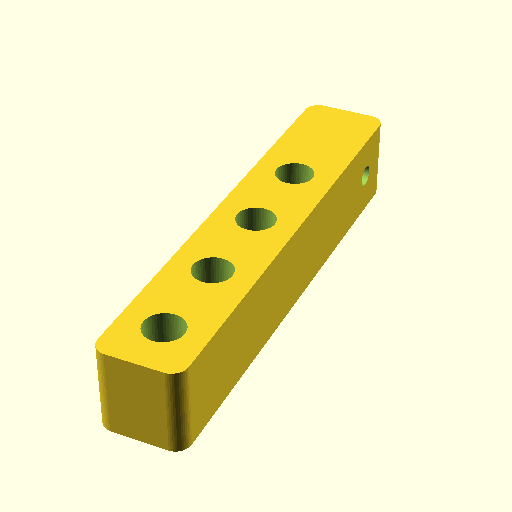

# Oobb Part Other 1 Width 5 Height 14 mm Depth Quarter Inch Pipe Thread Shaft Ptfe Tube Holder Ninety Degree Extra  

note: This is part of OOMP the Oopen Organization Method For Parts. For more details: https://github.com/oomlout/oomp_base

##  part details
  

other 1x5x14

### name
* name: Oobb Part Other 1 Width 5 Height 14 mm Depth Quarter Inch Pipe Thread Shaft Ptfe Tube Holder Ninety Degree Extra
* name_short: Other 1x5x14 Quarter Inch Pipe Thread
### id
* oomp_id: oobb_part_other_1_width_5_height_14_mm_depth_quarter_inch_pipe_thread_shaft_ptfe_tube_holder_ninety_degree_extra
  * classification: oobb
  * type: part
  * size: other
  * color: 
  * description_main: 1_width_5_height_14_mm_depth
  * description_extra: quarter_inch_pipe_thread_shaft_ptfe_tube_holder_ninety_degree_extra
  * manufacturer: 
  * part_number: 
  * bip 39 word 2: pole pond
  * bip 39 word 3: pole pond tired
  * bip 39 word: pole pond tired rebuild subject piece copy ramp idle fold uniform advice

### other_codes
* short_code: 
* oomp_word: camel hotel school
* oomp_word_emoji :camel: :hotel: :school:
* md5_6_alpha: 2ki52
* md5_6: 41dad6

### oomlout_oomp_utility_custom_data_manipulation
#### label print
[3x2](http://192.168.1.245:1112/?label=oomp%202ki52)
[3x2_oomp_table](http://192.168.1.108:1112/?label=oomp%202ki52)
[2x1](http://192.168.1.242:1112/?label=oomp%202ki52)
[6x4](http://192.168.1.55:1112/?label=oomp%202ki52)    

#### link

[link_main](https://github.com/oomlout/oomlout_oobb_version_4_generated_parts/tree/main/navigation_oomp/oobb/part/other/1_width_5_height_14_mm_depth/quarter_inch_pipe_thread_shaft_ptfe_tube_holder_ninety_degree_extra/part)                              

#### price

### all codes 
| key | value |  
| --- | --- |  
| classification | oobb |  
| classification_name | Oobb |  
| color |  |  
| color_name |  |  
| components | [] |  
| components_objects | [] |  
| components_string | [] |  
| description | other 1x5x14 |  
| description_extra | quarter_inch_pipe_thread_shaft_ptfe_tube_holder_ninety_degree_extra |  
| description_extra_name | Quarter Inch Pipe Thread Shaft Ptfe Tube Holder Ninety Degree Extra |  
| description_main | 1_width_5_height_14_mm_depth |  
| description_main_name | 1 Width 5 Height 14 mm Depth |  
| directory | parts/oobb_part_other_1_width_5_height_14_mm_depth_quarter_inch_pipe_thread_shaft_ptfe_tube_holder_ninety_degree_extra |  
| extra | ptfe_tube_holder_ninety_degree |  
| folder | C:\gh\oomlout_oobb_version_4_generated_parts\parts\oobb_part_other_1_width_5_height_14_mm_depth_quarter_inch_pipe_thread_shaft_ptfe_tube_holder_ninety_degree_extra |  
| github_link | https://github.com/oomlout/oomlout_oomp_part_src/tree/main/parts/oobb_part_other_1_width_5_height_14_mm_depth_quarter_inch_pipe_thread_shaft_ptfe_tube_holder_ninety_degree_extra |  
| height | 5 |  
| height_mm | 74 |  
| id | oobb_part_other_1_width_5_height_14_mm_depth_quarter_inch_pipe_thread_shaft_ptfe_tube_holder_ninety_degree_extra |  
| link_1 | https://github.com/oomlout/oomlout_oobb_version_4_generated_parts/tree/main/navigation_oomp/oobb/part/other/1_width_5_height_14_mm_depth/quarter_inch_pipe_thread_shaft_ptfe_tube_holder_ninety_degree_extra/part |  
| link_1_name | link_main |  
| link_main | https://github.com/oomlout/oomlout_oobb_version_4_generated_parts/tree/main/navigation_oomp/oobb/part/other/1_width_5_height_14_mm_depth/quarter_inch_pipe_thread_shaft_ptfe_tube_holder_ninety_degree_extra/part |  
| link_oomlout_label_2x1 | http://192.168.1.242:1112/?label=oomp%202ki52 |  
| link_oomlout_label_3x2 | http://192.168.1.245:1112/?label=oomp%202ki52 |  
| link_oomlout_label_3x2_oomp_table | http://192.168.1.108:1112/?label=oomp%202ki52 |  
| link_oomlout_label_6x4 | http://192.168.1.55:1112/?label=oomp%202ki52 |  
| link_redirect | https://github.com/oomlout/oomlout_oobb_version_4_generated_parts/tree/main/parts/oobb_other_01_05_14_ex_ptfe_tube_holder_ninety_degree_sh_quarter_inch_pipe_thread |  
| manufacturer |  |  
| manufacturer_name |  |  
| md5 | 41dad6a385b1660291ebfb35c569f53c |  
| md5_10 | 41dad6a385 |  
| md5_5 | 41dad |  
| md5_6 | 41dad6 |  
| md5_6_alpha | 2ki52 |  
| name | Oobb Part Other 1 Width 5 Height 14 mm Depth Quarter Inch Pipe Thread Shaft Ptfe Tube Holder Ninety Degree Extra |  
| name_short | Other 1x5x14 Quarter Inch Pipe Thread |  
| oomlout_detail_hierarchy_1 | oobb |  
| oomlout_detail_hierarchy_2 | part |  
| oomlout_detail_hierarchy_3 | other |  
| oomlout_detail_hierarchy_4 | 14_mm_depth |  
| oomlout_detail_hierarchy_5 | quarter_inch_pipe_thread |  
| oomlout_detail_hierarchy_6 | shaft_ptfe_tube_holder |  
| oomlout_detail_hierarchy_7 | ninety_degree_extra |  
| oomlout_oomp_utility_custom_data_manipulation | True |  
| oomp_key | oomp_oobb_part_other_1_width_5_height_14_mm_depth_quarter_inch_pipe_thread_shaft_ptfe_tube_holder_ninety_degree_extra |  
| oomp_word | camel hotel school |  
| oomp_word_emoji | :camel: :hotel: :school: |  
| oomp_word_emoji_list | [':camel:', ':hotel:', ':school:'] |  
| oomp_word_list | ['camel', 'hotel', 'school'] |  
| part_number |  |  
| part_number_name |  |  
| shaft | quarter_inch_pipe_thread |  
| short_name |  |  
| size | other |  
| size_name | Other |  
| thickness | 14 |  
| thickness_mm | 14 |  
| type | part |  
| type_name | Part |  
| width | 1 |  
| width_mm | 14 |  
