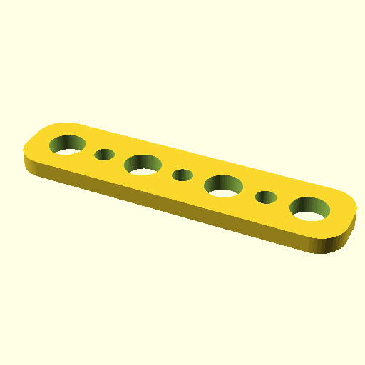

#   

note: This is part of OOMP the Oopen Organization Method For Parts. For more details: https://github.com/oomlout/oomp_base

##  part details
  

### name
* name: 
* name_short: 
### id
* oomp_id: 
  * classification: 
  * type: 
  * size: 
  * color: 
  * description_main: 
  * description_extra: 
  * manufacturer: 
  * part_number: 
  * bip 39 word 2: 
  * bip 39 word 3: 
  * bip 39 word: 

### other_codes
* short_code: 
* oomp_word: 
* oomp_word_emoji 
* md5_6_alpha: 
* md5_6: 

### all codes 
| key | value |  
| --- | --- |  
