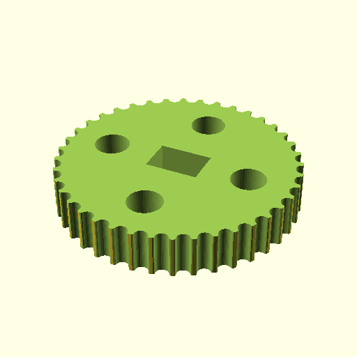

# Oobb Part Pulley Gt2 2 Diameter 6 mm Depth Motor Tt 01 Shaft 40 Teeth Extra  

note: This is part of OOMP the Oopen Organization Method For Parts. For more details: https://github.com/oomlout/oomp_base

##  part details
  

pulley gt2 0x0x6

### name
* name: Oobb Part Pulley Gt2 2 Diameter 6 mm Depth Motor Tt 01 Shaft 40 Teeth Extra
* name_short: Pulley Gt2 2x6 Motor Tt 01 Shaft 40
### id
* oomp_id: oobb_part_pulley_gt2_2_diameter_6_mm_depth_motor_tt_01_shaft_40_teeth_extra
  * classification: oobb
  * type: part
  * size: pulley_gt2
  * color: 
  * description_main: 2_diameter_6_mm_depth
  * description_extra: motor_tt_01_shaft_40_teeth_extra
  * manufacturer: 
  * part_number: 
  * bip 39 word 2: wash pave
  * bip 39 word 3: wash pave sport
  * bip 39 word: wash pave sport suffer noodle hope fork seat slam tobacco garden afraid

### other_codes
* short_code: 
* oomp_word: hatched_chick egg bell
* oomp_word_emoji :hatched_chick: :egg: :bell:
* md5_6_alpha: 2u6pk
* md5_6: 48bf78

### oomlout_oomp_utility_custom_data_manipulation
#### label print
[3x2](http://192.168.1.245:1112/?label=oomp%202u6pk)
[3x2_oomp_table](http://192.168.1.108:1112/?label=oomp%202u6pk)
[2x1](http://192.168.1.242:1112/?label=oomp%202u6pk)
[6x4](http://192.168.1.55:1112/?label=oomp%202u6pk)    

#### link

[link_main](https://github.com/oomlout/oomlout_oobb_version_4_generated_parts/tree/main/navigation_oomp/oobb/part/pulley_gt2/2_diameter_6_mm_depth/motor_tt_01_shaft_40_teeth_extra/part)                              

#### price

### all codes 
| key | value |  
| --- | --- |  
| classification | oobb |  
| classification_name | Oobb |  
| color |  |  
| color_name |  |  
| components | [] |  
| components_objects | [] |  
| components_string | [] |  
| description | pulley gt2 0x0x6 |  
| description_extra | motor_tt_01_shaft_40_teeth_extra |  
| description_extra_name | Motor Tt 01 Shaft 40 Teeth Extra |  
| description_main | 2_diameter_6_mm_depth |  
| description_main_name | 2 Diameter 6 mm Depth |  
| diameter | 2 |  
| directory | parts/oobb_part_pulley_gt2_2_diameter_6_mm_depth_motor_tt_01_shaft_40_teeth_extra |  
| extra | 40_teeth |  
| folder | C:\gh\oomlout_oobb_version_4_generated_parts\parts\oobb_part_pulley_gt2_2_diameter_6_mm_depth_motor_tt_01_shaft_40_teeth_extra |  
| github_link | https://github.com/oomlout/oomlout_oomp_part_src/tree/main/parts/oobb_part_pulley_gt2_2_diameter_6_mm_depth_motor_tt_01_shaft_40_teeth_extra |  
| id | oobb_part_pulley_gt2_2_diameter_6_mm_depth_motor_tt_01_shaft_40_teeth_extra |  
| link_1 | https://github.com/oomlout/oomlout_oobb_version_4_generated_parts/tree/main/navigation_oomp/oobb/part/pulley_gt2/2_diameter_6_mm_depth/motor_tt_01_shaft_40_teeth_extra/part |  
| link_1_name | link_main |  
| link_main | https://github.com/oomlout/oomlout_oobb_version_4_generated_parts/tree/main/navigation_oomp/oobb/part/pulley_gt2/2_diameter_6_mm_depth/motor_tt_01_shaft_40_teeth_extra/part |  
| link_oomlout_label_2x1 | http://192.168.1.242:1112/?label=oomp%202u6pk |  
| link_oomlout_label_3x2 | http://192.168.1.245:1112/?label=oomp%202u6pk |  
| link_oomlout_label_3x2_oomp_table | http://192.168.1.108:1112/?label=oomp%202u6pk |  
| link_oomlout_label_6x4 | http://192.168.1.55:1112/?label=oomp%202u6pk |  
| link_redirect | https://github.com/oomlout/oomlout_oobb_version_4_generated_parts/tree/main/parts/oobb_pulley_gt2_02_06_ex_40_teeth_sh_motor_tt_01 |  
| manufacturer |  |  
| manufacturer_name |  |  
| md5 | 48bf78ce58c24b6db5cb0d8ba56867bb |  
| md5_10 | 48bf78ce58 |  
| md5_5 | 48bf7 |  
| md5_6 | 48bf78 |  
| md5_6_alpha | 2u6pk |  
| name | Oobb Part Pulley Gt2 2 Diameter 6 mm Depth Motor Tt 01 Shaft 40 Teeth Extra |  
| name_short | Pulley Gt2 2x6 Motor Tt 01 Shaft 40 |  
| oomlout_detail_hierarchy_1 | oobb |  
| oomlout_detail_hierarchy_2 | part |  
| oomlout_detail_hierarchy_3 | pulley_gt2 |  
| oomlout_detail_hierarchy_4 | 2_diameter |  
| oomlout_detail_hierarchy_5 | 6_mm_depth |  
| oomlout_detail_hierarchy_6 | motor_tt_01_shaft |  
| oomlout_detail_hierarchy_7 | 40_teeth_extra |  
| oomlout_oomp_utility_custom_data_manipulation | True |  
| oomp_key | oomp_oobb_part_pulley_gt2_2_diameter_6_mm_depth_motor_tt_01_shaft_40_teeth_extra |  
| oomp_word | hatched_chick egg bell |  
| oomp_word_emoji | :hatched_chick: :egg: :bell: |  
| oomp_word_emoji_list | [':hatched_chick:', ':egg:', ':bell:'] |  
| oomp_word_list | ['hatched_chick', 'egg', 'bell'] |  
| part_number |  |  
| part_number_name |  |  
| shaft | motor_tt_01 |  
| short_name |  |  
| size | pulley_gt2 |  
| size_name | Pulley Gt2 |  
| thickness | 6 |  
| thickness_mm | 6 |  
| type | part |  
| type_name | Part |  
