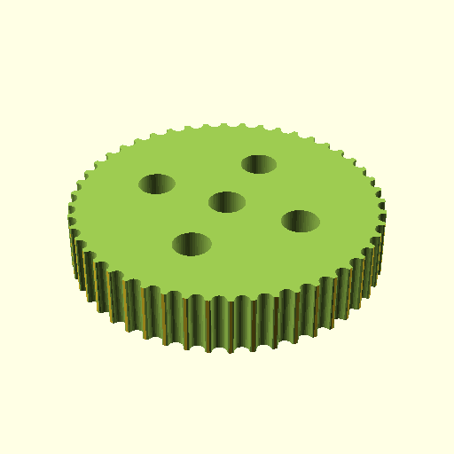

# Oobb Part Pulley Gt2 2 Diameter 9 mm Depth M3 Shaft 48 Teeth Extra  

note: This is part of OOMP the Oopen Organization Method For Parts. For more details: https://github.com/oomlout/oomp_base

##  part details
  

pulley gt2 0x0x9

### name
* name: Oobb Part Pulley Gt2 2 Diameter 9 mm Depth M3 Shaft 48 Teeth Extra
* name_short: Pulley Gt2 2x9 M3 Shaft 48 Teeth Extra
### id
* oomp_id: oobb_part_pulley_gt2_2_diameter_9_mm_depth_m3_shaft_48_teeth_extra
  * classification: oobb
  * type: part
  * size: pulley_gt2
  * color: 
  * description_main: 2_diameter_9_mm_depth
  * description_extra: m3_shaft_48_teeth_extra
  * manufacturer: 
  * part_number: 
  * bip 39 word 2: buffalo help
  * bip 39 word 3: buffalo help insane
  * bip 39 word: buffalo help insane equip spawn seed wealth please maximum mistake screen attitude

### other_codes
* short_code: 
* oomp_word: car lock kiss
* oomp_word_emoji :car: :lock: :kiss:
* md5_6_alpha: 96tcz
* md5_6: eb8323

### oomlout_oomp_utility_custom_data_manipulation
#### label print
[3x2](http://192.168.1.245:1112/?label=oomp%2096tcz)
[3x2_oomp_table](http://192.168.1.108:1112/?label=oomp%2096tcz)
[2x1](http://192.168.1.242:1112/?label=oomp%2096tcz)
[6x4](http://192.168.1.55:1112/?label=oomp%2096tcz)    

#### link

[link_main](https://github.com/oomlout/oomlout_oobb_version_4_generated_parts/tree/main/navigation_oomp/oobb/part/pulley_gt2/2_diameter_9_mm_depth/m3_shaft_48_teeth_extra/part)                              

#### price

### all codes 
| key | value |  
| --- | --- |  
| classification | oobb |  
| classification_name | Oobb |  
| color |  |  
| color_name |  |  
| components | [] |  
| components_objects | [] |  
| components_string | [] |  
| description | pulley gt2 0x0x9 |  
| description_extra | m3_shaft_48_teeth_extra |  
| description_extra_name | M3 Shaft 48 Teeth Extra |  
| description_main | 2_diameter_9_mm_depth |  
| description_main_name | 2 Diameter 9 mm Depth |  
| diameter | 2 |  
| directory | parts/oobb_part_pulley_gt2_2_diameter_9_mm_depth_m3_shaft_48_teeth_extra |  
| extra | 48_teeth |  
| folder | C:\gh\oomlout_oobb_version_4_generated_parts\parts\oobb_part_pulley_gt2_2_diameter_9_mm_depth_m3_shaft_48_teeth_extra |  
| github_link | https://github.com/oomlout/oomlout_oomp_part_src/tree/main/parts/oobb_part_pulley_gt2_2_diameter_9_mm_depth_m3_shaft_48_teeth_extra |  
| id | oobb_part_pulley_gt2_2_diameter_9_mm_depth_m3_shaft_48_teeth_extra |  
| link_1 | https://github.com/oomlout/oomlout_oobb_version_4_generated_parts/tree/main/navigation_oomp/oobb/part/pulley_gt2/2_diameter_9_mm_depth/m3_shaft_48_teeth_extra/part |  
| link_1_name | link_main |  
| link_main | https://github.com/oomlout/oomlout_oobb_version_4_generated_parts/tree/main/navigation_oomp/oobb/part/pulley_gt2/2_diameter_9_mm_depth/m3_shaft_48_teeth_extra/part |  
| link_oomlout_label_2x1 | http://192.168.1.242:1112/?label=oomp%2096tcz |  
| link_oomlout_label_3x2 | http://192.168.1.245:1112/?label=oomp%2096tcz |  
| link_oomlout_label_3x2_oomp_table | http://192.168.1.108:1112/?label=oomp%2096tcz |  
| link_oomlout_label_6x4 | http://192.168.1.55:1112/?label=oomp%2096tcz |  
| link_redirect | https://github.com/oomlout/oomlout_oobb_version_4_generated_parts/tree/main/parts/oobb_pulley_gt2_02_09_ex_48_teeth_sh_m3 |  
| manufacturer |  |  
| manufacturer_name |  |  
| md5 | eb83237c4ba67f070be854c2e9dac0ed |  
| md5_10 | eb83237c4b |  
| md5_5 | eb832 |  
| md5_6 | eb8323 |  
| md5_6_alpha | 96tcz |  
| name | Oobb Part Pulley Gt2 2 Diameter 9 mm Depth M3 Shaft 48 Teeth Extra |  
| name_short | Pulley Gt2 2x9 M3 Shaft 48 Teeth Extra |  
| oomlout_detail_hierarchy_1 | oobb |  
| oomlout_detail_hierarchy_2 | part |  
| oomlout_detail_hierarchy_3 | pulley_gt2 |  
| oomlout_detail_hierarchy_4 | 2_diameter |  
| oomlout_detail_hierarchy_5 | 9_mm_depth |  
| oomlout_detail_hierarchy_6 | m3_shaft_48_teeth_extra |  
| oomlout_oomp_utility_custom_data_manipulation | True |  
| oomp_key | oomp_oobb_part_pulley_gt2_2_diameter_9_mm_depth_m3_shaft_48_teeth_extra |  
| oomp_word | car lock kiss |  
| oomp_word_emoji | :car: :lock: :kiss: |  
| oomp_word_emoji_list | [':car:', ':lock:', ':kiss:'] |  
| oomp_word_list | ['car', 'lock', 'kiss'] |  
| part_number |  |  
| part_number_name |  |  
| shaft | m3 |  
| short_name |  |  
| size | pulley_gt2 |  
| size_name | Pulley Gt2 |  
| thickness | 9 |  
| thickness_mm | 9 |  
| type | part |  
| type_name | Part |  
