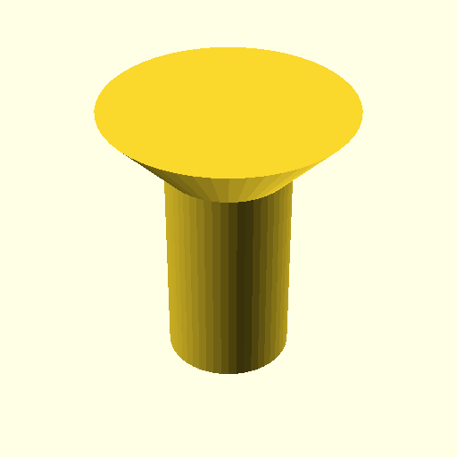

# Oobb Part Screw Countersunk M3 Radius Name 8 Depth  

note: This is part of OOMP the Oopen Organization Method For Parts. For more details: https://github.com/oomlout/oomp_base

##  part details
  

screw countersunk 0x0x0

### name
* name: Oobb Part Screw Countersunk M3 Radius Name 8 Depth
* name_short: Screw Countersunk M3 Radius Name 8 Depth
### id
* oomp_id: oobb_part_screw_countersunk_m3_radius_name_8_depth
  * classification: oobb
  * type: part
  * size: screw_countersunk
  * color: 
  * description_main: 
  * description_extra: m3_radius_name_8_depth
  * manufacturer: 
  * part_number: 
  * bip 39 word 2: audit butter
  * bip 39 word 3: audit butter whisper
  * bip 39 word: audit butter whisper wait hurt ugly fox weekend point month cover alley

### other_codes
* short_code: 
* oomp_word: mushroom rose kiss
* oomp_word_emoji :mushroom: :rose: :kiss:
* md5_6_alpha: 42mn7
* md5_6: 686323

### oomlout_oomp_utility_custom_data_manipulation
#### label print
[3x2](http://192.168.1.245:1112/?label=oomp%2042mn7)
[3x2_oomp_table](http://192.168.1.108:1112/?label=oomp%2042mn7)
[2x1](http://192.168.1.242:1112/?label=oomp%2042mn7)
[6x4](http://192.168.1.55:1112/?label=oomp%2042mn7)    

#### link

[link_main](https://github.com/oomlout/oomlout_oobb_version_4_generated_parts/tree/main/navigation_oomp/oobb/part/screw_countersunk//m3_radius_name_8_depth/part)                              

#### price

### all codes 
| key | value |  
| --- | --- |  
| classification | oobb |  
| classification_name | Oobb |  
| color |  |  
| color_name |  |  
| components | [] |  
| components_objects | [] |  
| components_string | [] |  
| depth | 8 |  
| description | screw countersunk 0x0x0 |  
| description_extra | m3_radius_name_8_depth |  
| description_extra_name | M3 Radius Name 8 Depth |  
| description_main |  |  
| description_main_name |  |  
| directory | parts/oobb_part_screw_countersunk_m3_radius_name_8_depth |  
| folder | C:\gh\oomlout_oobb_version_4_generated_parts\parts\oobb_part_screw_countersunk_m3_radius_name_8_depth |  
| github_link | https://github.com/oomlout/oomlout_oomp_part_src/tree/main/parts/oobb_part_screw_countersunk_m3_radius_name_8_depth |  
| id | oobb_part_screw_countersunk_m3_radius_name_8_depth |  
| link_1 | https://github.com/oomlout/oomlout_oobb_version_4_generated_parts/tree/main/navigation_oomp/oobb/part/screw_countersunk//m3_radius_name_8_depth/part |  
| link_1_name | link_main |  
| link_main | https://github.com/oomlout/oomlout_oobb_version_4_generated_parts/tree/main/navigation_oomp/oobb/part/screw_countersunk//m3_radius_name_8_depth/part |  
| link_oomlout_label_2x1 | http://192.168.1.242:1112/?label=oomp%2042mn7 |  
| link_oomlout_label_3x2 | http://192.168.1.245:1112/?label=oomp%2042mn7 |  
| link_oomlout_label_3x2_oomp_table | http://192.168.1.108:1112/?label=oomp%2042mn7 |  
| link_oomlout_label_6x4 | http://192.168.1.55:1112/?label=oomp%2042mn7 |  
| link_redirect | https://github.com/oomlout/oomlout_oobb_version_4_generated_parts/tree/main/parts/hardware_screw_countersunk_m3_08 |  
| manufacturer |  |  
| manufacturer_name |  |  
| md5 | 686323dd3af90b8bb037ef67f507d078 |  
| md5_10 | 686323dd3a |  
| md5_5 | 68632 |  
| md5_6 | 686323 |  
| md5_6_alpha | 42mn7 |  
| name | Oobb Part Screw Countersunk M3 Radius Name 8 Depth |  
| name_short | Screw Countersunk M3 Radius Name 8 Depth |  
| oomlout_detail_hierarchy_1 | oobb |  
| oomlout_detail_hierarchy_2 | part |  
| oomlout_detail_hierarchy_3 | scountersunk |  
| oomlout_detail_hierarchy_4 | m3_radius_name_8_depth |  
| oomlout_oomp_utility_custom_data_manipulation | True |  
| oomp_key | oomp_oobb_part_screw_countersunk_m3_radius_name_8_depth |  
| oomp_word | mushroom rose kiss |  
| oomp_word_emoji | :mushroom: :rose: :kiss: |  
| oomp_word_emoji_list | [':mushroom:', ':rose:', ':kiss:'] |  
| oomp_word_list | ['mushroom', 'rose', 'kiss'] |  
| part_number |  |  
| part_number_name |  |  
| radius_name | m3 |  
| short_name |  |  
| size | screw_countersunk |  
| size_name | Screw Countersunk |  
| type | part |  
| type_name | Part |  
