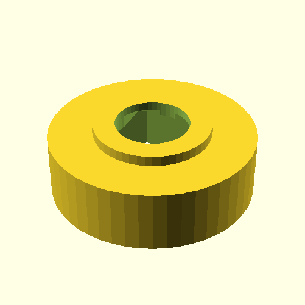

# Oobb Part Shaft 0D5 mm Depth Nut Small Extra  

note: This is part of OOMP the Oopen Organization Method For Parts. For more details: https://github.com/oomlout/oomp_base

##  part details
  

shaft 0x0x0.5

### name
* name: Oobb Part Shaft 0D5 mm Depth Nut Small Extra
* name_short: Shaft 0D5 Nut Small Extra
### id
* oomp_id: oobb_part_shaft_0d5_mm_depth_nut_small_extra
  * classification: oobb
  * type: part
  * size: shaft
  * color: 
  * description_main: 0.5_mm_depth
  * description_extra: nut_small_extra
  * manufacturer: 
  * part_number: 
  * bip 39 word 2: leaf prosper
  * bip 39 word 3: leaf prosper duck
  * bip 39 word: leaf prosper duck account loop crane category license actual cereal jar armed

### other_codes
* short_code: 
* oomp_word: sushi ambulance hammer
* oomp_word_emoji :sushi: :ambulance: :hammer:
* md5_6_alpha: 7ddvt
* md5_6: bcee89

### oomlout_oomp_utility_custom_data_manipulation
#### label print
[3x2](http://192.168.1.245:1112/?label=oomp%207ddvt)
[3x2_oomp_table](http://192.168.1.108:1112/?label=oomp%207ddvt)
[2x1](http://192.168.1.242:1112/?label=oomp%207ddvt)
[6x4](http://192.168.1.55:1112/?label=oomp%207ddvt)    

#### link

[link_main](https://github.com/oomlout/oomlout_oobb_version_4_generated_parts/tree/main/navigation_oomp/oobb/part/shaft/0.5_mm_depth/nut_small_extra/part)                              

#### price

### all codes 
| key | value |  
| --- | --- |  
| classification | oobb |  
| classification_name | Oobb |  
| color |  |  
| color_name |  |  
| components | [] |  
| components_objects | [] |  
| components_string | [] |  
| description | shaft 0x0x0.5 |  
| description_extra | nut_small_extra |  
| description_extra_name | Nut Small Extra |  
| description_main | 0.5_mm_depth |  
| description_main_name | 0.5 mm Depth |  
| directory | parts/oobb_part_shaft_0d5_mm_depth_nut_small_extra |  
| extra | nut_small |  
| folder | C:\gh\oomlout_oobb_version_4_generated_parts\parts\oobb_part_shaft_0d5_mm_depth_nut_small_extra |  
| github_link | https://github.com/oomlout/oomlout_oomp_part_src/tree/main/parts/oobb_part_shaft_0d5_mm_depth_nut_small_extra |  
| id | oobb_part_shaft_0d5_mm_depth_nut_small_extra |  
| link_1 | https://github.com/oomlout/oomlout_oobb_version_4_generated_parts/tree/main/navigation_oomp/oobb/part/shaft/0.5_mm_depth/nut_small_extra/part |  
| link_1_name | link_main |  
| link_main | https://github.com/oomlout/oomlout_oobb_version_4_generated_parts/tree/main/navigation_oomp/oobb/part/shaft/0.5_mm_depth/nut_small_extra/part |  
| link_oomlout_label_2x1 | http://192.168.1.242:1112/?label=oomp%207ddvt |  
| link_oomlout_label_3x2 | http://192.168.1.245:1112/?label=oomp%207ddvt |  
| link_oomlout_label_3x2_oomp_table | http://192.168.1.108:1112/?label=oomp%207ddvt |  
| link_oomlout_label_6x4 | http://192.168.1.55:1112/?label=oomp%207ddvt |  
| link_redirect | https://github.com/oomlout/oomlout_oobb_version_4_generated_parts/tree/main/parts/oobb_shaft_0d5_ex_nut_small |  
| manufacturer |  |  
| manufacturer_name |  |  
| md5 | bcee896017812484c941f01887ab23f5 |  
| md5_10 | bcee896017 |  
| md5_5 | bcee8 |  
| md5_6 | bcee89 |  
| md5_6_alpha | 7ddvt |  
| name | Oobb Part Shaft 0D5 mm Depth Nut Small Extra |  
| name_short | Shaft 0D5 Nut Small Extra |  
| oomlout_detail_hierarchy_1 | oobb |  
| oomlout_detail_hierarchy_2 | part |  
| oomlout_detail_hierarchy_3 | shaft |  
| oomlout_detail_hierarchy_4 | 5_mm_depth |  
| oomlout_detail_hierarchy_5 | nut_small_extra |  
| oomlout_oomp_utility_custom_data_manipulation | True |  
| oomp_key | oomp_oobb_part_shaft_0d5_mm_depth_nut_small_extra |  
| oomp_word | sushi ambulance hammer |  
| oomp_word_emoji | :sushi: :ambulance: :hammer: |  
| oomp_word_emoji_list | [':sushi:', ':ambulance:', ':hammer:'] |  
| oomp_word_list | ['sushi', 'ambulance', 'hammer'] |  
| part_number |  |  
| part_number_name |  |  
| short_name |  |  
| size | shaft |  
| size_name | Shaft |  
| thickness | 0.5 |  
| thickness_mm | 0.5 |  
| type | part |  
| type_name | Part |  
