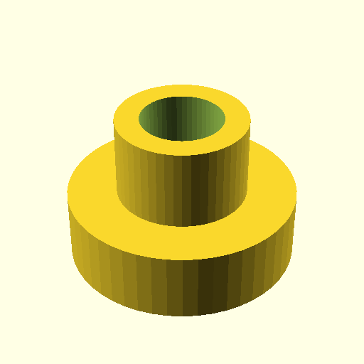

# Oobb Part Shaft 3D5 mm Depth Countersunk Small Extra  

note: This is part of OOMP the Oopen Organization Method For Parts. For more details: https://github.com/oomlout/oomp_base

##  part details
  

shaft 0x0x3.5

### name
* name: Oobb Part Shaft 3D5 mm Depth Countersunk Small Extra
* name_short: Shaft 3D5 Countersunk Small Extra
### id
* oomp_id: oobb_part_shaft_3d5_mm_depth_countersunk_small_extra
  * classification: oobb
  * type: part
  * size: shaft
  * color: 
  * description_main: 3.5_mm_depth
  * description_extra: countersunk_small_extra
  * manufacturer: 
  * part_number: 
  * bip 39 word 2: inject before
  * bip 39 word 3: inject before near
  * bip 39 word: inject before near betray light snack run seven exile employ unlock alarm

### other_codes
* short_code: 
* oomp_word: blowfish factory anger
* oomp_word_emoji :blowfish: :factory: :anger:
* md5_6_alpha: 3nuaa
* md5_6: 5ddc12

### oomlout_oomp_utility_custom_data_manipulation
#### label print
[3x2](http://192.168.1.245:1112/?label=oomp%203nuaa)
[3x2_oomp_table](http://192.168.1.108:1112/?label=oomp%203nuaa)
[2x1](http://192.168.1.242:1112/?label=oomp%203nuaa)
[6x4](http://192.168.1.55:1112/?label=oomp%203nuaa)    

#### link

[link_main](https://github.com/oomlout/oomlout_oobb_version_4_generated_parts/tree/main/navigation_oomp/oobb/part/shaft/3.5_mm_depth/countersunk_small_extra/part)                              

#### price

### all codes 
| key | value |  
| --- | --- |  
| classification | oobb |  
| classification_name | Oobb |  
| color |  |  
| color_name |  |  
| components | [] |  
| components_objects | [] |  
| components_string | [] |  
| description | shaft 0x0x3.5 |  
| description_extra | countersunk_small_extra |  
| description_extra_name | Countersunk Small Extra |  
| description_main | 3.5_mm_depth |  
| description_main_name | 3.5 mm Depth |  
| directory | parts/oobb_part_shaft_3d5_mm_depth_countersunk_small_extra |  
| extra | countersunk_small |  
| folder | C:\gh\oomlout_oobb_version_4_generated_parts\parts\oobb_part_shaft_3d5_mm_depth_countersunk_small_extra |  
| github_link | https://github.com/oomlout/oomlout_oomp_part_src/tree/main/parts/oobb_part_shaft_3d5_mm_depth_countersunk_small_extra |  
| id | oobb_part_shaft_3d5_mm_depth_countersunk_small_extra |  
| link_1 | https://github.com/oomlout/oomlout_oobb_version_4_generated_parts/tree/main/navigation_oomp/oobb/part/shaft/3.5_mm_depth/countersunk_small_extra/part |  
| link_1_name | link_main |  
| link_main | https://github.com/oomlout/oomlout_oobb_version_4_generated_parts/tree/main/navigation_oomp/oobb/part/shaft/3.5_mm_depth/countersunk_small_extra/part |  
| link_oomlout_label_2x1 | http://192.168.1.242:1112/?label=oomp%203nuaa |  
| link_oomlout_label_3x2 | http://192.168.1.245:1112/?label=oomp%203nuaa |  
| link_oomlout_label_3x2_oomp_table | http://192.168.1.108:1112/?label=oomp%203nuaa |  
| link_oomlout_label_6x4 | http://192.168.1.55:1112/?label=oomp%203nuaa |  
| link_redirect | https://github.com/oomlout/oomlout_oobb_version_4_generated_parts/tree/main/parts/oobb_shaft_3d5_ex_countersunk_small |  
| manufacturer |  |  
| manufacturer_name |  |  
| md5 | 5ddc123a7dc4b7ab3440c15727050ba0 |  
| md5_10 | 5ddc123a7d |  
| md5_5 | 5ddc1 |  
| md5_6 | 5ddc12 |  
| md5_6_alpha | 3nuaa |  
| name | Oobb Part Shaft 3D5 mm Depth Countersunk Small Extra |  
| name_short | Shaft 3D5 Countersunk Small Extra |  
| oomlout_detail_hierarchy_1 | oobb |  
| oomlout_detail_hierarchy_2 | part |  
| oomlout_detail_hierarchy_3 | shaft |  
| oomlout_detail_hierarchy_4 | 5_mm_depth |  
| oomlout_detail_hierarchy_5 | countersunk_small_extra |  
| oomlout_oomp_utility_custom_data_manipulation | True |  
| oomp_key | oomp_oobb_part_shaft_3d5_mm_depth_countersunk_small_extra |  
| oomp_word | blowfish factory anger |  
| oomp_word_emoji | :blowfish: :factory: :anger: |  
| oomp_word_emoji_list | [':blowfish:', ':factory:', ':anger:'] |  
| oomp_word_list | ['blowfish', 'factory', 'anger'] |  
| part_number |  |  
| part_number_name |  |  
| short_name |  |  
| size | shaft |  
| size_name | Shaft |  
| thickness | 3.5 |  
| thickness_mm | 3.5 |  
| type | part |  
| type_name | Part |  
