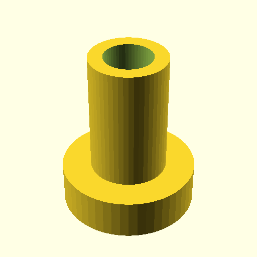

# Oobb Part Shaft 9 mm Depth Small Extra  

note: This is part of OOMP the Oopen Organization Method For Parts. For more details: https://github.com/oomlout/oomp_base

##  part details
  

shaft 0x0x9

### name
* name: Oobb Part Shaft 9 mm Depth Small Extra
* name_short: Shaft 9 Small Extra
### id
* oomp_id: oobb_part_shaft_9_mm_depth_small_extra
  * classification: oobb
  * type: part
  * size: shaft
  * color: 
  * description_main: 9_mm_depth
  * description_extra: small_extra
  * manufacturer: 
  * part_number: 
  * bip 39 word 2: review picture
  * bip 39 word 3: review picture appear
  * bip 39 word: review picture appear circle credit paper stove cancel select force pole arch

### other_codes
* short_code: 
* oomp_word: briefcase ant thumbsup
* oomp_word_emoji :briefcase: :ant: :thumbsup:
* md5_6_alpha: 6x252
* md5_6: b14f16

### oomlout_oomp_utility_custom_data_manipulation
#### label print
[3x2](http://192.168.1.245:1112/?label=oomp%206x252)
[3x2_oomp_table](http://192.168.1.108:1112/?label=oomp%206x252)
[2x1](http://192.168.1.242:1112/?label=oomp%206x252)
[6x4](http://192.168.1.55:1112/?label=oomp%206x252)    

#### link

[link_main](https://github.com/oomlout/oomlout_oobb_version_4_generated_parts/tree/main/navigation_oomp/oobb/part/shaft/9_mm_depth/small_extra/part)                              

#### price

### all codes 
| key | value |  
| --- | --- |  
| classification | oobb |  
| classification_name | Oobb |  
| color |  |  
| color_name |  |  
| components | [] |  
| components_objects | [] |  
| components_string | [] |  
| description | shaft 0x0x9 |  
| description_extra | small_extra |  
| description_extra_name | Small Extra |  
| description_main | 9_mm_depth |  
| description_main_name | 9 mm Depth |  
| directory | parts/oobb_part_shaft_9_mm_depth_small_extra |  
| extra | small |  
| folder | C:\gh\oomlout_oobb_version_4_generated_parts\parts\oobb_part_shaft_9_mm_depth_small_extra |  
| github_link | https://github.com/oomlout/oomlout_oomp_part_src/tree/main/parts/oobb_part_shaft_9_mm_depth_small_extra |  
| id | oobb_part_shaft_9_mm_depth_small_extra |  
| link_1 | https://github.com/oomlout/oomlout_oobb_version_4_generated_parts/tree/main/navigation_oomp/oobb/part/shaft/9_mm_depth/small_extra/part |  
| link_1_name | link_main |  
| link_main | https://github.com/oomlout/oomlout_oobb_version_4_generated_parts/tree/main/navigation_oomp/oobb/part/shaft/9_mm_depth/small_extra/part |  
| link_oomlout_label_2x1 | http://192.168.1.242:1112/?label=oomp%206x252 |  
| link_oomlout_label_3x2 | http://192.168.1.245:1112/?label=oomp%206x252 |  
| link_oomlout_label_3x2_oomp_table | http://192.168.1.108:1112/?label=oomp%206x252 |  
| link_oomlout_label_6x4 | http://192.168.1.55:1112/?label=oomp%206x252 |  
| link_redirect | https://github.com/oomlout/oomlout_oobb_version_4_generated_parts/tree/main/parts/oobb_shaft_09_ex_small |  
| manufacturer |  |  
| manufacturer_name |  |  
| md5 | b14f16c61a213ad67f998292152915c4 |  
| md5_10 | b14f16c61a |  
| md5_5 | b14f1 |  
| md5_6 | b14f16 |  
| md5_6_alpha | 6x252 |  
| name | Oobb Part Shaft 9 mm Depth Small Extra |  
| name_short | Shaft 9 Small Extra |  
| oomlout_detail_hierarchy_1 | oobb |  
| oomlout_detail_hierarchy_2 | part |  
| oomlout_detail_hierarchy_3 | shaft |  
| oomlout_detail_hierarchy_4 | 9_mm_depth |  
| oomlout_detail_hierarchy_5 | small_extra |  
| oomlout_oomp_utility_custom_data_manipulation | True |  
| oomp_key | oomp_oobb_part_shaft_9_mm_depth_small_extra |  
| oomp_word | briefcase ant thumbsup |  
| oomp_word_emoji | :briefcase: :ant: :thumbsup: |  
| oomp_word_emoji_list | [':briefcase:', ':ant:', ':thumbsup:'] |  
| oomp_word_list | ['briefcase', 'ant', 'thumbsup'] |  
| part_number |  |  
| part_number_name |  |  
| short_name |  |  
| size | shaft |  
| size_name | Shaft |  
| thickness | 9 |  
| thickness_mm | 9 |  
| type | part |  
| type_name | Part |  
