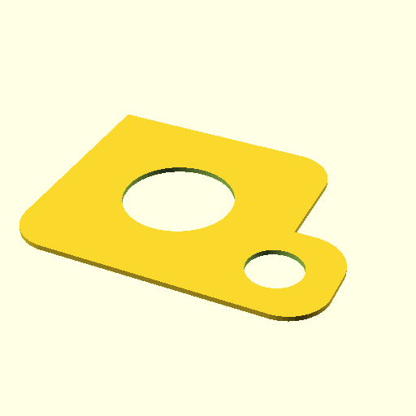

# Oobb Part SMD Magazine Lid 2 Width 2 Height  

note: This is part of OOMP the Oopen Organization Method For Parts. For more details: https://github.com/oomlout/oomp_base

##  part details
  

smd magazine lid 2x2x0

### name
* name: Oobb Part SMD Magazine Lid 2 Width 2 Height
* name_short: Smd Magazine Lid 2x2 Height
### id
* oomp_id: oobb_part_smd_magazine_lid_2_width_2_height
  * classification: oobb
  * type: part
  * size: smd_magazine_lid
  * color: 
  * description_main: 2_width_2_height
  * description_extra: 
  * manufacturer: 
  * part_number: 
  * bip 39 word 2: panda bubble
  * bip 39 word 3: panda bubble electric
  * bip 39 word: panda bubble electric become oval crawl grace funny chuckle script resource apple

### other_codes
* short_code: 
* oomp_word: boot moon foggy
* oomp_word_emoji :boot: :moon: :foggy:
* md5_6_alpha: 6ot2o
* md5_6: ab6f30

### oomlout_oomp_utility_custom_data_manipulation
#### label print
[3x2](http://192.168.1.245:1112/?label=oomp%206ot2o)
[3x2_oomp_table](http://192.168.1.108:1112/?label=oomp%206ot2o)
[2x1](http://192.168.1.242:1112/?label=oomp%206ot2o)
[6x4](http://192.168.1.55:1112/?label=oomp%206ot2o)    

#### link

[link_main](https://github.com/oomlout/oomlout_oobb_version_4_generated_parts/tree/main/navigation_oomp/oobb/part/smd_magazine_lid/2_width_2_height/part)                              

#### price

### all codes 
| key | value |  
| --- | --- |  
| classification | oobb |  
| classification_name | Oobb |  
| color |  |  
| color_name |  |  
| components | [] |  
| components_objects | [] |  
| components_string | [] |  
| description | smd magazine lid 2x2x0 |  
| description_extra |  |  
| description_extra_name |  |  
| description_main | 2_width_2_height |  
| description_main_name | 2 Width 2 Height |  
| directory | parts/oobb_part_smd_magazine_lid_2_width_2_height |  
| folder | C:\gh\oomlout_oobb_version_4_generated_parts\parts\oobb_part_smd_magazine_lid_2_width_2_height |  
| github_link | https://github.com/oomlout/oomlout_oomp_part_src/tree/main/parts/oobb_part_smd_magazine_lid_2_width_2_height |  
| height | 2 |  
| height_mm | 29 |  
| id | oobb_part_smd_magazine_lid_2_width_2_height |  
| link_1 | https://github.com/oomlout/oomlout_oobb_version_4_generated_parts/tree/main/navigation_oomp/oobb/part/smd_magazine_lid/2_width_2_height/part |  
| link_1_name | link_main |  
| link_main | https://github.com/oomlout/oomlout_oobb_version_4_generated_parts/tree/main/navigation_oomp/oobb/part/smd_magazine_lid/2_width_2_height/part |  
| link_oomlout_label_2x1 | http://192.168.1.242:1112/?label=oomp%206ot2o |  
| link_oomlout_label_3x2 | http://192.168.1.245:1112/?label=oomp%206ot2o |  
| link_oomlout_label_3x2_oomp_table | http://192.168.1.108:1112/?label=oomp%206ot2o |  
| link_oomlout_label_6x4 | http://192.168.1.55:1112/?label=oomp%206ot2o |  
| link_redirect | https://github.com/oomlout/oomlout_oobb_version_4_generated_parts/tree/main/parts/oobb_smd_magazine_lid_02_02 |  
| manufacturer |  |  
| manufacturer_name |  |  
| md5 | ab6f3069445e2caccaced13e8ec754fb |  
| md5_10 | ab6f306944 |  
| md5_5 | ab6f3 |  
| md5_6 | ab6f30 |  
| md5_6_alpha | 6ot2o |  
| name | Oobb Part SMD Magazine Lid 2 Width 2 Height |  
| name_short | Smd Magazine Lid 2x2 Height |  
| oomlout_detail_hierarchy_1 | oobb |  
| oomlout_detail_hierarchy_2 | part |  
| oomlout_detail_hierarchy_3 | smd_magazine_lid |  
| oomlout_detail_hierarchy_4 | 2_width_2_height |  
| oomlout_oomp_utility_custom_data_manipulation | True |  
| oomp_key | oomp_oobb_part_smd_magazine_lid_2_width_2_height |  
| oomp_word | boot moon foggy |  
| oomp_word_emoji | :boot: :moon: :foggy: |  
| oomp_word_emoji_list | [':boot:', ':moon:', ':foggy:'] |  
| oomp_word_list | ['boot', 'moon', 'foggy'] |  
| part_number |  |  
| part_number_name |  |  
| short_name |  |  
| size | smd_magazine_lid |  
| size_name | SMD Magazine Lid |  
| type | part |  
| type_name | Part |  
| width | 2 |  
| width_mm | 29 |  
