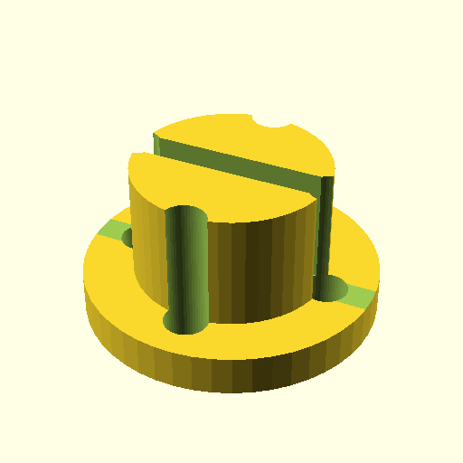

# Oobb Part SMD Magazine Refiller 3 Width Big Extra  

note: This is part of OOMP the Oopen Organization Method For Parts. For more details: https://github.com/oomlout/oomp_base

##  part details
  

smd magazine refiller 3x0x0

### name
* name: Oobb Part SMD Magazine Refiller 3 Width Big Extra
* name_short: Smd Magazine Refiller 3xBig Extra
### id
* oomp_id: oobb_part_smd_magazine_refiller_3_width_big_extra
  * classification: oobb
  * type: part
  * size: smd_magazine_refiller
  * color: 
  * description_main: 3_width
  * description_extra: big_extra
  * manufacturer: 
  * part_number: 
  * bip 39 word 2: finger fatigue
  * bip 39 word 3: finger fatigue arch
  * bip 39 word: finger fatigue arch mountain cannon patrol gauge crawl inhale trap dawn arena

### other_codes
* short_code: 
* oomp_word: beer moon eight
* oomp_word_emoji :beer: :moon: :eight:
* md5_6_alpha: 749h5
* md5_6: b66ff9

### oomlout_oomp_utility_custom_data_manipulation
#### label print
[3x2](http://192.168.1.245:1112/?label=oomp%20749h5)
[3x2_oomp_table](http://192.168.1.108:1112/?label=oomp%20749h5)
[2x1](http://192.168.1.242:1112/?label=oomp%20749h5)
[6x4](http://192.168.1.55:1112/?label=oomp%20749h5)    

#### link

[link_main](https://github.com/oomlout/oomlout_oobb_version_4_generated_parts/tree/main/navigation_oomp/oobb/part/smd_magazine_refiller/3_width/big_extra/part)                              

#### price

### all codes 
| key | value |  
| --- | --- |  
| classification | oobb |  
| classification_name | Oobb |  
| color |  |  
| color_name |  |  
| components | [] |  
| components_objects | [] |  
| components_string | [] |  
| description | smd magazine refiller 3x0x0 |  
| description_extra | big_extra |  
| description_extra_name | Big Extra |  
| description_main | 3_width |  
| description_main_name | 3 Width |  
| directory | parts/oobb_part_smd_magazine_refiller_3_width_big_extra |  
| extra | big |  
| folder | C:\gh\oomlout_oobb_version_4_generated_parts\parts\oobb_part_smd_magazine_refiller_3_width_big_extra |  
| github_link | https://github.com/oomlout/oomlout_oomp_part_src/tree/main/parts/oobb_part_smd_magazine_refiller_3_width_big_extra |  
| id | oobb_part_smd_magazine_refiller_3_width_big_extra |  
| link_1 | https://github.com/oomlout/oomlout_oobb_version_4_generated_parts/tree/main/navigation_oomp/oobb/part/smd_magazine_refiller/3_width/big_extra/part |  
| link_1_name | link_main |  
| link_main | https://github.com/oomlout/oomlout_oobb_version_4_generated_parts/tree/main/navigation_oomp/oobb/part/smd_magazine_refiller/3_width/big_extra/part |  
| link_oomlout_label_2x1 | http://192.168.1.242:1112/?label=oomp%20749h5 |  
| link_oomlout_label_3x2 | http://192.168.1.245:1112/?label=oomp%20749h5 |  
| link_oomlout_label_3x2_oomp_table | http://192.168.1.108:1112/?label=oomp%20749h5 |  
| link_oomlout_label_6x4 | http://192.168.1.55:1112/?label=oomp%20749h5 |  
| link_redirect | https://github.com/oomlout/oomlout_oobb_version_4_generated_parts/tree/main/parts/oobb_smd_magazine_refiller_03_ex_big |  
| manufacturer |  |  
| manufacturer_name |  |  
| md5 | b66ff9d39d32ac128490b9081614f2b7 |  
| md5_10 | b66ff9d39d |  
| md5_5 | b66ff |  
| md5_6 | b66ff9 |  
| md5_6_alpha | 749h5 |  
| name | Oobb Part SMD Magazine Refiller 3 Width Big Extra |  
| name_short | Smd Magazine Refiller 3xBig Extra |  
| oomlout_detail_hierarchy_1 | oobb |  
| oomlout_detail_hierarchy_2 | part |  
| oomlout_detail_hierarchy_3 | smd_magazine_refiller |  
| oomlout_detail_hierarchy_4 | 3_width |  
| oomlout_detail_hierarchy_5 | big_extra |  
| oomlout_oomp_utility_custom_data_manipulation | True |  
| oomp_key | oomp_oobb_part_smd_magazine_refiller_3_width_big_extra |  
| oomp_word | beer moon eight |  
| oomp_word_emoji | :beer: :moon: :eight: |  
| oomp_word_emoji_list | [':beer:', ':moon:', ':eight:'] |  
| oomp_word_list | ['beer', 'moon', 'eight'] |  
| part_number |  |  
| part_number_name |  |  
| short_name |  |  
| size | smd_magazine_refiller |  
| size_name | SMD Magazine Refiller |  
| type | part |  
| type_name | Part |  
| width | 3 |  
| width_mm | 44 |  
