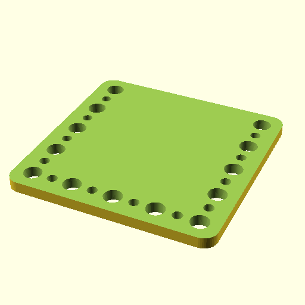

# Oobb Part Tool Holder Vertical 5 Width 5 Height 8 mm Depth Tool Screwdriver Hex Key Set Small Extra  

note: This is part of OOMP the Oopen Organization Method For Parts. For more details: https://github.com/oomlout/oomp_base

##  part details
  

tool holder vertical 5x5x8

### name
* name: Oobb Part Tool Holder Vertical 5 Width 5 Height 8 mm Depth Tool Screwdriver Hex Key Set Small Extra
* name_short: Tool Holder Vertical 5x5x8 Tool
### id
* oomp_id: oobb_part_tool_holder_vertical_5_width_5_height_8_mm_depth_tool_screwdriver_hex_key_set_small_extra
  * classification: oobb
  * type: part
  * size: tool_holder_vertical
  * color: 
  * description_main: 5_width_5_height_8_mm_depth
  * description_extra: tool_screwdriver_hex_key_set_small_extra
  * manufacturer: 
  * part_number: 
  * bip 39 word 2: jelly defense
  * bip 39 word 3: jelly defense label
  * bip 39 word: jelly defense label clog prefer tongue useful hedgehog mansion reunion tone almost

### other_codes
* short_code: 
* oomp_word: shell apple jeans
* oomp_word_emoji :shell: :apple: :jeans:
* md5_6_alpha: 4a7ji
* md5_6: 6dc8ae

### oomlout_oomp_utility_custom_data_manipulation
#### label print
[3x2](http://192.168.1.245:1112/?label=oomp%204a7ji)
[3x2_oomp_table](http://192.168.1.108:1112/?label=oomp%204a7ji)
[2x1](http://192.168.1.242:1112/?label=oomp%204a7ji)
[6x4](http://192.168.1.55:1112/?label=oomp%204a7ji)    

#### link

[link_main](https://github.com/oomlout/oomlout_oobb_version_4_generated_parts/tree/main/navigation_oomp/oobb/part/tool_holder_vertical/5_width_5_height_8_mm_depth/tool_screwdriver_hex_key_set_small_extra/part)                              

#### price

### all codes 
| key | value |  
| --- | --- |  
| classification | oobb |  
| classification_name | Oobb |  
| color |  |  
| color_name |  |  
| components | [] |  
| components_objects | [] |  
| components_string | [] |  
| description | tool holder vertical 5x5x8 |  
| description_extra | tool_screwdriver_hex_key_set_small_extra |  
| description_extra_name | Tool Screwdriver Hex Key Set Small Extra |  
| description_main | 5_width_5_height_8_mm_depth |  
| description_main_name | 5 Width 5 Height 8 mm Depth |  
| directory | parts/oobb_part_tool_holder_vertical_5_width_5_height_8_mm_depth_tool_screwdriver_hex_key_set_small_extra |  
| extra | tool_screwdriver_hex_key_set_small |  
| folder | C:\gh\oomlout_oobb_version_4_generated_parts\parts\oobb_part_tool_holder_vertical_5_width_5_height_8_mm_depth_tool_screwdriver_hex_key_set_small_extra |  
| github_link | https://github.com/oomlout/oomlout_oomp_part_src/tree/main/parts/oobb_part_tool_holder_vertical_5_width_5_height_8_mm_depth_tool_screwdriver_hex_key_set_small_extra |  
| height | 5 |  
| height_mm | 74 |  
| id | oobb_part_tool_holder_vertical_5_width_5_height_8_mm_depth_tool_screwdriver_hex_key_set_small_extra |  
| link_1 | https://github.com/oomlout/oomlout_oobb_version_4_generated_parts/tree/main/navigation_oomp/oobb/part/tool_holder_vertical/5_width_5_height_8_mm_depth/tool_screwdriver_hex_key_set_small_extra/part |  
| link_1_name | link_main |  
| link_main | https://github.com/oomlout/oomlout_oobb_version_4_generated_parts/tree/main/navigation_oomp/oobb/part/tool_holder_vertical/5_width_5_height_8_mm_depth/tool_screwdriver_hex_key_set_small_extra/part |  
| link_oomlout_label_2x1 | http://192.168.1.242:1112/?label=oomp%204a7ji |  
| link_oomlout_label_3x2 | http://192.168.1.245:1112/?label=oomp%204a7ji |  
| link_oomlout_label_3x2_oomp_table | http://192.168.1.108:1112/?label=oomp%204a7ji |  
| link_oomlout_label_6x4 | http://192.168.1.55:1112/?label=oomp%204a7ji |  
| link_redirect | https://github.com/oomlout/oomlout_oobb_version_4_generated_parts/tree/main/parts/oobb_tool_holder_vertical_05_05_08_ex_tool_screwdriver_hex_key_set_small |  
| manufacturer |  |  
| manufacturer_name |  |  
| md5 | 6dc8ae143a6a9dff91d4e2b8f84e5bbe |  
| md5_10 | 6dc8ae143a |  
| md5_5 | 6dc8a |  
| md5_6 | 6dc8ae |  
| md5_6_alpha | 4a7ji |  
| name | Oobb Part Tool Holder Vertical 5 Width 5 Height 8 mm Depth Tool Screwdriver Hex Key Set Small Extra |  
| name_short | Tool Holder Vertical 5x5x8 Tool |  
| oomlout_detail_hierarchy_1 | oobb |  
| oomlout_detail_hierarchy_2 | part |  
| oomlout_detail_hierarchy_3 | tool_holder_vertical |  
| oomlout_detail_hierarchy_4 | 8_mm_depth |  
| oomlout_detail_hierarchy_5 | tool_screwdriver_hex_key |  
| oomlout_detail_hierarchy_6 | set_small_extra |  
| oomlout_oomp_utility_custom_data_manipulation | True |  
| oomp_key | oomp_oobb_part_tool_holder_vertical_5_width_5_height_8_mm_depth_tool_screwdriver_hex_key_set_small_extra |  
| oomp_word | shell apple jeans |  
| oomp_word_emoji | :shell: :apple: :jeans: |  
| oomp_word_emoji_list | [':shell:', ':apple:', ':jeans:'] |  
| oomp_word_list | ['shell', 'apple', 'jeans'] |  
| part_number |  |  
| part_number_name |  |  
| short_name |  |  
| size | tool_holder_vertical |  
| size_name | Tool Holder Vertical |  
| thickness | 8 |  
| thickness_mm | 8 |  
| type | part |  
| type_name | Part |  
| width | 5 |  
| width_mm | 74 |  
