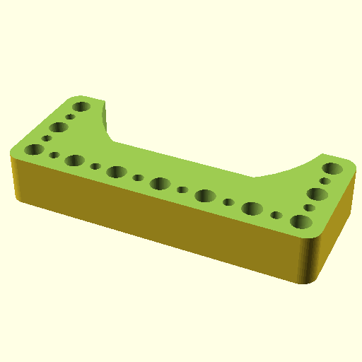

# Oobb Part Tool Holder Vertical 7 Width 3 Height 34 mm Depth Tool Timer 80 mm Diameter 30 mm Depth Black Extra  

note: This is part of OOMP the Oopen Organization Method For Parts. For more details: https://github.com/oomlout/oomp_base

##  part details
  

tool holder vertical 7x3x34

### name
* name: Oobb Part Tool Holder Vertical 7 Width 3 Height 34 mm Depth Tool Timer 80 mm Diameter 30 mm Depth Black Extra
* name_short: Tool Holder Vertical 7x3x34 Tool Timer
### id
* oomp_id: oobb_part_tool_holder_vertical_7_width_3_height_34_mm_depth_tool_timer_80_mm_diameter_30_mm_depth_black_extra
  * classification: oobb
  * type: part
  * size: tool_holder_vertical
  * color: 
  * description_main: 7_width_3_height_34_mm_depth
  * description_extra: tool_timer_80_mm_diameter_30_mm_depth_black_extra
  * manufacturer: 
  * part_number: 
  * bip 39 word 2: town claw
  * bip 39 word 3: town claw lake
  * bip 39 word: town claw lake rescue taste salmon diesel nuclear habit atom peace audit

### other_codes
* short_code: 
* oomp_word: ticket elephant lock
* oomp_word_emoji :ticket: :elephant: :lock:
* md5_6_alpha: 9ew77
* md5_6: f14383

### oomlout_oomp_utility_custom_data_manipulation
#### label print
[3x2](http://192.168.1.245:1112/?label=oomp%209ew77)
[3x2_oomp_table](http://192.168.1.108:1112/?label=oomp%209ew77)
[2x1](http://192.168.1.242:1112/?label=oomp%209ew77)
[6x4](http://192.168.1.55:1112/?label=oomp%209ew77)    

#### link

[link_main](https://github.com/oomlout/oomlout_oobb_version_4_generated_parts/tree/main/navigation_oomp/oobb/part/tool_holder_vertical/7_width_3_height_34_mm_depth/tool_timer_80_mm_diameter_30_mm_depth_black_extra/part)                              

#### price

### all codes 
| key | value |  
| --- | --- |  
| classification | oobb |  
| classification_name | Oobb |  
| color |  |  
| color_name |  |  
| components | [] |  
| components_objects | [] |  
| components_string | [] |  
| description | tool holder vertical 7x3x34 |  
| description_extra | tool_timer_80_mm_diameter_30_mm_depth_black_extra |  
| description_extra_name | Tool Timer 80 mm Diameter 30 mm Depth Black Extra |  
| description_main | 7_width_3_height_34_mm_depth |  
| description_main_name | 7 Width 3 Height 34 mm Depth |  
| directory | parts/oobb_part_tool_holder_vertical_7_width_3_height_34_mm_depth_tool_timer_80_mm_diameter_30_mm_depth_black_extra |  
| extra | tool_timer_80_mm_diameter_30_mm_depth_black |  
| folder | C:\gh\oomlout_oobb_version_4_generated_parts\parts\oobb_part_tool_holder_vertical_7_width_3_height_34_mm_depth_tool_timer_80_mm_diameter_30_mm_depth_black_extra |  
| github_link | https://github.com/oomlout/oomlout_oomp_part_src/tree/main/parts/oobb_part_tool_holder_vertical_7_width_3_height_34_mm_depth_tool_timer_80_mm_diameter_30_mm_depth_black_extra |  
| height | 3 |  
| height_mm | 44 |  
| id | oobb_part_tool_holder_vertical_7_width_3_height_34_mm_depth_tool_timer_80_mm_diameter_30_mm_depth_black_extra |  
| link_1 | https://github.com/oomlout/oomlout_oobb_version_4_generated_parts/tree/main/navigation_oomp/oobb/part/tool_holder_vertical/7_width_3_height_34_mm_depth/tool_timer_80_mm_diameter_30_mm_depth_black_extra/part |  
| link_1_name | link_main |  
| link_main | https://github.com/oomlout/oomlout_oobb_version_4_generated_parts/tree/main/navigation_oomp/oobb/part/tool_holder_vertical/7_width_3_height_34_mm_depth/tool_timer_80_mm_diameter_30_mm_depth_black_extra/part |  
| link_oomlout_label_2x1 | http://192.168.1.242:1112/?label=oomp%209ew77 |  
| link_oomlout_label_3x2 | http://192.168.1.245:1112/?label=oomp%209ew77 |  
| link_oomlout_label_3x2_oomp_table | http://192.168.1.108:1112/?label=oomp%209ew77 |  
| link_oomlout_label_6x4 | http://192.168.1.55:1112/?label=oomp%209ew77 |  
| link_redirect | https://github.com/oomlout/oomlout_oobb_version_4_generated_parts/tree/main/parts/oobb_tool_holder_vertical_07_03_34_ex_tool_timer_80_mm_diameter_30_mm_depth_black |  
| manufacturer |  |  
| manufacturer_name |  |  
| md5 | f1438393419747b2f9ef1b72f94a8732 |  
| md5_10 | f143839341 |  
| md5_5 | f1438 |  
| md5_6 | f14383 |  
| md5_6_alpha | 9ew77 |  
| name | Oobb Part Tool Holder Vertical 7 Width 3 Height 34 mm Depth Tool Timer 80 mm Diameter 30 mm Depth Black Extra |  
| name_short | Tool Holder Vertical 7x3x34 Tool Timer |  
| oomlout_detail_hierarchy_1 | oobb |  
| oomlout_detail_hierarchy_2 | part |  
| oomlout_detail_hierarchy_3 | tool_holder_vertical |  
| oomlout_detail_hierarchy_4 | 34_mm_depth |  
| oomlout_detail_hierarchy_5 | 30_mm_depth |  
| oomlout_oomp_utility_custom_data_manipulation | True |  
| oomp_key | oomp_oobb_part_tool_holder_vertical_7_width_3_height_34_mm_depth_tool_timer_80_mm_diameter_30_mm_depth_black_extra |  
| oomp_word | ticket elephant lock |  
| oomp_word_emoji | :ticket: :elephant: :lock: |  
| oomp_word_emoji_list | [':ticket:', ':elephant:', ':lock:'] |  
| oomp_word_list | ['ticket', 'elephant', 'lock'] |  
| part_number |  |  
| part_number_name |  |  
| short_name |  |  
| size | tool_holder_vertical |  
| size_name | Tool Holder Vertical |  
| thickness | 34 |  
| thickness_mm | 34 |  
| type | part |  
| type_name | Part |  
| width | 7 |  
| width_mm | 104 |  
