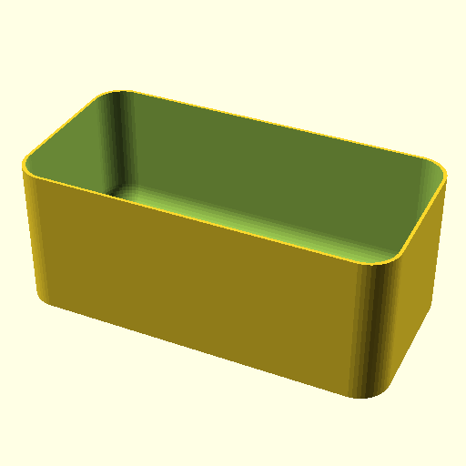

# Oobb Part Tray Thin 4 Width 2 Height 24 mm Depth  

note: This is part of OOMP the Oopen Organization Method For Parts. For more details: https://github.com/oomlout/oomp_base

##  part details
  

tray thin 4x2x24

### name
* name: Oobb Part Tray Thin 4 Width 2 Height 24 mm Depth
* name_short: Tray Thin 4x2x24 
### id
* oomp_id: oobb_part_tray_thin_4_width_2_height_24_mm_depth
  * classification: oobb
  * type: part
  * size: tray_thin
  * color: 
  * description_main: 4_width_2_height_24_mm_depth
  * description_extra: 
  * manufacturer: 
  * part_number: 
  * bip 39 word 2: grace syrup
  * bip 39 word 3: grace syrup giggle
  * bip 39 word: grace syrup giggle lion decide genius thought mule winter mistake unfair autumn

### other_codes
* short_code: 
* oomp_word: ok hotel kiss
* oomp_word_emoji :ok: :hotel: :kiss:
* md5_6_alpha: 9trmr
* md5_6: fbda23

### oomlout_oomp_utility_custom_data_manipulation
#### label print
[3x2](http://192.168.1.245:1112/?label=oomp%209trmr)
[3x2_oomp_table](http://192.168.1.108:1112/?label=oomp%209trmr)
[2x1](http://192.168.1.242:1112/?label=oomp%209trmr)
[6x4](http://192.168.1.55:1112/?label=oomp%209trmr)    

#### link

[link_main](https://github.com/oomlout/oomlout_oobb_version_4_generated_parts/tree/main/navigation_oomp/oobb/part/tray_thin/4_width_2_height_24_mm_depth/part)                              

#### price

### all codes 
| key | value |  
| --- | --- |  
| classification | oobb |  
| classification_name | Oobb |  
| color |  |  
| color_name |  |  
| components | [] |  
| components_objects | [] |  
| components_string | [] |  
| description | tray thin 4x2x24 |  
| description_extra |  |  
| description_extra_name |  |  
| description_main | 4_width_2_height_24_mm_depth |  
| description_main_name | 4 Width 2 Height 24 mm Depth |  
| directory | parts/oobb_part_tray_thin_4_width_2_height_24_mm_depth |  
| folder | C:\gh\oomlout_oobb_version_4_generated_parts\parts\oobb_part_tray_thin_4_width_2_height_24_mm_depth |  
| github_link | https://github.com/oomlout/oomlout_oomp_part_src/tree/main/parts/oobb_part_tray_thin_4_width_2_height_24_mm_depth |  
| height | 2 |  
| height_mm | 29 |  
| id | oobb_part_tray_thin_4_width_2_height_24_mm_depth |  
| link_1 | https://github.com/oomlout/oomlout_oobb_version_4_generated_parts/tree/main/navigation_oomp/oobb/part/tray_thin/4_width_2_height_24_mm_depth/part |  
| link_1_name | link_main |  
| link_main | https://github.com/oomlout/oomlout_oobb_version_4_generated_parts/tree/main/navigation_oomp/oobb/part/tray_thin/4_width_2_height_24_mm_depth/part |  
| link_oomlout_label_2x1 | http://192.168.1.242:1112/?label=oomp%209trmr |  
| link_oomlout_label_3x2 | http://192.168.1.245:1112/?label=oomp%209trmr |  
| link_oomlout_label_3x2_oomp_table | http://192.168.1.108:1112/?label=oomp%209trmr |  
| link_oomlout_label_6x4 | http://192.168.1.55:1112/?label=oomp%209trmr |  
| link_redirect | https://github.com/oomlout/oomlout_oobb_version_4_generated_parts/tree/main/parts/oobb_tray_thin_04_02_24 |  
| manufacturer |  |  
| manufacturer_name |  |  
| md5 | fbda237fe0915c1d839c6822c3f72b2b |  
| md5_10 | fbda237fe0 |  
| md5_5 | fbda2 |  
| md5_6 | fbda23 |  
| md5_6_alpha | 9trmr |  
| name | Oobb Part Tray Thin 4 Width 2 Height 24 mm Depth |  
| name_short | Tray Thin 4x2x24  |  
| oomlout_detail_hierarchy_1 | oobb |  
| oomlout_detail_hierarchy_2 | part |  
| oomlout_detail_hierarchy_3 | tray_thin |  
| oomlout_detail_hierarchy_4 | 24_mm_depth |  
| oomlout_oomp_utility_custom_data_manipulation | True |  
| oomp_key | oomp_oobb_part_tray_thin_4_width_2_height_24_mm_depth |  
| oomp_word | ok hotel kiss |  
| oomp_word_emoji | :ok: :hotel: :kiss: |  
| oomp_word_emoji_list | [':ok:', ':hotel:', ':kiss:'] |  
| oomp_word_list | ['ok', 'hotel', 'kiss'] |  
| part_number |  |  
| part_number_name |  |  
| short_name |  |  
| size | tray_thin |  
| size_name | Tray Thin |  
| thickness | 24 |  
| thickness_mm | 24 |  
| type | part |  
| type_name | Part |  
| width | 4 |  
| width_mm | 59 |  
