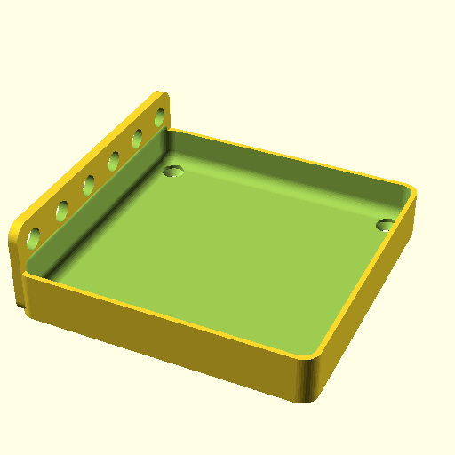

# Oobb Part Tray Vertical 6 Width 6 Height 15 mm Depth  

note: This is part of OOMP the Oopen Organization Method For Parts. For more details: https://github.com/oomlout/oomp_base

##  part details
  

tray vertical 6x6x15

### name
* name: Oobb Part Tray Vertical 6 Width 6 Height 15 mm Depth
* name_short: Tray Vertical 6x6x15 
### id
* oomp_id: oobb_part_tray_vertical_6_width_6_height_15_mm_depth
  * classification: oobb
  * type: part
  * size: tray_vertical
  * color: 
  * description_main: 6_width_6_height_15_mm_depth
  * description_extra: 
  * manufacturer: 
  * part_number: 
  * bip 39 word 2: curve open
  * bip 39 word 3: curve open certain
  * bip 39 word: curve open certain margin lake elite lobster print deposit august club acquire

### other_codes
* short_code: 
* oomp_word: lips water_buffalo elephant
* oomp_word_emoji :lips: :water_buffalo: :elephant:
* md5_6_alpha: 1c8qr
* md5_6: 225843

### oomlout_oomp_utility_custom_data_manipulation
#### label print
[3x2](http://192.168.1.245:1112/?label=oomp%201c8qr)
[3x2_oomp_table](http://192.168.1.108:1112/?label=oomp%201c8qr)
[2x1](http://192.168.1.242:1112/?label=oomp%201c8qr)
[6x4](http://192.168.1.55:1112/?label=oomp%201c8qr)    

#### link

[link_main](https://github.com/oomlout/oomlout_oobb_version_4_generated_parts/tree/main/navigation_oomp/oobb/part/tray_vertical/6_width_6_height_15_mm_depth/part)                              

#### price

### all codes 
| key | value |  
| --- | --- |  
| classification | oobb |  
| classification_name | Oobb |  
| color |  |  
| color_name |  |  
| components | [] |  
| components_objects | [] |  
| components_string | [] |  
| description | tray vertical 6x6x15 |  
| description_extra |  |  
| description_extra_name |  |  
| description_main | 6_width_6_height_15_mm_depth |  
| description_main_name | 6 Width 6 Height 15 mm Depth |  
| directory | parts/oobb_part_tray_vertical_6_width_6_height_15_mm_depth |  
| folder | C:\gh\oomlout_oobb_version_4_generated_parts\parts\oobb_part_tray_vertical_6_width_6_height_15_mm_depth |  
| github_link | https://github.com/oomlout/oomlout_oomp_part_src/tree/main/parts/oobb_part_tray_vertical_6_width_6_height_15_mm_depth |  
| height | 6 |  
| height_mm | 89 |  
| id | oobb_part_tray_vertical_6_width_6_height_15_mm_depth |  
| link_1 | https://github.com/oomlout/oomlout_oobb_version_4_generated_parts/tree/main/navigation_oomp/oobb/part/tray_vertical/6_width_6_height_15_mm_depth/part |  
| link_1_name | link_main |  
| link_main | https://github.com/oomlout/oomlout_oobb_version_4_generated_parts/tree/main/navigation_oomp/oobb/part/tray_vertical/6_width_6_height_15_mm_depth/part |  
| link_oomlout_label_2x1 | http://192.168.1.242:1112/?label=oomp%201c8qr |  
| link_oomlout_label_3x2 | http://192.168.1.245:1112/?label=oomp%201c8qr |  
| link_oomlout_label_3x2_oomp_table | http://192.168.1.108:1112/?label=oomp%201c8qr |  
| link_oomlout_label_6x4 | http://192.168.1.55:1112/?label=oomp%201c8qr |  
| link_redirect | https://github.com/oomlout/oomlout_oobb_version_4_generated_parts/tree/main/parts/oobb_tray_vertical_06_06_15 |  
| manufacturer |  |  
| manufacturer_name |  |  
| md5 | 225843c9d8aad065203e587e4b66c9b2 |  
| md5_10 | 225843c9d8 |  
| md5_5 | 22584 |  
| md5_6 | 225843 |  
| md5_6_alpha | 1c8qr |  
| name | Oobb Part Tray Vertical 6 Width 6 Height 15 mm Depth |  
| name_short | Tray Vertical 6x6x15  |  
| oomlout_detail_hierarchy_1 | oobb |  
| oomlout_detail_hierarchy_2 | part |  
| oomlout_detail_hierarchy_3 | tray_vertical |  
| oomlout_detail_hierarchy_4 | 15_mm_depth |  
| oomlout_oomp_utility_custom_data_manipulation | True |  
| oomp_key | oomp_oobb_part_tray_vertical_6_width_6_height_15_mm_depth |  
| oomp_word | lips water_buffalo elephant |  
| oomp_word_emoji | :lips: :water_buffalo: :elephant: |  
| oomp_word_emoji_list | [':lips:', ':water_buffalo:', ':elephant:'] |  
| oomp_word_list | ['lips', 'water_buffalo', 'elephant'] |  
| part_number |  |  
| part_number_name |  |  
| short_name |  |  
| size | tray_vertical |  
| size_name | Tray Vertical |  
| thickness | 15 |  
| thickness_mm | 15 |  
| type | part |  
| type_name | Part |  
| width | 6 |  
| width_mm | 89 |  
