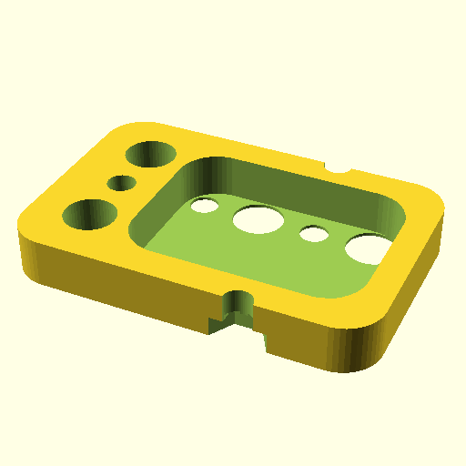

# Oobb Part Wire 3 Width 2 Height 6 mm Depth Spacer Long Extra mm Extra  

note: This is part of OOMP the Oopen Organization Method For Parts. For more details: https://github.com/oomlout/oomp_base

##  part details
  

wire 3x2x6

### name
* name: Oobb Part Wire 3 Width 2 Height 6 mm Depth Spacer Long Extra mm Extra
* name_short: Wire 3x2x6 Spacer Long Extra mm Extra
### id
* oomp_id: oobb_part_wire_3_width_2_height_6_mm_depth_spacer_long_extra_mm_extra
  * classification: oobb
  * type: part
  * size: wire
  * color: 
  * description_main: 3_width_2_height_6_mm_depth
  * description_extra: spacer_long_extra_mm_extra
  * manufacturer: 
  * part_number: 
  * bip 39 word 2: idea umbrella
  * bip 39 word 3: idea umbrella size
  * bip 39 word: idea umbrella size flock term enforce world tag huge heart december alley

### other_codes
* short_code: 
* oomp_word: mushroom bamboo goat
* oomp_word_emoji :mushroom: :bamboo: :goat:
* md5_6_alpha: 42pga
* md5_6: 68715a

### oomlout_oomp_utility_custom_data_manipulation
#### label print
[3x2](http://192.168.1.245:1112/?label=oomp%2042pga)
[3x2_oomp_table](http://192.168.1.108:1112/?label=oomp%2042pga)
[2x1](http://192.168.1.242:1112/?label=oomp%2042pga)
[6x4](http://192.168.1.55:1112/?label=oomp%2042pga)    

#### link

[link_main](https://github.com/oomlout/oomlout_oobb_version_4_generated_parts/tree/main/navigation_oomp/oobb/part/wire/3_width_2_height_6_mm_depth/spacer_long_extra_mm_extra/part)                              

#### price

### all codes 
| key | value |  
| --- | --- |  
| classification | oobb |  
| classification_name | Oobb |  
| color |  |  
| color_name |  |  
| components | [] |  
| components_objects | [] |  
| components_string | [] |  
| description | wire 3x2x6 |  
| description_extra | spacer_long_extra_mm_extra |  
| description_extra_name | Spacer Long Extra mm Extra |  
| description_main | 3_width_2_height_6_mm_depth |  
| description_main_name | 3 Width 2 Height 6 mm Depth |  
| directory | parts/oobb_part_wire_3_width_2_height_6_mm_depth_spacer_long_extra_mm_extra |  
| extra | spacer_long_extra_mm |  
| folder | C:\gh\oomlout_oobb_version_4_generated_parts\parts\oobb_part_wire_3_width_2_height_6_mm_depth_spacer_long_extra_mm_extra |  
| github_link | https://github.com/oomlout/oomlout_oomp_part_src/tree/main/parts/oobb_part_wire_3_width_2_height_6_mm_depth_spacer_long_extra_mm_extra |  
| height | 2 |  
| height_mm | 29 |  
| id | oobb_part_wire_3_width_2_height_6_mm_depth_spacer_long_extra_mm_extra |  
| link_1 | https://github.com/oomlout/oomlout_oobb_version_4_generated_parts/tree/main/navigation_oomp/oobb/part/wire/3_width_2_height_6_mm_depth/spacer_long_extra_mm_extra/part |  
| link_1_name | link_main |  
| link_main | https://github.com/oomlout/oomlout_oobb_version_4_generated_parts/tree/main/navigation_oomp/oobb/part/wire/3_width_2_height_6_mm_depth/spacer_long_extra_mm_extra/part |  
| link_oomlout_label_2x1 | http://192.168.1.242:1112/?label=oomp%2042pga |  
| link_oomlout_label_3x2 | http://192.168.1.245:1112/?label=oomp%2042pga |  
| link_oomlout_label_3x2_oomp_table | http://192.168.1.108:1112/?label=oomp%2042pga |  
| link_oomlout_label_6x4 | http://192.168.1.55:1112/?label=oomp%2042pga |  
| link_redirect | https://github.com/oomlout/oomlout_oobb_version_4_generated_parts/tree/main/parts/oobb_wire_03_02_06_ex_spacer_long_extra_mm |  
| manufacturer |  |  
| manufacturer_name |  |  
| md5 | 68715a9375dd3fb528efb59593fb0b83 |  
| md5_10 | 68715a9375 |  
| md5_5 | 68715 |  
| md5_6 | 68715a |  
| md5_6_alpha | 42pga |  
| name | Oobb Part Wire 3 Width 2 Height 6 mm Depth Spacer Long Extra mm Extra |  
| name_short | Wire 3x2x6 Spacer Long Extra mm Extra |  
| oomlout_detail_hierarchy_1 | oobb |  
| oomlout_detail_hierarchy_2 | part |  
| oomlout_detail_hierarchy_3 | wire |  
| oomlout_detail_hierarchy_4 | 6_mm_depth |  
| oomlout_detail_hierarchy_5 | spacer_long_extra_mm_extra |  
| oomlout_oomp_utility_custom_data_manipulation | True |  
| oomp_key | oomp_oobb_part_wire_3_width_2_height_6_mm_depth_spacer_long_extra_mm_extra |  
| oomp_word | mushroom bamboo goat |  
| oomp_word_emoji | :mushroom: :bamboo: :goat: |  
| oomp_word_emoji_list | [':mushroom:', ':bamboo:', ':goat:'] |  
| oomp_word_list | ['mushroom', 'bamboo', 'goat'] |  
| part_number |  |  
| part_number_name |  |  
| short_name |  |  
| size | wire |  
| size_name | Wire |  
| thickness | 6 |  
| thickness_mm | 6 |  
| type | part |  
| type_name | Part |  
| width | 3 |  
| width_mm | 44 |  
