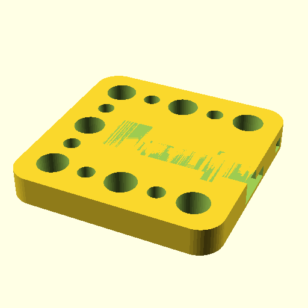

# Oobb Part Wire 3 Width 3 Height 6 mm Depth Motor Basic Extra  

note: This is part of OOMP the Oopen Organization Method For Parts. For more details: https://github.com/oomlout/oomp_base

##  part details
  

wire 3x3x6

### name
* name: Oobb Part Wire 3 Width 3 Height 6 mm Depth Motor Basic Extra
* name_short: Wire 3x3x6 Motor Basic Extra
### id
* oomp_id: oobb_part_wire_3_width_3_height_6_mm_depth_motor_basic_extra
  * classification: oobb
  * type: part
  * size: wire
  * color: 
  * description_main: 3_width_3_height_6_mm_depth
  * description_extra: motor_basic_extra
  * manufacturer: 
  * part_number: 
  * bip 39 word 2: rug kick
  * bip 39 word 3: rug kick company
  * bip 39 word: rug kick company burger razor dinosaur nurse minute field high human anchor

### other_codes
* short_code: 
* oomp_word: bath stars golf
* oomp_word_emoji :bath: :stars: :golf:
* md5_6_alpha: 59fve
* md5_6: 86dd9a

### oomlout_oomp_utility_custom_data_manipulation
#### label print
[3x2](http://192.168.1.245:1112/?label=oomp%2059fve)
[3x2_oomp_table](http://192.168.1.108:1112/?label=oomp%2059fve)
[2x1](http://192.168.1.242:1112/?label=oomp%2059fve)
[6x4](http://192.168.1.55:1112/?label=oomp%2059fve)    

#### link

[link_main](https://github.com/oomlout/oomlout_oobb_version_4_generated_parts/tree/main/navigation_oomp/oobb/part/wire/3_width_3_height_6_mm_depth/motor_basic_extra/part)                              

#### price

### all codes 
| key | value |  
| --- | --- |  
| classification | oobb |  
| classification_name | Oobb |  
| color |  |  
| color_name |  |  
| components | [] |  
| components_objects | [] |  
| components_string | [] |  
| description | wire 3x3x6 |  
| description_extra | motor_basic_extra |  
| description_extra_name | Motor Basic Extra |  
| description_main | 3_width_3_height_6_mm_depth |  
| description_main_name | 3 Width 3 Height 6 mm Depth |  
| directory | parts/oobb_part_wire_3_width_3_height_6_mm_depth_motor_basic_extra |  
| extra | ['motor', 'basic'] |  
| folder | C:\gh\oomlout_oobb_version_4_generated_parts\parts\oobb_part_wire_3_width_3_height_6_mm_depth_motor_basic_extra |  
| github_link | https://github.com/oomlout/oomlout_oomp_part_src/tree/main/parts/oobb_part_wire_3_width_3_height_6_mm_depth_motor_basic_extra |  
| height | 3 |  
| height_mm | 44 |  
| id | oobb_part_wire_3_width_3_height_6_mm_depth_motor_basic_extra |  
| link_1 | https://github.com/oomlout/oomlout_oobb_version_4_generated_parts/tree/main/navigation_oomp/oobb/part/wire/3_width_3_height_6_mm_depth/motor_basic_extra/part |  
| link_1_name | link_main |  
| link_main | https://github.com/oomlout/oomlout_oobb_version_4_generated_parts/tree/main/navigation_oomp/oobb/part/wire/3_width_3_height_6_mm_depth/motor_basic_extra/part |  
| link_oomlout_label_2x1 | http://192.168.1.242:1112/?label=oomp%2059fve |  
| link_oomlout_label_3x2 | http://192.168.1.245:1112/?label=oomp%2059fve |  
| link_oomlout_label_3x2_oomp_table | http://192.168.1.108:1112/?label=oomp%2059fve |  
| link_oomlout_label_6x4 | http://192.168.1.55:1112/?label=oomp%2059fve |  
| link_redirect | https://github.com/oomlout/oomlout_oobb_version_4_generated_parts/tree/main/parts/oobb_wire_03_03_06_ex_motor_basic |  
| manufacturer |  |  
| manufacturer_name |  |  
| md5 | 86dd9ae2af8d52f0f9d951ea5d1e8de8 |  
| md5_10 | 86dd9ae2af |  
| md5_5 | 86dd9 |  
| md5_6 | 86dd9a |  
| md5_6_alpha | 59fve |  
| name | Oobb Part Wire 3 Width 3 Height 6 mm Depth Motor Basic Extra |  
| name_short | Wire 3x3x6 Motor Basic Extra |  
| oomlout_detail_hierarchy_1 | oobb |  
| oomlout_detail_hierarchy_2 | part |  
| oomlout_detail_hierarchy_3 | wire |  
| oomlout_detail_hierarchy_4 | 6_mm_depth |  
| oomlout_detail_hierarchy_5 | motor_basic_extra |  
| oomlout_oomp_utility_custom_data_manipulation | True |  
| oomp_key | oomp_oobb_part_wire_3_width_3_height_6_mm_depth_motor_basic_extra |  
| oomp_word | bath stars golf |  
| oomp_word_emoji | :bath: :stars: :golf: |  
| oomp_word_emoji_list | [':bath:', ':stars:', ':golf:'] |  
| oomp_word_list | ['bath', 'stars', 'golf'] |  
| part_number |  |  
| part_number_name |  |  
| short_name |  |  
| size | wire |  
| size_name | Wire |  
| thickness | 6 |  
| thickness_mm | 6 |  
| type | part |  
| type_name | Part |  
| width | 3 |  
| width_mm | 44 |  
