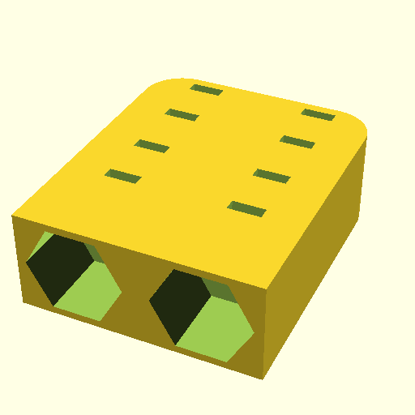

# Oobb Part Ziptie Holder Jack 2 Width 2 Height 12 mm Depth  

note: This is part of OOMP the Oopen Organization Method For Parts. For more details: https://github.com/oomlout/oomp_base

##  part details
  

ziptie holder jack 2x2x12

### name
* name: Oobb Part Ziptie Holder Jack 2 Width 2 Height 12 mm Depth
* name_short: Ziptie Holder Jack 2x2x12 
### id
* oomp_id: oobb_part_ziptie_holder_jack_2_width_2_height_12_mm_depth
  * classification: oobb
  * type: part
  * size: ziptie_holder_jack
  * color: 
  * description_main: 2_width_2_height_12_mm_depth
  * description_extra: 
  * manufacturer: 
  * part_number: 
  * bip 39 word 2: depend shock
  * bip 39 word 3: depend shock toss
  * bip 39 word: depend shock toss broken describe round drink veteran core creek topic aim

### other_codes
* short_code: 
* oomp_word: dolphin cherries alien
* oomp_word_emoji :dolphin: :cherries: :alien:
* md5_6_alpha: 3ci6k
* md5_6: 55ca0c

### oomlout_oomp_utility_custom_data_manipulation
#### label print
[3x2](http://192.168.1.245:1112/?label=oomp%203ci6k)
[3x2_oomp_table](http://192.168.1.108:1112/?label=oomp%203ci6k)
[2x1](http://192.168.1.242:1112/?label=oomp%203ci6k)
[6x4](http://192.168.1.55:1112/?label=oomp%203ci6k)    

#### link

[link_main](https://github.com/oomlout/oomlout_oobb_version_4_generated_parts/tree/main/navigation_oomp/oobb/part/ziptie_holder_jack/2_width_2_height_12_mm_depth/part)                              

#### price

### all codes 
| key | value |  
| --- | --- |  
| classification | oobb |  
| classification_name | Oobb |  
| color |  |  
| color_name |  |  
| components | [] |  
| components_objects | [] |  
| components_string | [] |  
| description | ziptie holder jack 2x2x12 |  
| description_extra |  |  
| description_extra_name |  |  
| description_main | 2_width_2_height_12_mm_depth |  
| description_main_name | 2 Width 2 Height 12 mm Depth |  
| directory | parts/oobb_part_ziptie_holder_jack_2_width_2_height_12_mm_depth |  
| folder | C:\gh\oomlout_oobb_version_4_generated_parts\parts\oobb_part_ziptie_holder_jack_2_width_2_height_12_mm_depth |  
| github_link | https://github.com/oomlout/oomlout_oomp_part_src/tree/main/parts/oobb_part_ziptie_holder_jack_2_width_2_height_12_mm_depth |  
| height | 2 |  
| height_mm | 29 |  
| id | oobb_part_ziptie_holder_jack_2_width_2_height_12_mm_depth |  
| link_1 | https://github.com/oomlout/oomlout_oobb_version_4_generated_parts/tree/main/navigation_oomp/oobb/part/ziptie_holder_jack/2_width_2_height_12_mm_depth/part |  
| link_1_name | link_main |  
| link_main | https://github.com/oomlout/oomlout_oobb_version_4_generated_parts/tree/main/navigation_oomp/oobb/part/ziptie_holder_jack/2_width_2_height_12_mm_depth/part |  
| link_oomlout_label_2x1 | http://192.168.1.242:1112/?label=oomp%203ci6k |  
| link_oomlout_label_3x2 | http://192.168.1.245:1112/?label=oomp%203ci6k |  
| link_oomlout_label_3x2_oomp_table | http://192.168.1.108:1112/?label=oomp%203ci6k |  
| link_oomlout_label_6x4 | http://192.168.1.55:1112/?label=oomp%203ci6k |  
| link_redirect | https://github.com/oomlout/oomlout_oobb_version_4_generated_parts/tree/main/parts/oobb_ziptie_holder_jack_02_02_12 |  
| manufacturer |  |  
| manufacturer_name |  |  
| md5 | 55ca0cc982f32862f19dc1c9cb7191d7 |  
| md5_10 | 55ca0cc982 |  
| md5_5 | 55ca0 |  
| md5_6 | 55ca0c |  
| md5_6_alpha | 3ci6k |  
| name | Oobb Part Ziptie Holder Jack 2 Width 2 Height 12 mm Depth |  
| name_short | Ziptie Holder Jack 2x2x12  |  
| oomlout_detail_hierarchy_1 | oobb |  
| oomlout_detail_hierarchy_2 | part |  
| oomlout_detail_hierarchy_3 | ziptie_holder_jack |  
| oomlout_detail_hierarchy_4 | 12_mm_depth |  
| oomlout_oomp_utility_custom_data_manipulation | True |  
| oomp_key | oomp_oobb_part_ziptie_holder_jack_2_width_2_height_12_mm_depth |  
| oomp_word | dolphin cherries alien |  
| oomp_word_emoji | :dolphin: :cherries: :alien: |  
| oomp_word_emoji_list | [':dolphin:', ':cherries:', ':alien:'] |  
| oomp_word_list | ['dolphin', 'cherries', 'alien'] |  
| part_number |  |  
| part_number_name |  |  
| short_name |  |  
| size | ziptie_holder_jack |  
| size_name | Ziptie Holder Jack |  
| thickness | 12 |  
| thickness_mm | 12 |  
| type | part |  
| type_name | Part |  
| width | 2 |  
| width_mm | 29 |  
